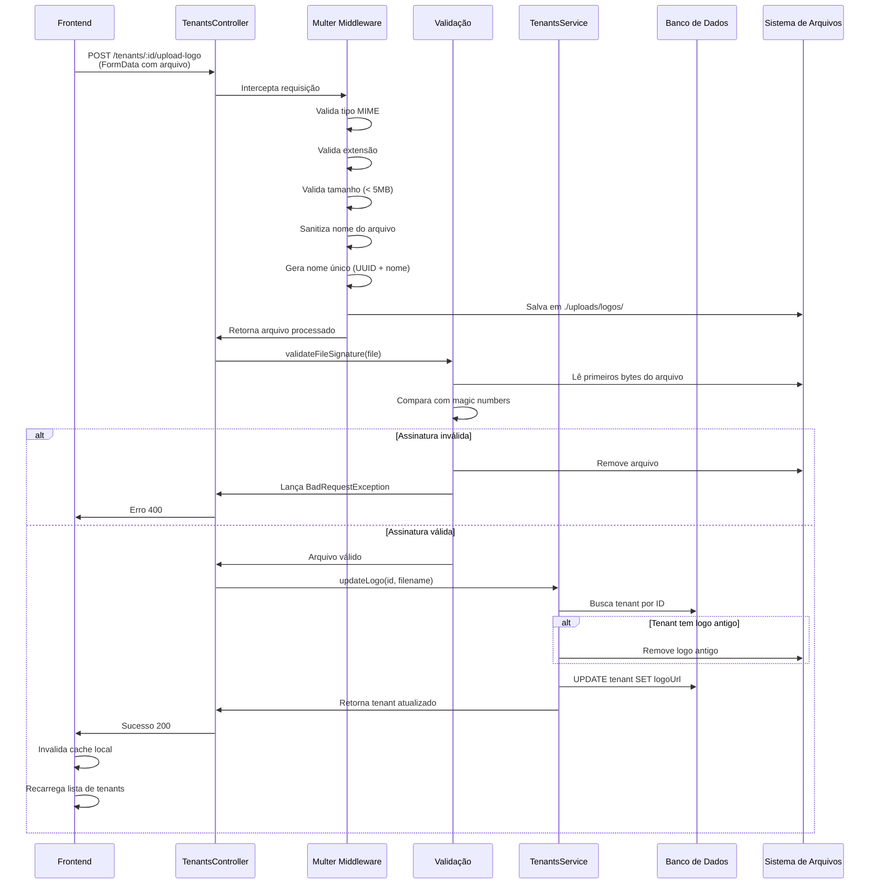
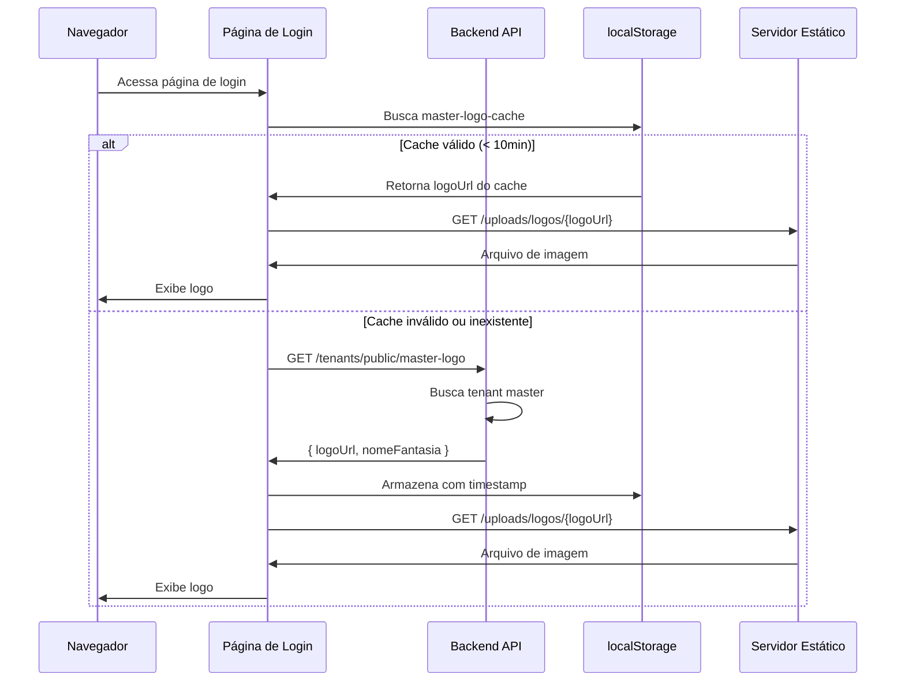
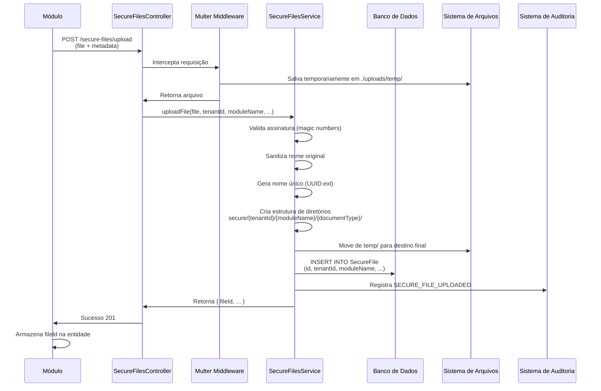
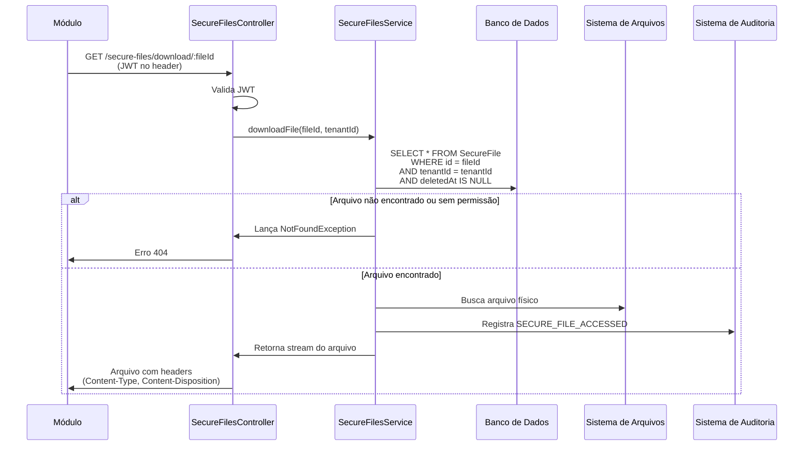

# Análise Completa do Sistema de Upload de Arquivos

## Visão Geral

Este documento apresenta uma análise abrangente do sistema de upload de arquivos, incluindo configurações, armazenamento, acesso público e autenticado, com foco especial nas áreas de empresas e logos.

## 1. Sistema de Upload de Logos de Empresas

### 1.1 Configuração de Armazenamento

#### Localização Física
- **Diretório de Armazenamento**: `backend/uploads/logos/`
- **Nomenclatura de Arquivos**: UUID v4 + nome sanitizado (exemplo: `abc123-def456_logo_empresa.png`)
- **Estrutura de Diretórios**:
  ```
  backend/uploads/
  ├── logos/          (logos de empresas/tenants)
  ├── secure/         (arquivos sensíveis com isolamento por tenant)
  ├── temp/           (arquivos temporários)
  └── modules/        (arquivos de módulos)
  ```

#### Configuração Multer
- **Arquivo**: `backend/src/core/common/config/multer.config.ts`
- **Storage**: `diskStorage` (armazenamento em disco)
- **Validações Implementadas**:
  - Tipos MIME permitidos: `image/jpeg`, `image/png`, `image/webp`, `image/gif`
  - Extensões permitidas: `.jpg`, `.jpeg`, `.png`, `.webp`, `.gif`
  - Tamanho máximo: 5 MB por arquivo
  - Tamanho mínimo: 100 bytes (validação anti-corrupção)
  - Limite de comprimento do nome: 255 caracteres
  - Sanitização de caracteres perigosos no nome do arquivo
  - Validação de assinatura de arquivo (magic numbers)

#### Magic Numbers Validation
O sistema valida a assinatura binária real dos arquivos para prevenir uploads maliciosos:

| Tipo MIME | Magic Numbers (primeiros bytes) |
|-----------|----------------------------------|
| image/jpeg | `0xFF 0xD8 0xFF` |
| image/png | `0x89 0x50 0x4E 0x47` |
| image/webp | `0x52 0x49 0x46 0x46` |
| image/gif | `0x47 0x49 0x46` |

### 1.2 Endpoints de Upload

#### Upload de Logo (SUPER_ADMIN)
- **Endpoint**: `POST /tenants/:id/upload-logo`
- **Autenticação**: JWT obrigatório
- **Autorização**: Role `SUPER_ADMIN`
- **Isolamento**: Desabilitado (`@SkipTenantIsolation`)
- **Field Name**: `logo`
- **Comportamento**: 
  - Remove logo antigo automaticamente (se existir)
  - Salva novo arquivo com nome único
  - Atualiza campo `logoUrl` no banco de dados
  - Valida assinatura do arquivo após upload

#### Upload de Logo (ADMIN do Próprio Tenant)
- **Endpoint**: `POST /tenants/my-tenant/upload-logo`
- **Autenticação**: JWT obrigatório
- **Autorização**: Role `ADMIN`
- **Isolamento**: Ativo (tenant do usuário logado)
- **Comportamento**: Mesmo do endpoint SUPER_ADMIN, mas para o tenant do usuário

#### Remoção de Logo (SUPER_ADMIN)
- **Endpoint**: `PATCH /tenants/:id/remove-logo`
- **Autenticação**: JWT obrigatório
- **Autorização**: Role `SUPER_ADMIN`
- **Comportamento**:
  - Remove arquivo físico do sistema
  - Define `logoUrl` como `null` no banco de dados
  - Falha silenciosamente se arquivo não existir fisicamente

#### Remoção de Logo (ADMIN)
- **Endpoint**: `PATCH /tenants/my-tenant/remove-logo`
- **Autenticação**: JWT obrigatório
- **Autorização**: Role `ADMIN`

### 1.3 Acesso aos Logos

#### Acesso Público via Arquivos Estáticos
- **URL Base**: `http://localhost:4000/uploads/logos/{filename}`
- **Configuração**: `app.useStaticAssets()` em `main.ts`
- **CORS**: Permissivo para logos (`Access-Control-Allow-Origin: *`)
- **Cache**: 24 horas (`Cache-Control: public, max-age=86400`)
- **Headers de Segurança**:
  - `X-Content-Type-Options: nosniff`
  - `X-Frame-Options: DENY`
  - `Cross-Origin-Resource-Policy: cross-origin`

**Justificativa para CORS Permissivo em Logos**:
- Logos são recursos visuais públicos não sensíveis
- Tags `` frequentemente não enviam header `origin`
- Necessário para exibição em páginas de login (sem autenticação)
- Não contém dados pessoais ou informações confidenciais

#### Endpoints Públicos de Metadata

##### Logo da Empresa Master
- **Endpoint**: `GET /tenants/public/master-logo`
- **Autenticação**: Não requerida (`@Public()`)
- **Rate Limiting**: Desabilitado (`@SkipThrottle()`)
- **Retorno**:
  ```
  {
    "logoUrl": "uuid-v4_filename.png",
    "nomeFantasia": "Nome da Empresa"
  }
  ```
- **Lógica de Seleção**:
  - Busca tenant com email `empresa1@example.com` OU
  - Primeiro tenant ativo (ordenado por `createdAt`)

##### Logo de Tenant Específico
- **Endpoint**: `GET /tenants/public/:id/logo`
- **Autenticação**: Não requerida (`@Public()`)
- **Rate Limiting**: Desabilitado (`@SkipThrottle()`)
- **Retorno**:
  ```
  {
    "logoUrl": "uuid-v4_filename.png",
    "nomeFantasia": "Nome da Empresa"
  }
  ```

### 1.4 Consumo no Frontend

#### Página de Login (Pública - Sem Autenticação)
- **Arquivo**: `frontend/src/core/login/page.tsx` e `frontend/src/app/login/page.tsx`
- **Comportamento**:
  - Busca logo master via `GET /tenants/public/master-logo`
  - Exibe logo da plataforma acima do formulário de login
  - URL completa: `${API_URL}/uploads/logos/${masterLogo}`
  - Fallback: Ícone de prédio se logo não carregar

#### TopBar (Autenticada)
- **Arquivo**: `frontend/src/core/TopBar.tsx` e `frontend/src/components/TopBar.tsx`
- **Comportamento**:
  - **Logo Master (Header)**: 
    - Busca via `GET /tenants/public/master-logo`
    - Cache em localStorage por 10 minutos
    - Exibido no canto superior esquerdo
  - **Logo do Tenant do Usuário (Dropdown)**:
    - Usuários com tenant (ADMIN, USER, CLIENT): busca via `GET /tenants/public/:id/logo`
    - SUPER_ADMIN: sem logo de tenant
    - Exibido no menu do usuário (canto superior direito)
    - URL: `${API_URL}/uploads/logos/${userTenantLogo}?t=${Date.now()}`
    - Cache busting com timestamp para forçar atualização

#### Página de Empresas (SUPER_ADMIN)
- **Arquivo**: `frontend/src/app/empresas/page.tsx` e `frontend/src/core/empresas/page.tsx`
- **Comportamento**:
  - Listagem: Exibe logo em cada card de tenant
  - Upload: Dialog com preview antes de enviar
  - Validações no Frontend:
    - Tipo de arquivo: `accept="image/*"`
    - Tamanho máximo: 5 MB
    - Preview antes do upload
  - Cache busting: `?t=${Date.now()}` em algumas versões
  - Invalidação de cache: Remove `tenants-list-cache` após upload/remoção

## 2. Sistema de Arquivos Sensíveis (Secure Files)

### 2.1 Configuração de Armazenamento

#### Localização Física
- **Diretório Base**: `uploads/secure/`
- **Estrutura Dinâmica por Tenant e Módulo**:
  ```
  uploads/secure/
  └── {tenantId}/
      └── {moduleName}/
          └── {documentType}/
              └── {uuid}.{extensão}
  ```
- **Exemplo**:
  ```
  uploads/secure/
  └── tenant-abc-123/
      └── cadastro-pessoas/
          └── documentos-pessoais/
              └── 550e8400-e29b-41d4-a716-446655440000.pdf
  ```

#### Configuração Multer
- **Arquivo**: `backend/src/core/secure-files/config/secure-multer.config.ts`
- **Storage Inicial**: `diskStorage` para temp (`./uploads/temp`)
- **Destino Final**: Movido dinamicamente pelo service
- **Validações**:
  - Tipos MIME permitidos (configurável via `.env`):
    - Imagens: `image/jpeg`, `image/png`, `image/webp`, `image/gif`
    - Documentos: `application/pdf`, `application/msword`, `.docx`
    - Planilhas: `application/vnd.ms-excel`, `.xlsx`
  - Tamanho máximo: Configurável (padrão 10 MB)
  - Validação de assinatura de arquivo (magic numbers estendido)
  - Sanitização de nomes de arquivo

#### Magic Numbers para Secure Files

| Tipo MIME | Magic Numbers |
|-----------|---------------|
| application/pdf | `0x25 0x50 0x44 0x46` |
| application/zip | `0x50 0x4B 0x03 0x04` |
| (+ tipos de imagem do sistema de logos) | |

### 2.2 Banco de Dados

#### Tabela `SecureFile`
Armazena metadata dos arquivos sensíveis:

| Campo | Tipo | Descrição |
|-------|------|-----------|
| id | String (UUID) | Identificador único do arquivo |
| tenantId | String | Tenant proprietário |
| moduleName | String | Módulo que fez o upload |
| documentType | String | Tipo de documento |
| originalName | String | Nome original (sanitizado) |
| storedName | String | Nome único no sistema de arquivos |
| mimeType | String | Tipo MIME do arquivo |
| sizeBytes | BigInt | Tamanho em bytes |
| uploadedBy | String | ID do usuário que fez upload |
| metadata | String (JSON) | Metadata adicional |
| deletedAt | DateTime? | Soft delete timestamp |
| createdAt | DateTime | Data de criação |
| updatedAt | DateTime | Data de atualização |

### 2.3 Endpoints de Secure Files

#### Upload de Arquivo Sensível
- **Endpoint**: `POST /secure-files/upload`
- **Autenticação**: JWT obrigatório
- **Autorização**: Baseado em tenant
- **Body Params**: `tenantId`, `moduleName`, `documentType`, `userId`, `metadata`
- **Field Name**: `file`
- **Comportamento**:
  1. Valida assinatura do arquivo
  2. Sanitiza nome original
  3. Gera nome único (UUID + extensão)
  4. Cria estrutura de diretórios dinâmica
  5. Move arquivo de temp para destino final
  6. Registra metadata no banco `SecureFile`
  7. Cria log de auditoria

#### Download de Arquivo Sensível
- **Endpoint**: `GET /secure-files/download/:fileId`
- **Autenticação**: JWT obrigatório
- **Validações**:
  - Verifica se arquivo pertence ao tenant do usuário
  - Verifica se arquivo não foi deletado (soft delete)
  - Registra acesso em auditoria
- **Retorno**: Stream do arquivo com headers apropriados

#### Listar Arquivos do Tenant
- **Endpoint**: `GET /secure-files`
- **Autenticação**: JWT obrigatório
- **Query Params**: `moduleName`, `documentType` (opcionais)
- **Isolamento**: Automático por tenant via TenantIsolationInterceptor
- **Retorno**: Lista de metadata dos arquivos

#### Deletar Arquivo (Soft Delete)
- **Endpoint**: `DELETE /secure-files/:fileId`
- **Autenticação**: JWT obrigatório
- **Comportamento**: 
  - Define `deletedAt` no banco
  - Arquivo físico permanece no sistema
  - Registra deleção em auditoria

### 2.4 Segurança de Secure Files

#### Regras de Segurança Críticas

**NUNCA Fazer**:
- ❌ Expor pasta `/uploads/secure` como static
- ❌ Retornar path absoluto do arquivo ao frontend
- ❌ Usar nome original do arquivo no filesystem
- ❌ Permitir acesso cross-tenant
- ❌ Salvar URL pública do arquivo no banco

**SEMPRE Fazer**:
- ✅ Validar JWT em todos os acessos
- ✅ Verificar tenant ownership
- ✅ Usar `fileId` para referenciar arquivos
- ✅ Sanitizar nomes de arquivo
- ✅ Validar assinatura de arquivo (magic numbers)
- ✅ Registrar acessos em auditoria

#### Auditoria Automática
Todos os eventos são registrados na tabela `audit_logs`:

| Evento | Action | Dados Registrados |
|--------|--------|-------------------|
| Upload | `SECURE_FILE_UPLOADED` | fileId, moduleName, documentType, sizeBytes |
| Acesso | `SECURE_FILE_ACCESSED` | fileId, moduleName, documentType |
| Exclusão | `SECURE_FILE_DELETED` | fileId, moduleName, documentType |

## 3. Upload de Módulos (ZIP)

### 3.1 Configuração

#### Endpoint de Upload
- **Endpoint**: `POST /core/module-installer/upload`
- **Autenticação**: JWT obrigatório
- **Storage**: `memoryStorage()` (arquivo mantido em memória como Buffer)
- **Validações**:
  - Extensão: Apenas `.zip`
  - Tamanho máximo: 50 MB
  - Field name: `file`

#### Processamento
- **Arquivo**: `backend/src/core/module-installer.service.ts`
- **Fluxo**:
  1. Recebe arquivo ZIP em memória (Buffer)
  2. Escreve temporariamente em `temp/` usando `fs.writeFileSync`
  3. Extrai conteúdo para `modules/{slug}/`
  4. Registra módulo no banco com status `installed`
  5. Remove arquivo temporário

#### Correções Aplicadas
- **Problema Anterior**: `file.buffer` chegava como Object em vez de Buffer
- **Solução**: Configuração explícita de `memoryStorage()` no `FileInterceptor`
- **Validação Defensiva**: Conversão de buffer com fallbacks em caso de incompatibilidade

## 4. Configurações no .env

### 4.1 Variáveis Existentes

#### Uploads Gerais
```
UPLOAD_DESTINATION="./uploads"
MAX_FILE_SIZE="10485760"
ALLOWED_FILE_TYPES="image/jpeg,image/png,image/webp"
UPLOADS_PUBLIC_URL="http://localhost:4000/uploads"
```

#### Secure Files
```
UPLOADS_ROOT="uploads"
SECURE_UPLOADS_DIR="uploads/secure"
MAX_SECURE_FILE_SIZE="10485760"
ALLOWED_SECURE_MIME_TYPES="image/jpeg,image/png,image/webp,image/gif,application/pdf,application/msword,application/vnd.openxmlformats-officedocument.wordprocessingml.document,application/vnd.ms-excel,application/vnd.openxmlformats-officedocument.spreadsheetml.sheet"
```

#### CORS e Frontend
```
FRONTEND_URL="http://localhost:5000"
CORS_MAX_AGE=86400
```

### 4.2 Variáveis Ausentes Identificadas

#### Recomendações de Novas Variáveis

**Para Logos de Empresas**:
```
# Tamanho máximo específico para logos (atualmente hardcoded em 5MB)
MAX_LOGO_FILE_SIZE="5242880"

# Tipos MIME permitidos para logos (atualmente hardcoded)
ALLOWED_LOGO_MIME_TYPES="image/jpeg,image/png,image/webp,image/gif"

# Diretório de logos (atualmente hardcoded como './uploads/logos')
LOGOS_UPLOAD_DIR="./uploads/logos"

# Cache TTL para logos em segundos (atualmente hardcoded 86400)
LOGO_CACHE_TTL="86400"
```

**Para Upload de Módulos**:
```
# Tamanho máximo para módulos ZIP (atualmente hardcoded em 50MB)
MAX_MODULE_FILE_SIZE="52428800"

# Diretório temporário para processamento de módulos
MODULES_TEMP_DIR="./uploads/temp"

# Diretório de instalação de módulos
MODULES_INSTALL_DIR="./modules"
```

**Para Proteção Adicional**:
```
# Habilitar validação de magic numbers (atualmente sempre ativo)
ENABLE_FILE_SIGNATURE_VALIDATION="true"

# Habilitar soft delete automático em secure files
SECURE_FILES_SOFT_DELETE="true"

# Tempo de retenção de arquivos deletados (dias)
SECURE_FILES_RETENTION_DAYS="90"
```

## 5. Análise das Áreas Específicas

### 5.1 Logo da Tenant Master (Plataforma)

#### Identificação da Tenant Master
A lógica atual identifica a tenant master através de:

**Método**: `TenantsService.getMasterLogo()`

**Critérios de Seleção** (em ordem de prioridade):
1. Tenant com email `empresa1@example.com` (tenant padrão do seed)
2. Primeiro tenant ativo (ordenado por data de criação)

#### Problema Potencial Identificado
A seleção baseada em email hardcoded (`empresa1@example.com`) pode causar problemas se:
- Este tenant for deletado ou desativado
- O email for alterado
- Múltiplos ambientes usarem seeds diferentes

#### Recomendação de Melhoria
Adicionar um campo explícito no banco de dados:

**Estrutura Sugerida**:
- Campo: `isMasterTenant` (Boolean)
- Índice único para garantir apenas um master
- Migração para marcar tenant padrão como master

**Benefícios**:
- Controle explícito sobre qual tenant é a master
- Independente de email ou ordem de criação
- Facilita mudança de master via interface administrativa

### 5.2 Logo Exibida na TopBar

#### Implementação Atual

**Duas Logos Exibidas**:
1. **Logo da Plataforma (Master)**: Canto superior esquerdo
2. **Logo do Tenant do Usuário**: Menu do usuário (dropdown)

#### Logo da Plataforma (Master)

**Fonte de Dados**: `GET /tenants/public/master-logo`

**Cache Strategy**:
- Armazenado em `localStorage` com chave `master-logo-cache`
- TTL: 10 minutos
- Estrutura do cache:
  ```
  {
    "logoUrl": "uuid-v4_filename.png",
    "timestamp": 1234567890
  }
  ```

**Fluxo de Carregamento**:
1. Verifica cache em localStorage
2. Se cache válido (< 10 min), usa valor cacheado
3. Se inválido ou inexistente, busca da API
4. Armazena novo valor em cache

**Problema Identificado - Cache Desatualizado**:
- Logos não atualizam imediatamente após upload
- Cache de 10 minutos pode exibir logo antiga
- Usuário precisa aguardar ou limpar cache manualmente

**Solução Implementada**:
- Cache busting com timestamp na URL: `?t=${Date.now()}`
- Invalidação manual de cache após upload/remoção
- Ferramenta de limpeza de cache: `/clear-cache.html`

#### Logo do Tenant do Usuário

**Lógica de Exibição**:
- **SUPER_ADMIN**: Não exibe logo de tenant (não pertence a nenhum)
- **ADMIN/USER/CLIENT**: Exibe logo do tenant via `GET /tenants/public/:id/logo`

**Cache Strategy**:
- Cache com timestamp para forçar refresh
- URL: `${API_URL}/uploads/logos/${userTenantLogo}?t=${Date.now()}`

**Fallback**:
- Se logo não carregar, exibe iniciais do nome do usuário em círculo colorido

#### Problema de Consistência Identificado

**Cenário**: Dois usuários do mesmo tenant visualizam logos diferentes temporariamente

**Causa**: 
- Cache independente em cada navegador
- Timestamp de cache-busting diferente
- Invalidação não sincronizada

**Recomendação de Melhoria**:
- Implementar versionamento de logo no banco de dados
- Adicionar campo `logoVersion` na tabela `Tenant`
- Incrementar versão a cada upload/remoção
- Incluir versão na URL: `?v=${logoVersion}` em vez de timestamp

## 6. Problemas e Lacunas Identificados

### 6.1 Configuração

#### Valores Hardcoded
- ❌ Tamanho máximo de logos (5 MB) está hardcoded
- ❌ Tipos MIME permitidos hardcoded em múltiplos arquivos
- ❌ Paths de diretórios parcialmente hardcoded
- ❌ TTL de cache hardcoded

**Impacto**: Dificulta ajustes sem modificar código

**Recomendação**: Mover para variáveis de ambiente (ver seção 4.2)

#### Duplicação de Configuração
- ❌ Configuração Multer duplicada em 4 arquivos:
  - `backend/src/core/multer.config.ts`
  - `backend/src/core/common/config/multer.config.ts`
  - `backend/src/core/config/multer.config.ts`
  - `backend/src/common/config/multer.config.ts`

**Impacto**: Risco de inconsistência, manutenção difícil

**Recomendação**: Consolidar em um único arquivo centralizado

### 6.2 Segurança

#### CORS Permissivo em Logos
- ⚠️ `Access-Control-Allow-Origin: *` para todos os logos
- Permite acesso de qualquer origem
- Potencial vazamento de logos de tenants privados

**Justificativa Atual**: Necessário para páginas públicas (login)

**Recomendação de Melhoria**:
- Separar logos públicos de privados
- Logos de tenants privados: CORS restritivo
- Logo master: CORS permissivo
- Adicionar flag `logoPublic` no banco de dados

#### Ausência de Rate Limiting em Arquivos Estáticos
- ⚠️ Arquivos estáticos não têm rate limiting
- Possível DDoS baixando logos repetidamente

**Recomendação**: Implementar rate limiting em nível de servidor web (Nginx)

#### Validação de Tenant na Remoção de Logo
- ✅ SUPER_ADMIN pode remover logo de qualquer tenant (correto)
- ⚠️ Ausência de log de auditoria para esta ação crítica

**Recomendação**: Adicionar auditoria para upload/remoção de logos

### 6.3 Performance

#### Cache de Logos
- ⚠️ Cache de 24 horas pode exibir logos desatualizadas
- Invalidação manual necessária após upload
- Não sincronizado entre múltiplos usuários

**Recomendação**: Implementar sistema de versionamento (ver seção 5.2)

#### Carregamento de Logos na Listagem
- ⚠️ Página de empresas carrega logo de cada tenant individualmente
- Múltiplas requisições HTTP simultâneas
- Sem lazy loading ou paginação de imagens

**Recomendação**:
- Implementar lazy loading de imagens
- Considerar CDN para logos
- Adicionar placeholders durante carregamento

### 6.4 Usabilidade

#### Feedback de Upload
- ✅ Preview antes do upload implementado
- ⚠️ Sem barra de progresso durante upload
- ⚠️ Sem indicação visual de validação de arquivo

**Recomendação**: Adicionar indicadores visuais de progresso e validação

#### Gestão de Logos Antigas
- ⚠️ Logos antigas são deletadas imediatamente ao fazer novo upload
- Sem histórico ou possibilidade de rollback
- Sem backup automático

**Recomendação**:
- Implementar soft delete para logos
- Manter histórico das últimas N versões
- Adicionar funcionalidade de rollback para SUPER_ADMIN

### 6.5 Tenant Master

#### Ausência de Configuração Explícita
- ❌ Lógica baseada em email hardcoded
- Sem interface para alterar tenant master
- Sem validação de existência de logo master

**Recomendação**: Implementar gestão explícita de tenant master (ver seção 5.1)

#### Fallback de Logo Master
- ⚠️ Se tenant master não tiver logo, página de login não exibe nada
- Sem logo padrão do sistema

**Recomendação**: Adicionar logo padrão da plataforma como fallback

### 6.6 Documentação

#### Documentação Fragmentada
- ✅ Múltiplos arquivos de documentação existentes
- ⚠️ Informações duplicadas e possivelmente desatualizadas
- ⚠️ Sem diagrama de fluxo de upload

**Recomendação**: Consolidar documentação em local centralizado

## 7. Fluxos de Upload e Acesso

### 7.1 Fluxo de Upload de Logo (SUPER_ADMIN)



### 7.2 Fluxo de Acesso a Logo (Página Pública)



### 7.3 Fluxo de Upload de Arquivo Sensível



### 7.4 Fluxo de Download de Arquivo Sensível



## 8. Recomendações Priorizadas

### 8.1 Prioridade Alta (Críticas)

#### 1. Consolidar Configuração Multer
- **Problema**: 4 arquivos duplicados com mesma configuração
- **Impacto**: Alto risco de inconsistência
- **Ação**: Manter apenas `backend/src/core/common/config/multer.config.ts`

#### 2. Implementar Tenant Master Explícito
- **Problema**: Lógica baseada em email hardcoded
- **Impacto**: Fragilidade na identificação da plataforma
- **Ação**: Adicionar campo `isMasterTenant` no banco

#### 3. Adicionar Auditoria para Logos
- **Problema**: Upload/remoção de logos não auditados
- **Impacto**: Falta de rastreabilidade
- **Ação**: Registrar eventos na tabela `audit_logs`

#### 4. Mover Configurações para .env
- **Problema**: Valores hardcoded em código
- **Impacto**: Dificulta configuração por ambiente
- **Ação**: Implementar variáveis da seção 4.2

### 8.2 Prioridade Média (Importantes)

#### 5. Sistema de Versionamento de Logos
- **Problema**: Cache desatualizado entre usuários
- **Impacto**: Inconsistência visual temporária
- **Ação**: Campo `logoVersion` + URL com versão

#### 6. Separar Logos Públicos de Privados
- **Problema**: CORS permissivo para todos os logos
- **Impacto**: Risco de segurança
- **Ação**: Flag `logoPublic` + CORS condicional

#### 7. Histórico de Logos
- **Problema**: Logos antigas deletadas permanentemente
- **Impacto**: Impossibilidade de rollback
- **Ação**: Soft delete + tabela de histórico

#### 8. Lazy Loading de Imagens
- **Problema**: Carregamento simultâneo de todas as logos
- **Impacto**: Performance na página de listagem
- **Ação**: Implementar lazy loading nativo ou biblioteca

### 8.3 Prioridade Baixa (Melhorias)

#### 9. Logo Padrão da Plataforma
- **Problema**: Ausência de fallback se master não tiver logo
- **Impacto**: Experiência ruim em páginas públicas
- **Ação**: Adicionar logo padrão em assets estáticos

#### 10. Barra de Progresso de Upload
- **Problema**: Sem feedback visual durante upload
- **Impacto**: Usabilidade
- **Ação**: Implementar progress tracking

#### 11. Rate Limiting em Arquivos Estáticos
- **Problema**: Possível DDoS em downloads
- **Impacto**: Performance
- **Ação**: Configurar rate limiting no Nginx/servidor web

#### 12. Consolidar Documentação
- **Problema**: Documentação fragmentada
- **Impacto**: Dificulta manutenção
- **Ação**: Criar documento único de referência

## 9. Resumo Executivo

### Status Atual

#### Pontos Fortes
- ✅ Sistema de upload robusto com múltiplas validações
- ✅ Validação de assinatura de arquivo (magic numbers)
- ✅ Isolamento de arquivos sensíveis por tenant
- ✅ Soft delete implementado em secure files
- ✅ Auditoria completa em secure files
- ✅ CORS configurado adequadamente para diferentes cenários
- ✅ Cache implementado para melhorar performance

#### Pontos de Atenção
- ⚠️ Configuração duplicada em múltiplos arquivos
- ⚠️ Valores hardcoded que deveriam estar no .env
- ⚠️ Identificação de tenant master frágil
- ⚠️ Ausência de auditoria para logos
- ⚠️ Cache desatualizado pode causar inconsistência
- ⚠️ CORS permissivo para todos os logos
- ⚠️ Ausência de histórico de logos

### Áreas Críticas Analisadas

#### 1. Logo da Tenant Master
- **Identificação**: Email hardcoded ou primeiro tenant ativo
- **Problema Principal**: Lógica frágil e não explícita
- **Recomendação**: Campo `isMasterTenant` no banco

#### 2. Logo na TopBar
- **Exibição**: Logo master (esquerda) + Logo do tenant (direita)
- **Problema Principal**: Cache desatualizado entre usuários
- **Recomendação**: Sistema de versionamento

### Configurações .env

#### Existentes e Adequadas
- Uploads gerais configurados
- Secure files bem configurado
- CORS e frontend definidos

#### Ausentes (Recomendadas)
- Configurações específicas de logos
- Configurações de módulos
- Flags de features (versionamento, auditoria)

### Próximos Passos Sugeridos

1. **Imediato**: Consolidar configuração Multer
2. **Curto Prazo**: Implementar tenant master explícito + auditoria de logos
3. **Médio Prazo**: Sistema de versionamento + separação de logos públicos/privados
4. **Longo Prazo**: Histórico de logos + melhorias de performance
