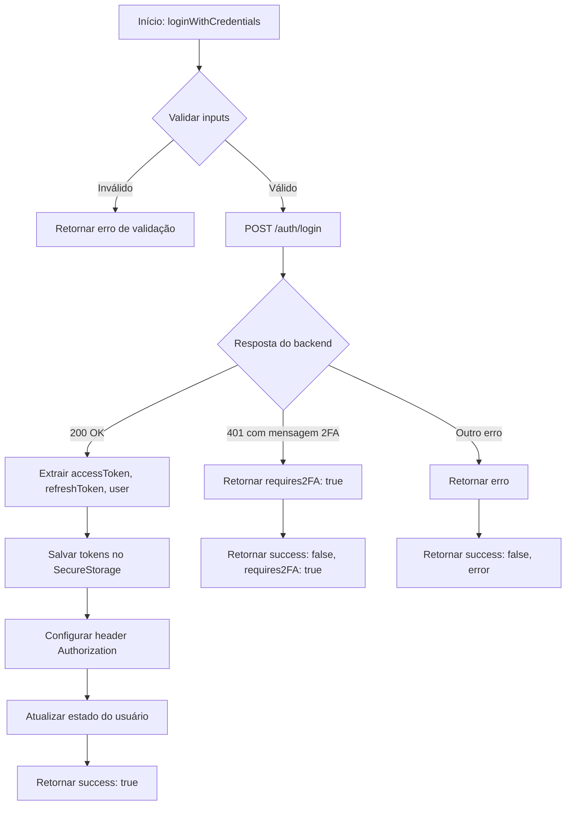
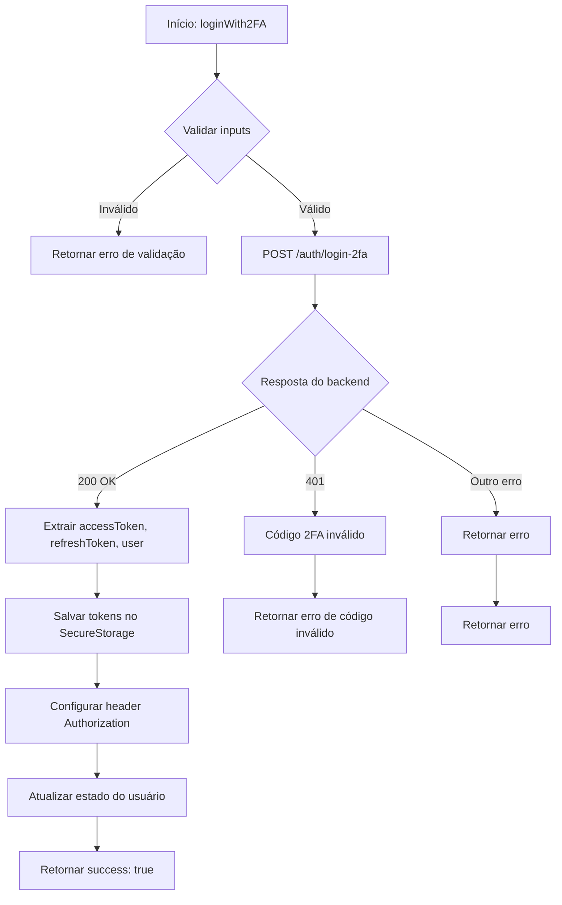
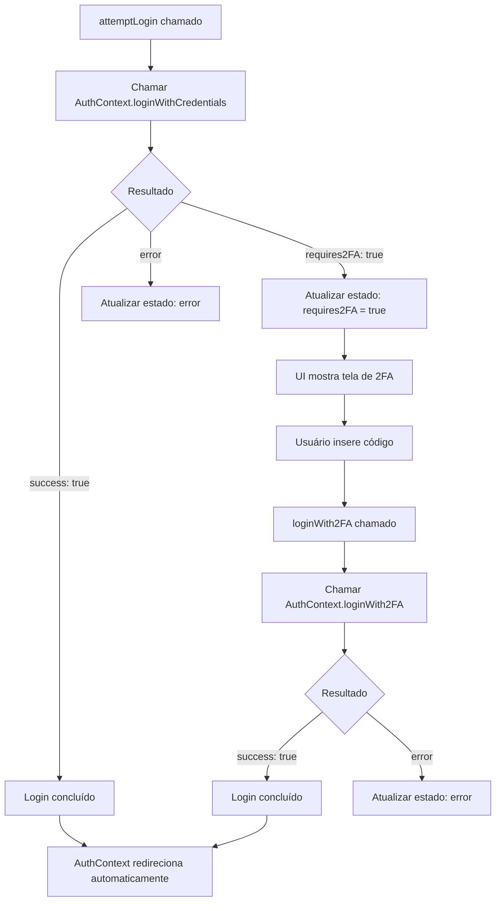
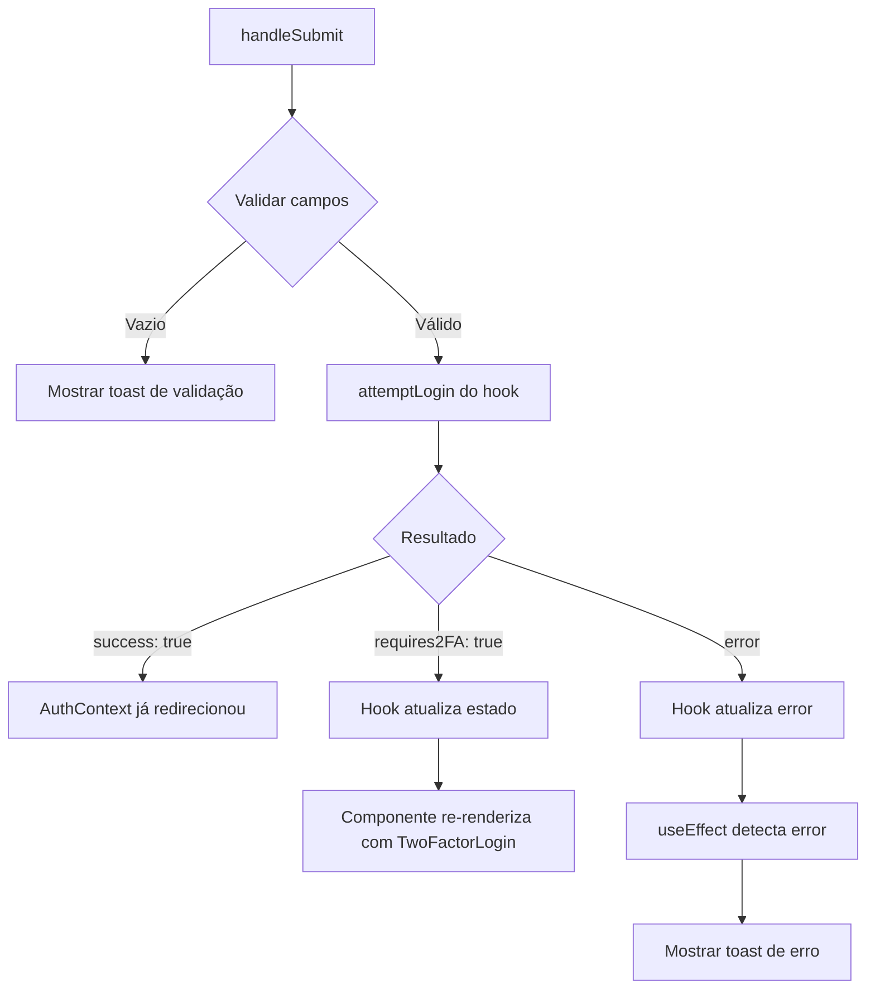
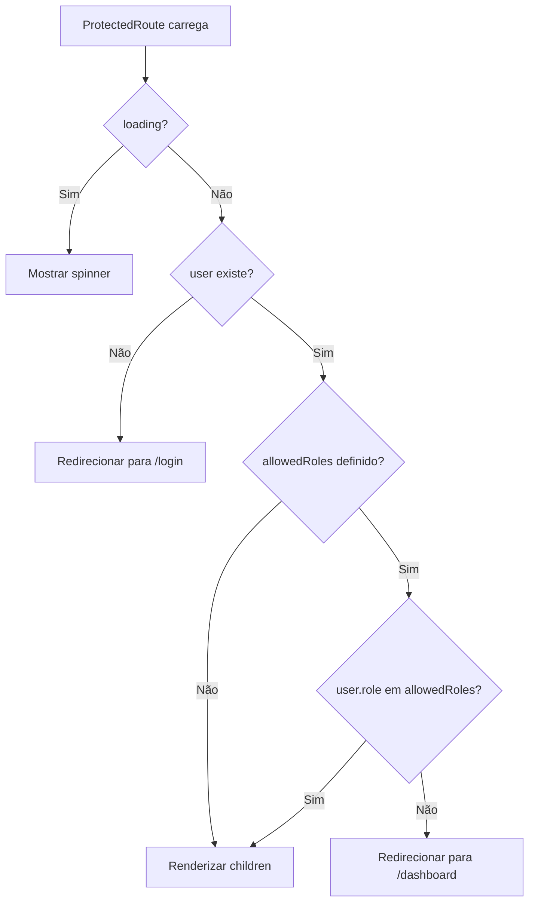
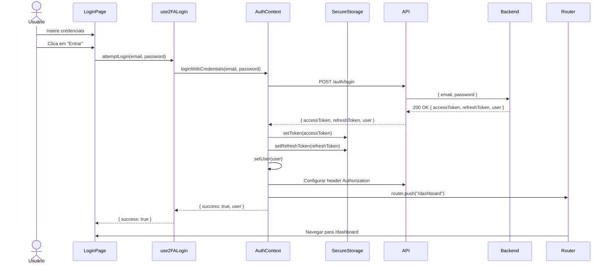
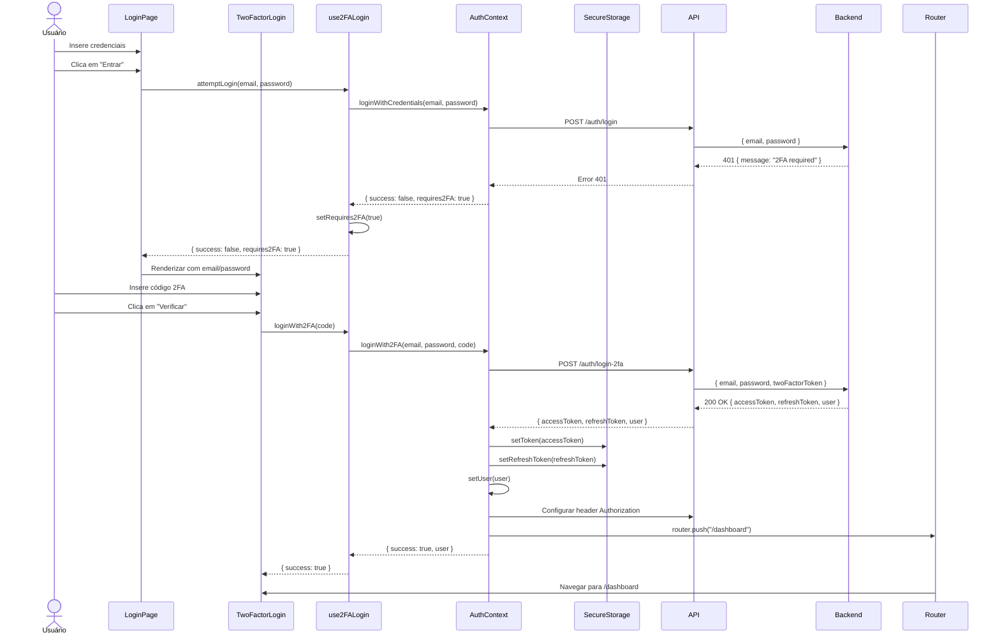
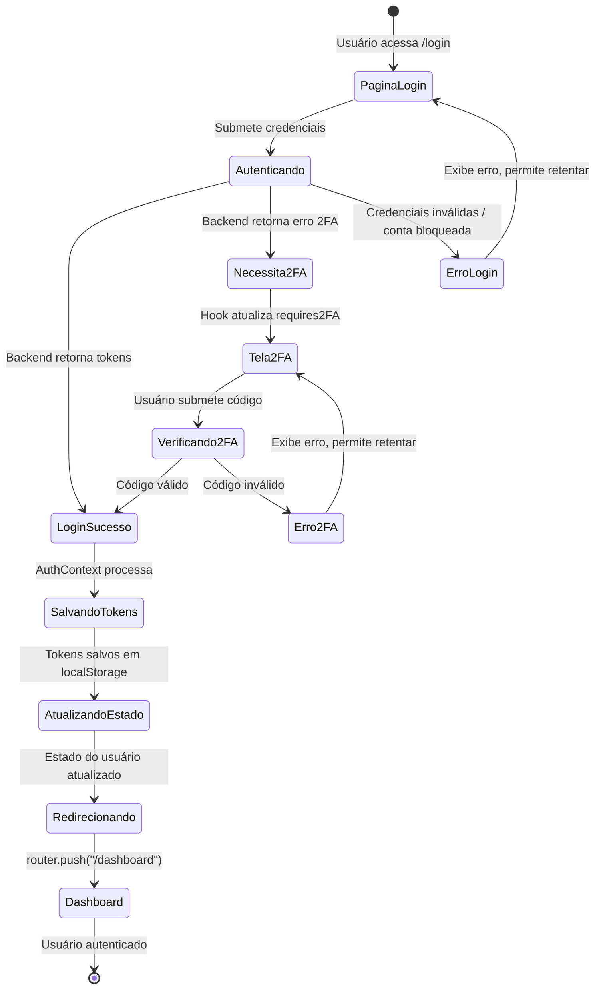

# Correção do Fluxo de Autenticação - Login

## Contexto do Problema

O sistema multitenant apresenta um problema crítico no fluxo de autenticação onde, ao realizar login com credenciais válidas, o backend retorna sucesso com tokens válidos, mas o frontend permanece na página de login sem redirecionar para o dashboard.

### Credenciais de Teste Afetadas
- SUPER_ADMIN: admin@system.com / admin123
- ADMIN: admin@empresa1.com / admin123
- USER: user@empresa1.com / user123

### Comportamento Atual Observado
1. Usuário insere credenciais válidas na página de login
2. Requisição é enviada para endpoint `/auth/login`
3. Backend retorna status 200 com tokens e dados do usuário
4. Toast de sucesso é exibido: "Login realizado com sucesso!"
5. Frontend permanece na página de login sem redirecionar
6. Usuário não consegue acessar o dashboard

## Análise da Causa Raiz

### Problema Principal: Inconsistência no Gerenciamento de Estado de Autenticação

Existem **dois fluxos de login paralelos** que não se comunicam corretamente:

#### Fluxo 1: Hook use2FALogin (usado na página de login)
- Localização: `frontend/src/hooks/use2FALogin.ts`
- Armazenamento: **sessionStorage**
- Chaves: `@App:token` e `@App:refreshToken`
- Responsabilidade: Gerenciar login inicial e fluxo 2FA

#### Fluxo 2: AuthContext (gerenciador global de autenticação)
- Localização: `frontend/src/contexts/AuthContext.tsx`
- Armazenamento: **localStorage** com criptografia básica (Base64)
- Chaves: `@App:token` e `@App:refreshToken` (criptografadas)
- Responsabilidade: Gerenciar estado global do usuário autenticado

#### Fluxo 3: API Client (interceptor de requisições)
- Localização: `frontend/src/lib/api.ts`
- Leitura: **localStorage** (espera tokens criptografados)
- Responsabilidade: Adicionar token em todas as requisições e renovar automaticamente

### Conflito Identificado

```
Fluxo de Login Atual:
┌──────────────────────────────────────────────────────────────────────┐
│ 1. Usuário submete login em /login                                   │
│    ↓                                                                  │
│ 2. use2FALogin.attemptLogin() executa                                │
│    ↓                                                                  │
│ 3. POST /auth/login → sucesso                                        │
│    ↓                                                                  │
│ 4. Tokens salvos em sessionStorage (NÃO criptografados)             │
│    ↓                                                                  │
│ 5. router.push("/dashboard") executado                               │
│    ↓                                                                  │
│ 6. Dashboard carrega → AuthContext.useEffect verifica autenticação  │
│    ↓                                                                  │
│ 7. AuthContext busca token em localStorage (VAZIO!)                 │
│    ↓                                                                  │
│ 8. ProtectedRoute detecta ausência de usuário                       │
│    ↓                                                                  │
│ 9. Redirecionamento para /login (BLOQUEIO DO ACESSO)               │
└──────────────────────────────────────────────────────────────────────┘
```

### Problemas Específicos Detectados

| Componente | Problema | Impacto |
|------------|----------|---------|
| use2FALogin | Salva tokens em sessionStorage sem criptografia | Tokens não são reconhecidos pelo AuthContext |
| AuthContext | Lê tokens apenas de localStorage com descriptografia | Não encontra os tokens salvos pelo hook de login |
| API Client | Espera tokens criptografados em localStorage | Falha ao adicionar Authorization header |
| ProtectedRoute | Depende do estado do AuthContext para autorização | Bloqueia acesso ao dashboard quando AuthContext está vazio |

## Estratégia de Correção

### Objetivo
Unificar o gerenciamento de tokens para garantir consistência entre login inicial, estado global e interceptores de API.

### Princípios da Solução

1. **Ponto Único de Verdade**: AuthContext deve ser a única fonte de verdade para tokens e estado do usuário
2. **Consistência de Armazenamento**: Todos os componentes devem usar o mesmo storage (localStorage) com mesma estratégia de criptografia
3. **Separação de Responsabilidades**: 
   - Hook use2FALogin: gerenciar apenas o fluxo de 2FA
   - AuthContext: gerenciar autenticação e tokens
   - API Client: consumir tokens do AuthContext/localStorage

### Abordagem de Implementação

#### Opção 1: Centralizar Login no AuthContext (RECOMENDADA)

**Vantagens:**
- Única fonte de gerenciamento de autenticação
- Consistência garantida em todo o sistema
- Simplifica manutenção futura
- Reduz duplicação de lógica

**Mudanças necessárias:**

1. **AuthContext** - Adicionar suporte a 2FA
   - Criar método `loginWithCredentials(email, password)` que:
     - Tenta login normal via `/auth/login`
     - Se receber erro indicando necessidade de 2FA, retorna flag
     - Se sucesso, salva tokens em localStorage criptografados
     - Atualiza estado do usuário
   - Criar método `loginWith2FA(email, password, code)` que:
     - Envia requisição para `/auth/login-2fa`
     - Salva tokens em localStorage criptografados
     - Atualiza estado do usuário
     - Redireciona para dashboard

2. **Hook use2FALogin** - Refatorar para delegar ao AuthContext
   - Remover lógica de salvamento de tokens
   - Remover lógica de redirecionamento
   - Usar métodos do AuthContext para autenticação
   - Manter apenas gerenciamento de estado UI (requires2FA, loading, error)

3. **Página de Login** - Simplificar
   - Usar AuthContext diretamente para login
   - Hook use2FALogin apenas para controle de fluxo 2FA

4. **API Client** - Manter como está
   - Já está configurado para ler localStorage corretamente

#### Opção 2: Sincronizar Storages (NÃO RECOMENDADA)

Fazer use2FALogin salvar também em localStorage com criptografia após login bem-sucedido.

**Desvantagens:**
- Mantém duplicação de lógica
- Maior superfície de erro
- Dificulta manutenção

## Design da Solução (Opção 1)

### Componente: AuthContext - Método loginWithCredentials

**Assinatura:**
```
loginWithCredentials(email: string, password: string): Promise<LoginResult>

interface LoginResult {
  success: boolean;
  requires2FA: boolean;
  user?: User;
  error?: string;
}
```

**Fluxo de Execução:**



**Responsabilidades:**
- Validar credenciais de entrada
- Enviar requisição de login ao backend
- Detectar se 2FA é necessário baseado na resposta
- Salvar tokens usando SecureStorage (localStorage criptografado)
- Atualizar estado global do usuário
- Configurar header Authorization no API client
- Retornar resultado estruturado para a UI

**Tratamento de Erros:**

| Cenário | Ação |
|---------|------|
| Credenciais vazias | Retornar erro de validação imediatamente |
| Usuário não encontrado | Propagar mensagem do backend |
| Senha incorreta | Propagar mensagem do backend (pode incluir contagem de tentativas) |
| Conta bloqueada | Propagar mensagem do backend com tempo restante |
| 2FA necessário | Retornar flag requires2FA sem erro |
| Erro de rede | Retornar erro genérico de conexão |

### Componente: AuthContext - Método loginWith2FA

**Assinatura:**
```
loginWith2FA(email: string, password: string, twoFactorToken: string): Promise<LoginResult>
```

**Fluxo de Execução:**



**Responsabilidades:**
- Validar credenciais e código 2FA
- Enviar requisição de login 2FA ao backend
- Salvar tokens usando SecureStorage
- Atualizar estado global do usuário
- Configurar header Authorization
- Retornar resultado estruturado

### Componente: Hook use2FALogin - Refatoração

**Objetivo:** Simplificar para atuar apenas como controlador de UI do fluxo 2FA

**Estado Gerenciado:**
```
{
  requires2FA: boolean;       // Se deve mostrar tela de 2FA
  loading: boolean;           // Loading durante autenticação
  error: string;              // Mensagem de erro
  credentials: {              // Credenciais para 2FA
    email: string;
    password: string;
  }
}
```

**Métodos Expostos:**

| Método | Responsabilidade | Delegação |
|--------|------------------|-----------|
| attemptLogin | Iniciar tentativa de login | AuthContext.loginWithCredentials |
| loginWith2FA | Submeter código 2FA | AuthContext.loginWith2FA |
| reset | Resetar estado para voltar ao login | Interno (limpar estado) |

**Novo Fluxo:**



**Mudanças Específicas:**
- **REMOVER**: Salvamento direto de tokens
- **REMOVER**: Redirecionamento com router.push ou window.location
- **REMOVER**: Configuração direta de api.defaults.headers
- **ADICIONAR**: Chamadas delegadas aos métodos do AuthContext
- **MANTER**: Gerenciamento de estado de UI (requires2FA, loading, error)

### Componente: Página de Login - Ajustes

**Responsabilidades Atualizadas:**
- Renderizar formulário de login
- Renderizar componente TwoFactorLogin quando requires2FA é true
- Exibir toasts de erro usando o error do hook
- Exibir loading durante autenticação

**Novo Fluxo de handleSubmit:**



**Mudanças Específicas:**
- **REMOVER**: Toast de sucesso manual (AuthContext pode gerenciar isso)
- **MANTER**: Toast de erro baseado no error do hook
- **MANTER**: Lógica de renderização condicional (login vs 2FA)

### Integração com ProtectedRoute

**Comportamento Esperado Após Correção:**

1. Usuário faz login com credenciais válidas
2. AuthContext salva tokens em localStorage e atualiza estado do usuário
3. AuthContext redireciona para /dashboard
4. ProtectedRoute verifica estado do AuthContext
5. Estado do usuário está populado → permite acesso
6. Dashboard é renderizado com sucesso

**Verificações do ProtectedRoute:**



### Sincronização do API Client

**Estado Atual:** Já configurado corretamente

O interceptor de requisições em `api.ts` já:
- Lê tokens de localStorage
- Descriptografa usando atob
- Adiciona header Authorization
- Renova tokens automaticamente via /auth/refresh
- Salva novos tokens criptografados em localStorage

**Nenhuma alteração necessária** - A solução proposta garante que os tokens estarão disponíveis onde o API client espera.

## Modelo de Dados

### SecureStorage (já existente no AuthContext)

| Método | Parâmetro | Retorno | Descrição |
|--------|-----------|---------|-----------|
| setToken | token: string | void | Criptografa (Base64) e salva token em localStorage |
| getToken | - | string \| null | Lê e descriptografa token de localStorage |
| removeToken | - | void | Remove token de localStorage |
| setRefreshToken | token: string | void | Criptografa e salva refresh token em localStorage |
| getRefreshToken | - | string \| null | Lê e descriptografa refresh token de localStorage |
| removeRefreshToken | - | void | Remove refresh token de localStorage |

**Nota:** Base64 não é criptografia real, apenas ofuscação. Em produção, considerar criptografia mais robusta.

### Interface LoginResult (nova)

```
interface LoginResult {
  success: boolean;         // Indica se o login foi concluído com sucesso
  requires2FA: boolean;     // Indica se 2FA é necessário
  user?: User;              // Dados do usuário (quando success = true)
  error?: string;           // Mensagem de erro (quando success = false)
}
```

### Interface AuthContextData (atualizada)

```
interface AuthContextData {
  user: User | null;
  loading: boolean;
  login: (email: string, password: string) => Promise<void>;           // Deprecado - manter compatibilidade
  loginWithCredentials: (email: string, password: string) => Promise<LoginResult>;  // Novo
  loginWith2FA: (email: string, password: string, code: string) => Promise<LoginResult>;  // Novo
  logout: () => void;
  updateUser: (userData: Partial<User>) => void;
}
```

## Fluxo de Autenticação Corrigido

### Diagrama de Sequência - Login Sem 2FA



### Diagrama de Sequência - Login Com 2FA



### Diagrama de Estados - Fluxo Completo



## Validações e Tratamento de Erros

### Validações de Input

| Campo | Validação | Mensagem de Erro |
|-------|-----------|------------------|
| Email | Não vazio | "Preencha todos os campos" |
| Email | Formato válido de email | Validação nativa do input type="email" |
| Password | Não vazio | "Preencha todos os campos" |
| Código 2FA | Não vazio | "Código 2FA é obrigatório" |
| Código 2FA | Apenas dígitos, 6 caracteres | "Código inválido" |

### Cenários de Erro Backend

| Erro | Status HTTP | Mensagem Backend | Ação no Frontend |
|------|-------------|------------------|------------------|
| Usuário não encontrado | 401 | "Credenciais inválidas" | Exibir toast de erro |
| Senha incorreta | 401 | "Credenciais inválidas. Você tem X tentativas restantes" | Exibir toast com contagem |
| Conta bloqueada | 401 | "Conta bloqueada por múltiplas tentativas..." | Exibir toast com tempo de bloqueio |
| 2FA necessário | 401 | "2FA required" | Mostrar tela de 2FA sem erro |
| Código 2FA inválido | 401 | "Código 2FA inválido" | Exibir toast de erro |
| 2FA não ativado | 401 | "2FA não está ativado para este usuário" | Exibir toast de erro |
| Erro de rede | - | - | "Erro de conexão. Tente novamente" |
| Erro interno servidor | 500 | Variado | "Erro no servidor. Tente novamente mais tarde" |

### Estratégia de Retry

**Login normal:**
- Não fazer retry automático
- Permitir que usuário tente novamente manualmente
- Backend gerencia bloqueio de conta após múltiplas tentativas

**Login 2FA:**
- Não fazer retry automático
- Permitir que usuário tente novamente manualmente
- Considerar timeout do código 2FA (normalmente 30 segundos por código)

**Renovação de token (API Client):**
- Já implementado com fila de requisições pendentes
- Uma única tentativa de renovação
- Se falhar, força logout

## Impactos e Considerações

### Compatibilidade

**Mudanças Breaking:**
- Nenhuma - método `login` existente no AuthContext é mantido para compatibilidade
- Novos métodos são adicionados sem remover funcionalidade existente

**Migração:**
- Não há dados a migrar - tokens em sessionStorage serão descartados naturalmente
- Usuários precisarão fazer login novamente após deploy da correção

### Segurança

**Melhorias:**
- Eliminação de inconsistência de storage reduz superfície de ataque
- Centralização de lógica de autenticação facilita auditoria de segurança

**Considerações:**
- Base64 não é criptografia real - considerar upgrade para criptografia adequada em produção
- Tokens em localStorage são acessíveis via JavaScript - avaliar uso de cookies HttpOnly para refresh token

### Performance

**Impacto:** Neutro
- Mesmas operações de storage
- Mesmas requisições HTTP
- Eliminação de tentativas de redirecionamento duplicadas pode melhorar levemente

### Testabilidade

**Melhorias:**
- Centralização facilita testes unitários do AuthContext
- Separação de responsabilidades facilita testes isolados do hook de 2FA
- Fluxo mais previsível facilita testes E2E

### Manutenibilidade

**Melhorias significativas:**
- Ponto único de verdade para autenticação
- Menos duplicação de lógica
- Responsabilidades claras entre componentes
- Mais fácil adicionar novos métodos de autenticação no futuro

## Critérios de Aceitação

### Funcionalidade

- [ ] Login com credenciais válidas redireciona para dashboard
- [ ] Login com credenciais inválidas exibe mensagem de erro
- [ ] Login com conta bloqueada exibe mensagem com tempo restante
- [ ] Login de usuário com 2FA ativado solicita código
- [ ] Código 2FA válido completa login e redireciona
- [ ] Código 2FA inválido exibe erro e permite retentar
- [ ] Tokens são salvos em localStorage criptografados
- [ ] Estado do usuário é atualizado no AuthContext
- [ ] ProtectedRoute permite acesso ao dashboard após login
- [ ] API Client adiciona header Authorization em requisições

### Segurança

- [ ] Tokens não ficam expostos em texto plano no sessionStorage
- [ ] Apenas localStorage é usado para persistência de tokens
- [ ] Redirecionamento funciona sem expor tokens na URL
- [ ] Logout limpa todos os tokens do storage

### Experiência do Usuário

- [ ] Loading é exibido durante autenticação
- [ ] Mensagens de erro são claras e acionáveis
- [ ] Transição para dashboard é suave (sem flickers)
- [ ] Toast de erro desaparece automaticamente
- [ ] Usuário pode voltar da tela de 2FA para login normal

### Compatibilidade

- [ ] Todas as credenciais de teste funcionam corretamente
- [ ] Funciona em navegadores modernos (Chrome, Firefox, Edge, Safari)
- [ ] Funciona em modo anônimo/incógnito
- [ ] Não quebra fluxos existentes (logout, refresh de token)

## Validação do Comportamento

### Casos de Teste Essenciais

#### CT-001: Login Bem-Sucedido Sem 2FA
**Pré-condições:**
- Usuário não autenticado
- Credenciais válidas: admin@system.com / admin123
- 2FA não ativado para o usuário

**Passos:**
1. Acessar página /login
2. Inserir email: admin@system.com
3. Inserir senha: admin123
4. Clicar em "Entrar"

**Resultado Esperado:**
- Loading é exibido durante requisição
- Tokens são salvos em localStorage (criptografados)
- Estado do usuário é atualizado no AuthContext
- Redirecionamento automático para /dashboard
- Dashboard é renderizado com dados do usuário
- Não há redirecionamento de volta para /login

#### CT-002: Login Com 2FA
**Pré-condições:**
- Usuário não autenticado
- Credenciais válidas de usuário com 2FA ativado
- Aplicativo autenticador disponível

**Passos:**
1. Acessar página /login
2. Inserir credenciais de usuário com 2FA
3. Clicar em "Entrar"
4. Aguardar tela de código 2FA aparecer
5. Inserir código válido do autenticador
6. Clicar em "Verificar"

**Resultado Esperado:**
- Primeira requisição retorna necessidade de 2FA
- Tela de código 2FA é exibida
- Após código válido, tokens são salvos
- Redirecionamento automático para /dashboard
- Dashboard é renderizado com dados do usuário

#### CT-003: Credenciais Inválidas
**Pré-condições:**
- Usuário não autenticado

**Passos:**
1. Acessar página /login
2. Inserir email: invalido@test.com
3. Inserir senha: senha_errada
4. Clicar em "Entrar"

**Resultado Esperado:**
- Loading é exibido durante requisição
- Toast de erro é exibido com mensagem "Credenciais inválidas"
- Usuário permanece na página de login
- Campos de input são mantidos editáveis
- Nenhum token é salvo

#### CT-004: Persistência Após Recarga
**Pré-condições:**
- Usuário já autenticado
- Tokens válidos em localStorage

**Passos:**
1. Estar autenticado e no dashboard
2. Recarregar página (F5 ou Ctrl+R)

**Resultado Esperado:**
- AuthContext carrega tokens de localStorage
- GET /auth/me é executado com sucesso
- Estado do usuário é restaurado
- Usuário permanece no dashboard
- Não há redirecionamento para login

#### CT-005: Token Expirado
**Pré-condições:**
- Usuário autenticado
- Access token expirado
- Refresh token válido

**Passos:**
1. Estar autenticado com access token expirado
2. Tentar acessar endpoint protegido

**Resultado Esperado:**
- API Client detecta erro 401
- Renovação automática é disparada
- Novos tokens são obtidos via /auth/refresh
- Tokens atualizados são salvos em localStorage
- Requisição original é retentada com sucesso
- Usuário não percebe interrupção

## Observações de Implementação

### Ordem de Implementação Recomendada

1. **Atualizar AuthContext** - adicionar novos métodos loginWithCredentials e loginWith2FA
2. **Atualizar use2FALogin** - refatorar para usar métodos do AuthContext
3. **Atualizar página de login** - ajustar toasts e fluxo
4. **Testar fluxo completo** - validar todos os casos de teste
5. **Remover código obsoleto** - método login antigo do AuthContext (após confirmação de funcionamento)

### Pontos de Atenção

**Redirecionamento:**
- Usar `router.push` do Next.js é preferível a `window.location.href`
- AuthContext deve gerenciar redirecionamento para manter controle centralizado
- Evitar múltiplos redirecionamentos conflitantes

**Sincronização de Estado:**
- AuthContext deve ser a única fonte de verdade para estado do usuário
- use2FALogin deve apenas gerenciar estado de UI, não de autenticação
- Evitar duplicação de estado entre hook e contexto

**Tratamento de Erros:**
- Mensagens de erro devem vir do backend quando possível (para consistência)
- Frontend deve apenas formatar/traduzir se necessário
- Não expor detalhes técnicos ao usuário final

**Limpeza de Storage:**
- Ao fazer logout, limpar completamente localStorage
- Ao fazer login, sobrescrever tokens antigos
- Não acumular múltiplos tokens no storage

### Melhorias Futuras (Fora do Escopo Atual)

1. **Criptografia Real**: Substituir Base64 por criptografia AES ou similar
2. **Cookies HttpOnly**: Mover refresh token para cookie HttpOnly para maior segurança
3. **Renovação Proativa**: Renovar access token antes de expirar (não apenas quando falha)
4. **Detecção de Múltiplas Abas**: Sincronizar logout entre abas do navegador
5. **Auditoria de Login**: Mostrar histórico de logins ao usuário
6. **Notificação de Login Suspeito**: Alertar sobre login de novo dispositivo/localização
