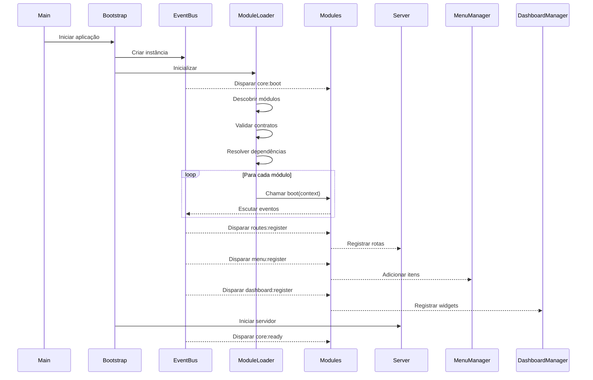
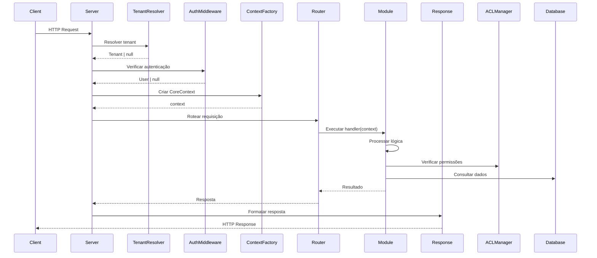
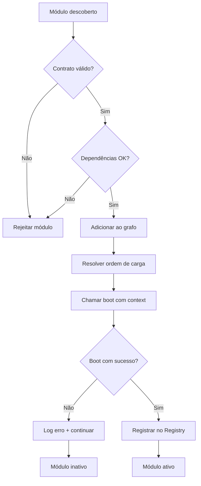

# CORE IDEAL - PLATAFORMA MODULAR SEM LIMITES

## Visão Geral

Este documento define a arquitetura de um CORE ideal para uma plataforma multi-tenant 100% modular e extensível, onde o CORE funciona exclusivamente como infraestrutura e ambiente de execução, sem regras de negócio ou lógica de módulos.

### Princípio Fundamental

**O CORE não resolve problemas de negócio. Ele apenas cria o ambiente para que módulos resolvam.**

O CORE é uma plataforma, não um sistema final. Deve ser estável, previsível, mínimo e nunca necessitar mudanças ao adicionar ou remover módulos.

---

## Responsabilidades do CORE

### 1. Infraestrutura HTTP

O CORE fornece a infraestrutura básica de servidor web:

| Componente | Responsabilidade | Detalhes |
|------------|-----------------|----------|
| **Servidor HTTP** | Gerenciar requisições e respostas | Express/Fastify com suporte a middleware |
| **Router Base** | Fornecer sistema de roteamento | Router vazio com capacidade de registro dinâmico |
| **Engine de Views** | Sistema de renderização | Suporte para React/Next.js no frontend |
| **Middleware Pipeline** | Cadeia de processamento de requisições | CORS, parsing, compressão |

O CORE **NÃO** registra rotas específicas de módulos. Apenas expõe métodos para registro.

### 2. Sistema de Eventos (Event Bus)

O Event Bus é o coração da comunicação na plataforma. O CORE dispara eventos, os módulos escutam.

#### Eventos do Core

| Evento | Momento de Disparo | Payload |
|--------|-------------------|---------|
| `core:boot` | Inicialização do sistema | `{ timestamp, environment }` |
| `core:ready` | Sistema pronto para receber requisições | `{ modules: string[] }` |
| `core:shutdown` | Desligamento do sistema | `{ reason: string }` |
| `menu:register` | Solicitação de registro de menus | `{ context: CoreContext }` |
| `dashboard:register` | Solicitação de registro de widgets | `{ context: CoreContext }` |
| `routes:register` | Solicitação de registro de rotas | `{ router: Router }` |
| `permissions:register` | Solicitação de registro de permissões | `{ acl: ACLManager }` |
| `notifications:register` | Solicitação de registro de canais | `{ notifier: NotificationManager }` |
| `tenant:resolved` | Tenant identificado na requisição | `{ tenant: Tenant, request }` |
| `user:authenticated` | Usuário autenticado com sucesso | `{ user: User, request }` |

#### Características do Event Bus

- **Síncrono para eventos críticos**: `core:boot`, `routes:register`
- **Assíncrono para eventos de notificação**: `user:authenticated`, `tenant:resolved`
- **Sem retornos**: O CORE não interpreta respostas dos listeners
- **Fire and forget**: Módulos respondem, mas não bloqueiam o CORE
- **Type-safe**: Eventos tipados com TypeScript

### 3. Contexto Global (CoreContext)

O CoreContext é um objeto imutável injetado em todos os módulos durante inicialização e disponível em requisições.

#### Estrutura do CoreContext

```
CoreContext {
  // Identificação
  tenant: Tenant | null
  user: User | null
  permissions: string[]
  
  // HTTP
  request: Request
  response: Response
  
  // Infraestrutura
  db: DatabaseConnection
  cache: CacheManager
  logger: Logger
  
  // Managers
  events: EventBus
  router: RouterManager
  notifier: NotificationManager
  menu: MenuManager
  dashboard: DashboardManager
  acl: ACLManager
  
  // Metadados
  requestId: string
  timestamp: Date
  environment: string
}
```

#### Regras do CoreContext

- **Imutável**: Uma vez criado, não pode ser modificado
- **Request-scoped**: Novo contexto para cada requisição
- **Injetado**: Passado para módulos, nunca acessado diretamente
- **Completo**: Contém tudo que um módulo precisa para operar

### 4. Loader de Módulos

O Module Loader é responsável por descobrir e inicializar módulos de forma determinística.

#### Fluxo de Carregamento

```
1. Descoberta
   ↓
   Varrer diretório /modules
   Identificar module.json válidos
   
2. Validação
   ↓
   Verificar contrato ModuleContract
   Validar dependências
   Checar compatibilidade de versão
   
3. Ordenação
   ↓
   Resolver dependências entre módulos
   Criar grafo de inicialização
   Ordenar topologicamente
   
4. Inicialização
   ↓
   Para cada módulo (em ordem):
     - Carregar código
     - Chamar module.boot(coreContext)
     - Aguardar conclusão
     
5. Verificação
   ↓
   Validar que todos módulos ativos foram carregados
   Registrar módulos no sistema
```

#### O que o Loader NUNCA faz

- Validar lógica interna dos módulos
- Forçar padrões de UI
- Bloquear funcionalidades
- Executar migrations automáticas
- Criar menus ou rotas por convenção

### 5. Sistema de Banco de Dados

O CORE fornece apenas infraestrutura de acesso a dados.

| Capacidade | Descrição |
|------------|-----------|
| **Conexão** | Pool de conexões gerenciado (Prisma/TypeORM) |
| **Transações** | API para transações ACID |
| **Query Builder** | Interface fluente para queries |
| **Helpers** | Utilitários para operações comuns |

#### APIs Expostas

```
db.connection → Conexão ativa
db.transaction(callback) → Executar transação
db.runModuleMigrations(slug) → Executar migrations de módulo (sob demanda)
db.raw(sql, params) → Query SQL direta
```

O CORE **NÃO**:
- Executa migrations de módulos automaticamente
- Versiona banco de dados de módulos
- Decide quando rodar seeds
- Conhece estrutura de tabelas de módulos

### 6. Sistema de Autenticação e ACL

O CORE fornece apenas a base para autenticação e controle de acesso.

#### Componentes de Autenticação

| Componente | Responsabilidade |
|------------|-----------------|
| **AuthProvider** | Interface para estratégias de autenticação |
| **SessionManager** | Gerenciamento de sessões |
| **TokenManager** | Criação e validação de tokens JWT |
| **PasswordManager** | Hash e validação de senhas |

#### Sistema ACL Base

```
ACL {
  roles: Map<string, Role>
  permissions: Map<string, Permission>
  
  registerRole(name, permissions)
  registerPermission(name, description)
  userHasPermission(user, permission)
  userHasRole(user, role)
  filterByPermission(items, user, permission)
}
```

Módulos registram suas próprias permissões via evento `permissions:register`.

### 7. Resolução de Multitenancy

O CORE resolve automaticamente o tenant em cada requisição.

#### Estratégias de Resolução

| Estratégia | Método de Identificação |
|------------|------------------------|
| **Subdomain** | `tenant1.plataforma.com` |
| **Header** | `X-Tenant-ID: uuid` |
| **Path** | `/t/tenant-slug/resource` |
| **Token** | JWT contém tenantId |

#### Fluxo de Resolução

```
Requisição recebida
  ↓
TenantResolver.resolve(request)
  ↓
Tenant identificado ou null
  ↓
Injeta no CoreContext
  ↓
Dispara evento tenant:resolved
  ↓
Módulos podem reagir (logs, analytics, etc)
```

O CORE **NUNCA** decide o que mostrar baseado no tenant. Apenas resolve e injeta no contexto.

### 8. Managers de UI (Menu, Dashboard, Notificações)

O CORE fornece managers que agregam contribuições de módulos.

#### MenuManager

```
MenuManager {
  items: MenuItem[]
  
  add(item: MenuItem) → void
  remove(id: string) → void
  getItems(user: User) → MenuItem[]
  clear() → void
}
```

#### DashboardManager

```
DashboardManager {
  widgets: DashboardWidget[]
  
  addWidget(widget: DashboardWidget) → void
  removeWidget(id: string) → void
  getWidgets(user: User) → DashboardWidget[]
  clear() → void
}
```

#### NotificationManager

```
NotificationManager {
  channels: Map<string, NotificationChannel>
  
  registerChannel(name, handler) → void
  send(channel, message, targets) → Promise<void>
  broadcast(message) → Promise<void>
}
```

Todos os managers:
- **Agregam** contribuições de módulos
- **Filtram** baseado em permissões do usuário
- **Nunca decidem** o que mostrar
- **Delegam** renderização para módulos

---

## Contrato de Módulo (ModuleContract)

### Interface Mínima Obrigatória

Todo módulo deve implementar:

```
interface ModuleContract {
  // Identificação (OBRIGATÓRIO)
  name: string        // Nome técnico único (ex: "crm")
  slug: string        // Identificador URL-safe (ex: "crm")
  version: string     // Semantic versioning (ex: "1.2.3")
  
  // Metadados (OBRIGATÓRIO)
  displayName: string      // Nome apresentável
  description: string      // Descrição curta
  author: string          // Autor/Organização
  
  // Lifecycle (OBRIGATÓRIO)
  boot(context: CoreContext): Promise<void> | void
  
  // Lifecycle (OPCIONAL)
  shutdown?(): Promise<void> | void
  
  // Dependências (OPCIONAL)
  dependencies?: {
    modules?: string[]     // Outros módulos necessários
    coreVersion?: string   // Versão mínima do core
  }
}
```

### Método boot()

O método `boot()` é o único ponto de entrada garantido pelo CORE. Dentro dele, o módulo pode:

1. Registrar rotas escutando `routes:register`
2. Adicionar itens ao menu via `MenuManager`
3. Registrar widgets no dashboard
4. Configurar permissões
5. Inicializar serviços internos

**O CORE não executa nada além de chamar boot(context).**

---

## Estrutura de Diretórios do CORE

```
core/
├── bootstrap/
│   ├── app.ts                    # Inicialização da aplicação
│   ├── environment.ts            # Configuração de ambiente
│   └── error-handler.ts          # Tratamento global de erros
│
├── http/
│   ├── server.ts                 # Servidor HTTP
│   ├── router.ts                 # Router base
│   ├── middleware/
│   │   ├── cors.ts
│   │   ├── parser.ts
│   │   ├── compression.ts
│   │   └── helmet.ts
│   └── response.ts               # Helpers de resposta
│
├── events/
│   ├── EventBus.ts               # Sistema de eventos
│   ├── EventEmitter.ts           # Emissor de eventos
│   └── event-types.ts            # Definições de eventos
│
├── context/
│   ├── CoreContext.ts            # Contexto global
│   ├── ContextFactory.ts         # Criador de contextos
│   └── RequestContext.ts         # Contexto de requisição
│
├── modules/
│   ├── ModuleLoader.ts           # Carregador de módulos
│   ├── ModuleRegistry.ts         # Registro de módulos
│   ├── ModuleValidator.ts        # Validador de contratos
│   └── DependencyResolver.ts     # Resolvedor de dependências
│
├── database/
│   ├── Connection.ts             # Gerenciador de conexão
│   ├── Transaction.ts            # Wrapper de transações
│   ├── QueryBuilder.ts           # Builder de queries
│   └── MigrationRunner.ts        # Executor de migrations
│
├── auth/
│   ├── AuthProvider.ts           # Interface de autenticação
│   ├── SessionManager.ts         # Gerenciador de sessões
│   ├── TokenManager.ts           # Gerenciador de tokens
│   └── PasswordManager.ts        # Gerenciador de senhas
│
├── acl/
│   ├── ACLManager.ts             # Gerenciador de ACL
│   ├── Role.ts                   # Modelo de papel
│   ├── Permission.ts             # Modelo de permissão
│   └── PermissionChecker.ts      # Verificador de permissões
│
├── ui/
│   ├── MenuManager.ts            # Gerenciador de menus
│   ├── DashboardManager.ts       # Gerenciador de dashboard
│   └── NotificationManager.ts    # Gerenciador de notificações
│
├── tenant/
│   ├── TenantResolver.ts         # Resolvedor de tenant
│   ├── TenantContext.ts          # Contexto de tenant
│   └── strategies/
│       ├── SubdomainStrategy.ts
│       ├── HeaderStrategy.ts
│       ├── PathStrategy.ts
│       └── TokenStrategy.ts
│
├── cache/
│   ├── CacheManager.ts           # Gerenciador de cache
│   └── adapters/
│       ├── RedisAdapter.ts
│       └── MemoryAdapter.ts
│
├── logger/
│   ├── Logger.ts                 # Sistema de logging
│   └── LogFormatter.ts           # Formatador de logs
│
└── contracts/
    ├── ModuleContract.ts         # Contrato de módulo
    ├── MenuItem.ts               # Interface de item de menu
    ├── DashboardWidget.ts        # Interface de widget
    ├── NotificationChannel.ts    # Interface de canal
    └── types.ts                  # Tipos compartilhados
```

---

## Fluxo de Execução Completo

### Inicialização do Sistema



### Processamento de Requisição



### Registro de Módulo



---

## Regras de Funcionamento

### O QUE O CORE PODE FAZER

- ✅ Fornecer infraestrutura HTTP, eventos, banco de dados
- ✅ Criar e injetar CoreContext em módulos
- ✅ Disparar eventos em momentos definidos
- ✅ Carregar módulos que implementam ModuleContract
- ✅ Resolver tenant automaticamente
- ✅ Gerenciar autenticação base (tokens, sessões)
- ✅ Fornecer managers para agregação (Menu, Dashboard, Notificações)
- ✅ Executar migrations de módulo **sob demanda explícita**
- ✅ Logar eventos do sistema
- ✅ Tratar erros globalmente

### O QUE O CORE NUNCA PODE FAZER

- ❌ Criar regras de negócio
- ❌ Conhecer nomes específicos de módulos no código
- ❌ Criar menus fixos hardcoded
- ❌ Criar dashboards específicos
- ❌ Executar lógica condicional baseada em módulos (`if (module === 'x')`)
- ❌ Forçar estruturas de UI nos módulos
- ❌ Decidir o que mostrar baseado no tenant
- ❌ Executar migrations de módulo automaticamente
- ❌ Interpretar respostas de eventos
- ❌ Bloquear funcionalidades de módulos

### O QUE OS MÓDULOS FAZEM

- ✅ Implementar ModuleContract
- ✅ Escutar eventos do CORE
- ✅ Registrar rotas quando solicitado
- ✅ Adicionar itens ao MenuManager
- ✅ Registrar widgets no DashboardManager
- ✅ Declarar permissões via ACLManager
- ✅ Criar suas próprias páginas, componentes e serviços
- ✅ Expor páginas públicas se necessário
- ✅ Criar APIs próprias
- ✅ Gerar notificações customizadas
- ✅ Implementar lógica de negócio específica

### O QUE OS MÓDULOS NUNCA FAZEM

- ❌ Modificar arquivos do CORE
- ❌ Acessar estruturas internas do CORE diretamente
- ❌ Tomar decisões sobre renderização global
- ❌ Fazer auto-discovery de outros módulos
- ❌ Executar código antes de boot() ser chamado

---

## Exemplos de Uso

### Módulo Registrando Rotas

```
// No arquivo boot.ts do módulo CRM

export async function boot(context: CoreContext): Promise<void> {
  // Escutar evento de registro de rotas
  context.events.on('routes:register', ({ router }) => {
    // Registrar rotas do módulo
    router.get('/crm/customers', async (req, res) => {
      const customers = await getCustomers(context.db, context.tenant);
      res.json(customers);
    });
    
    router.post('/crm/customers', async (req, res) => {
      const customer = await createCustomer(context.db, context.tenant, req.body);
      res.json(customer);
    });
  });
}
```

### Módulo Adicionando Menu

```
export async function boot(context: CoreContext): Promise<void> {
  // Adicionar item ao menu
  context.menu.add({
    id: 'crm-customers',
    label: 'Clientes',
    icon: 'users',
    href: '/crm/customers',
    order: 10,
    permissions: ['crm.customers.view'],
    roles: ['ADMIN', 'USER']
  });
  
  context.menu.add({
    id: 'crm-deals',
    label: 'Negociações',
    icon: 'briefcase',
    href: '/crm/deals',
    order: 11,
    permissions: ['crm.deals.view']
  });
}
```

### Módulo Registrando Widget de Dashboard

```
export async function boot(context: CoreContext): Promise<void> {
  // Escutar evento de dashboard
  context.events.on('dashboard:register', () => {
    context.dashboard.addWidget({
      id: 'crm-summary',
      title: 'Resumo CRM',
      component: 'CRMSummaryWidget',
      size: 'medium',
      order: 5,
      permissions: ['crm.dashboard.view'],
      refresh: 60000 // Atualiza a cada 60s
    });
  });
}
```

### Módulo Criando Página Pública

```
export async function boot(context: CoreContext): Promise<void> {
  context.events.on('routes:register', ({ router }) => {
    // Rota pública sem autenticação
    router.get('/public/catalog', async (req, res) => {
      const products = await getPublicProducts(context.db, context.tenant);
      res.render('catalog', { products });
    });
    
    // Rota pública por tenant
    router.get('/public/:tenantSlug/products', async (req, res) => {
      const tenant = await resolveTenantBySlug(req.params.tenantSlug);
      const products = await getPublicProducts(context.db, tenant);
      res.render('products', { products, tenant });
    });
  });
}
```

### Módulo Gerando Notificação

```
export async function createOrder(context: CoreContext, data: OrderData) {
  const order = await context.db.orders.create(data);
  
  // Enviar notificação customizada
  await context.notifier.send('email', {
    to: data.customerEmail,
    subject: 'Pedido criado com sucesso',
    template: 'order-confirmation',
    data: { order }
  });
  
  // Broadcast para admins
  await context.notifier.broadcast({
    type: 'order.created',
    message: `Novo pedido #${order.id}`,
    target: 'admins',
    data: { orderId: order.id }
  });
  
  return order;
}
```

---

## Testabilidade

### CORE Testável Isoladamente

O CORE deve funcionar sem nenhum módulo carregado:

```
Teste: Inicializar CORE sem módulos
  ✓ Servidor HTTP inicia
  ✓ Event Bus está ativo
  ✓ Database connection estabelecida
  ✓ Rotas base funcionam (/health, /metrics)
  ✓ Sistema responde requisições
```

### Módulos Testáveis Isoladamente

Módulos devem ser testáveis sem o CORE completo:

```
Teste: Módulo CRM isolado
  ✓ boot() executa sem erros
  ✓ Registra rotas corretamente
  ✓ Adiciona itens ao menu
  ✓ Valida permissões
  ✓ Funciona com mock de CoreContext
```

### Testes de Integração

```
Teste: CORE + Módulo CRM
  ✓ Módulo carregado na inicialização
  ✓ Rotas acessíveis via HTTP
  ✓ Menu contém itens do CRM
  ✓ Dashboard contém widgets do CRM
  ✓ Permissões funcionam corretamente
```

---

## Critério de Sucesso Final

### Teste de Extensibilidade

Se amanhã um módulo precisar:

- ✅ Criar rotas públicas complexas → CORE não muda
- ✅ Gerar notificações customizadas → CORE não muda
- ✅ Criar dashboards próprios → CORE não muda
- ✅ Expor páginas por tenant → CORE não muda
- ✅ Criar APIs REST/GraphQL → CORE não muda
- ✅ Implementar SSE/WebSockets → CORE não muda
- ✅ Gerar relatórios em background → CORE não muda
- ✅ Integrar com serviços externos → CORE não muda

**Então o CORE está correto.**

### Métricas de Qualidade

| Métrica | Objetivo |
|---------|----------|
| **Estabilidade** | 0 mudanças no CORE ao adicionar módulos |
| **Acoplamento** | CORE não conhece módulos específicos |
| **Cobertura de Testes** | > 90% do código do CORE |
| **Tempo de Boot** | < 2s com 10 módulos |
| **Documentação** | 100% das APIs públicas documentadas |
| **Compatibilidade** | Versionamento semântico estrito |

---

## Justificativas Técnicas

### Por que Event Bus em vez de Importações Diretas?

**Problema**: Importações diretas criam acoplamento forte entre CORE e módulos.

**Solução**: Event Bus permite comunicação assíncrona e desacoplada. Módulos podem vir e ir sem quebrar o CORE.

### Por que CoreContext Imutável?

**Problema**: Contextos mutáveis levam a efeitos colaterais imprevisíveis.

**Solução**: Imutabilidade garante que cada módulo recebe um estado consistente e previsível.

### Por que Não Auto-Executar Migrations?

**Problema**: Migrations automáticas podem falhar e quebrar toda a aplicação.

**Solução**: Módulos solicitam explicitamente execução de migrations. CORE apenas fornece a ferramenta, não decide quando usar.

### Por que Managers em vez de Hooks?

**Problema**: Hooks criam lógica mágica e implícita.

**Solução**: Managers fornecem APIs explícitas onde módulos registram contribuições de forma clara e determinística.

### Por que Resolver Tenant no CORE?

**Problema**: Cada módulo resolver tenant de forma diferente cria inconsistência.

**Solução**: CORE resolve uma única vez e injeta no contexto. Todos módulos trabalham com a mesma informação.

### Por que Não Permitir if (module === 'x')?

**Problema**: Condicionais baseadas em módulos específicos criam dependências implícitas e tornam o CORE instável.

**Solução**: CORE trata todos módulos igualmente. Qualquer comportamento específico deve estar no próprio módulo.

---

## Comparação com Arquitetura Atual

| Aspecto | Arquitetura Atual | CORE Ideal |
|---------|-------------------|------------|
| **Descoberta de Módulos** | Auto-loader com `readdirSync` | Contrato explícito + validação |
| **Comunicação** | Importações diretas | Event Bus |
| **Menus** | Hardcoded no CORE | MenuManager + contribuições |
| **Dashboard** | Componentes fixos | DashboardManager + widgets |
| **Rotas** | Misto de fixas e dinâmicas | 100% registradas por módulos |
| **Migrations** | Execução automática | Sob demanda explícita |
| **Contexto** | Espalhado em múltiplos lugares | CoreContext centralizado |
| **Testabilidade** | Acoplada | Totalmente isolável |
| **Estabilidade** | Requer mudanças ao adicionar módulos | Zero mudanças no CORE |

---

## Próximos Passos para Implementação

### Fase 1: Fundação do CORE

- Implementar Event Bus
- Criar CoreContext e ContextFactory
- Desenvolver ModuleLoader com validação de contratos
- Estabelecer estrutura de diretórios

### Fase 2: Infraestrutura Básica

- Configurar servidor HTTP com Router base
- Implementar TenantResolver com estratégias
- Criar sistema de autenticação base
- Desenvolver ACLManager

### Fase 3: Managers de UI

- Implementar MenuManager
- Desenvolver DashboardManager
- Criar NotificationManager
- Integrar com Event Bus

### Fase 4: Migração de Módulos

- Refatorar módulo CORE para seguir ModuleContract
- Migrar módulos existentes para novo padrão
- Remover lógica hardcoded
- Validar funcionamento

### Fase 5: Testes e Documentação

- Criar testes unitários do CORE
- Desenvolver testes de integração
- Documentar todas as APIs públicas
- Criar guias para desenvolvimento de módulos

---

## Conclusão

Este design define um CORE que funciona como uma **plataforma verdadeiramente modular**, onde:

- O CORE fornece infraestrutura, não regras de negócio
- Módulos são cidadãos de primeira classe
- A comunicação é desacoplada via eventos
- O sistema é previsível e determinístico
- Não há limites para o que módulos podem fazer
- Adicionar ou remover módulos não requer mudanças no CORE

**O CORE é estável. Os módulos são livres.**
- Documentar todas as APIs públicas
- Criar guias para desenvolvimento de módulos

---

## Conclusão

Este design define um CORE que funciona como uma **plataforma verdadeiramente modular**, onde:

- O CORE fornece infraestrutura, não regras de negócio
- Módulos são cidadãos de primeira classe
- A comunicação é desacoplada via eventos
- O sistema é previsível e determinístico
- Não há limites para o que módulos podem fazer
- Adicionar ou remover módulos não requer mudanças no CORE

**O CORE é estável. Os módulos são livres.**
