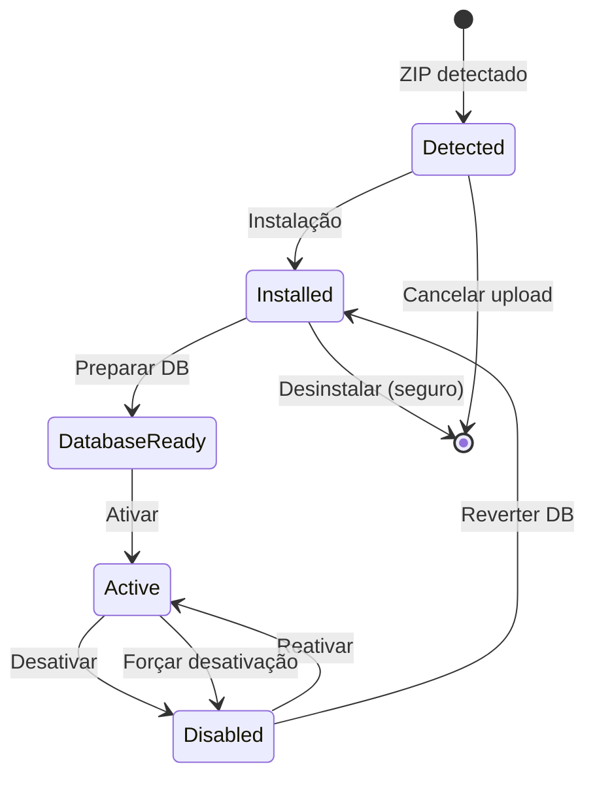
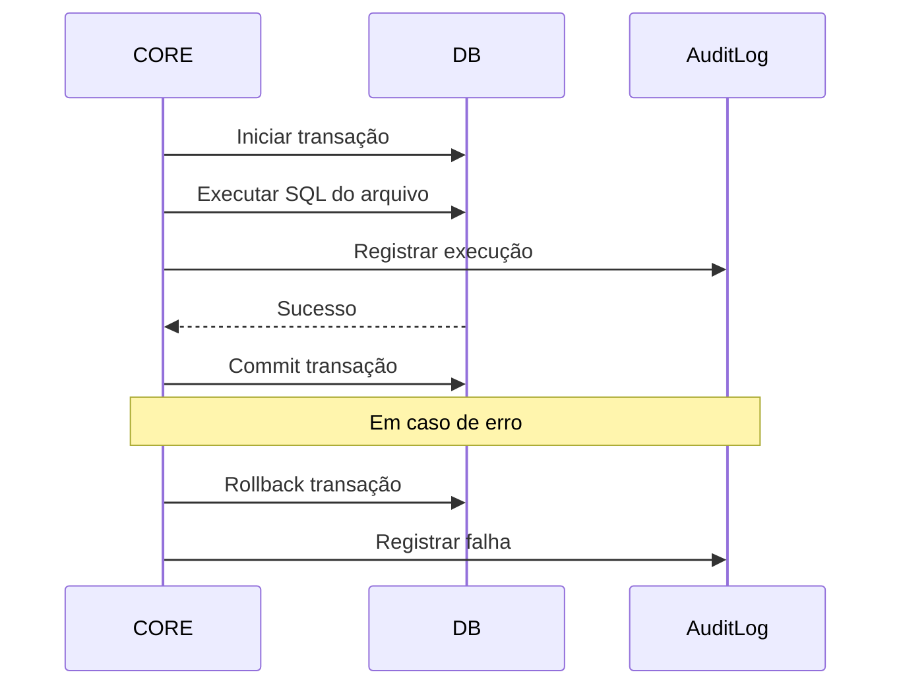
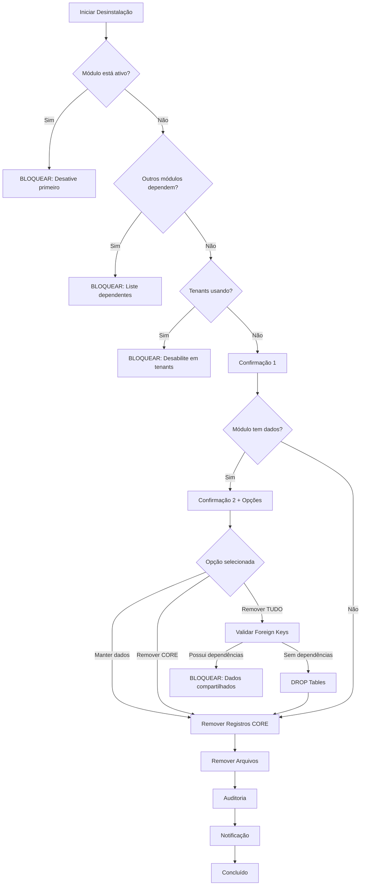

# Design: Ciclo de Vida de Instalação e Desinstalação de Módulos

## Contexto

O sistema atual possui uma arquitetura modular com CORE soberano, onde módulos podem ser instalados, ativados, desativados e desinstalados. Atualmente, o fluxo não separa claramente as responsabilidades de cada fase do ciclo de vida, misturando instalação com execução de código e desinstalação com remoção destrutiva de dados.

## Problema

O processo atual apresenta as seguintes lacunas:

- Instalação executa código do módulo imediatamente (migrations/seeds) sem controle explícito
- Não há separação clara entre instalar, preparar banco de dados e ativar
- Desinstalação não valida dependências entre módulos
- Não há proteção contra remoção de dados compartilhados ou tabelas em uso
- Falta mecanismo de confirmação dupla para ações destrutivas
- Ausência de validação de módulos dependentes antes da remoção

## Objetivos

Estabelecer um ciclo de vida seguro, previsível e auditável para módulos, onde:

- Instalação é não-destrutiva e não executa código do módulo
- Preparação de banco é explícita e controlada
- Ativação é separada da instalação
- Desinstalação é segura, validada e não remove dados sem confirmação

## Princípios Fundamentais

### Separação de Responsabilidades

- **Instalar**: Tornar o módulo disponível no sistema
- **Preparar Banco**: Executar migrations e seeds sob demanda explícita
- **Ativar**: Habilitar funcionalidades do módulo (rotas, menus, eventos)
- **Desativar**: Desligar funcionalidades sem remover dados
- **Desinstalar**: Remover módulo do sistema de forma segura

### Segurança por Padrão

- Nenhuma operação destrutiva ocorre automaticamente
- Validações em cascata antes de qualquer remoção
- Confirmação dupla para ações irreversíveis
- Auditoria completa de todas as operações

### Reversibilidade

- Instalação pode ser revertida sem impacto
- Preparação de banco não é destrutiva
- Desativação preserva estado para reativação
- Desinstalação permite opção de manter dados

## Ciclo de Vida Completo

### Diagrama de Estados



### Estados do Módulo

| Estado | Descrição | Banco de Dados | Rotas/Menus | Pode Ativar |
|--------|-----------|----------------|-------------|-------------|
| **detected** | ZIP enviado, validação pendente | Não | Não | Não |
| **installed** | Arquivos extraídos, registrado | Não | Não | Não |
| **db_ready** | Migrations/seeds executados | Sim | Não | Sim |
| **active** | Módulo em operação | Sim | Sim | N/A |
| **disabled** | Desligado temporariamente | Sim | Não | Sim |

## Fase 1: Instalação

### Objetivo

Tornar o módulo disponível no sistema sem executar código ou impactar banco de dados.

### Processo de Instalação

#### Etapa 1.1: Upload e Validação

**Entrada**: Arquivo ZIP enviado por SUPER_ADMIN

**Validações Obrigatórias**:

| Validação | Critério | Ação se Falhar |
|-----------|----------|----------------|
| Formato do arquivo | Extensão .zip válida | Rejeitar upload |
| Tamanho do arquivo | Máximo 50MB | Rejeitar upload |
| Estrutura interna | Presença de module.json | Rejeitar extração |
| Slug único | Não existe módulo com mesmo slug | Rejeitar instalação |
| Campos obrigatórios | slug, name, version presentes | Rejeitar instalação |
| Nomenclatura do slug | Apenas [a-zA-Z0-9_-] | Rejeitar instalação |

**Resultado**: ZIP validado e pronto para extração

#### Etapa 1.2: Extração de Arquivos

**Ações**:

- Criar diretório temporário em `uploads/modules/temp_{timestamp}_{slug}`
- Extrair conteúdo do ZIP
- Validar estrutura do module.json
- Mover para `modules/{slug}` apenas após validação completa

**Proteções**:

- Nenhum arquivo executável é processado durante extração
- Nenhuma migration ou seed é executada
- Nenhum script NPM é disparado

#### Etapa 1.3: Registro no Banco

**Dados Registrados na Tabela `modules`**:

| Campo | Valor | Observação |
|-------|-------|------------|
| slug | Do module.json | Identificador único |
| name | Do module.json | Nome de exibição |
| version | Do module.json | Versão declarada |
| description | Do module.json (opcional) | Descrição textual |
| status | `installed` | Estado inicial seguro |
| hasBackend | Boolean | Verifica existência de pasta backend/ |
| hasFrontend | Boolean | Verifica existência de pasta frontend/ |
| installedAt | DateTime.now() | Timestamp da instalação |
| activatedAt | null | Ainda não ativado |

**Dados Registrados na Tabela `module_menus`**:

- Registra menus declarados no module.json
- Menus ficam INATIVOS (não são retornados pela API ainda)
- Apenas metadados são armazenados

**Observação Importante**: Nenhum código do módulo é executado nesta fase

#### Etapa 1.4: Notificação

**Criar Notificação**:

| Campo | Valor |
|-------|-------|
| title | "Módulo Instalado" |
| message | "Módulo {name} instalado. Execute preparação de banco antes de ativar." |
| severity | info |
| audience | super_admin |
| source | core |
| module | {slug} |

### Resultado da Instalação

- Módulo disponível no sistema (status: `installed`)
- Arquivos extraídos em `modules/{slug}`
- Registro completo no banco de dados
- Nenhum impacto em tenants ou banco de dados funcional
- Módulo NÃO está ativo

## Fase 2: Preparação de Banco de Dados

### Objetivo

Executar migrations e seeds do módulo sob demanda explícita do SUPER_ADMIN.

### Pré-requisitos

| Validação | Critério |
|-----------|----------|
| Status do módulo | Deve ser `installed` |
| Permissão | Apenas SUPER_ADMIN |
| Confirmação | Usuário deve confirmar a ação |

### Processo de Preparação

#### Etapa 2.1: Escanear Migrations

**Localização**: `modules/{slug}/migrations/*.sql`

**Processamento**:

- Listar todos os arquivos .sql
- Ordenar por nome (convenção: `001_descricao.sql`, `002_descricao.sql`)
- Verificar quais já foram executados na tabela `module_migrations`
- Identificar apenas migrations pendentes

#### Etapa 2.2: Executar Migrations Pendentes

**Para cada migration pendente**:



**Registro na Tabela `module_migrations`**:

| Campo | Valor |
|-------|-------|
| moduleId | ID do módulo |
| filename | Nome do arquivo .sql |
| type | `migration` |
| executedAt | DateTime.now() |

**Tratamento de Erro**:

- Se qualquer migration falhar, interromper processo
- Não registrar migrations não executadas
- Manter status do módulo como `installed`
- Criar notificação de erro

#### Etapa 2.3: Escanear Seeds

**Localização**: `modules/{slug}/seeds/*.sql`

**Processamento**: Idêntico às migrations, mas com type = `seed`

#### Etapa 2.4: Atualizar Status

**Após execução bem-sucedida**:

- Atualizar `modules.status` para `db_ready`
- Criar notificação de sucesso

### Proteções de Segurança

| Proteção | Implementação |
|----------|---------------|
| Operações destrutivas | Apenas DDL permitido (CREATE, ALTER), DROP requer flag especial |
| Integridade de dados | Transações garantem atomicidade |
| Re-execução | Checksum de arquivos impede execução duplicada |
| Auditoria | Todos os logs são preservados |

### Resultado da Preparação

- Banco de dados contém tabelas/dados do módulo
- Módulo marcado como `db_ready`
- Módulo ainda NÃO está ativo
- Pronto para ativação

## Fase 3: Ativação

### Objetivo

Habilitar o módulo para uso funcional no sistema.

### Pré-requisitos

| Validação | Critério |
|-----------|----------|
| Status do módulo | Deve ser `db_ready` |
| Dependências | Todos os módulos requeridos devem estar ativos |
| Permissão | Apenas SUPER_ADMIN |

### Processo de Ativação

#### Etapa 3.1: Validar Dependências

**Se module.json declara dependências**:

```
{
  "dependencies": ["modulo-base", "modulo-comum"]
}
```

**Validações**:

- Todos os módulos da lista devem existir
- Todos os módulos da lista devem ter status `active`
- Se qualquer dependência estiver ausente ou inativa, BLOQUEAR ativação

#### Etapa 3.2: Ativar Backend (se hasBackend = true)

**Ações do CORE**:

- Carregar rotas do módulo
- Registrar controllers no Express
- Habilitar middlewares declarados
- Inicializar serviços do módulo

#### Etapa 3.3: Ativar Frontend (se hasFrontend = true)

**Ações do CORE**:

- Menus do módulo passam a ser retornados pela API `/me/modules`
- Componentes do módulo ficam disponíveis para roteamento
- Widgets/notificações são habilitados

#### Etapa 3.4: Atualizar Status

**Registro no banco**:

| Campo | Valor |
|-------|-------|
| status | `active` |
| activatedAt | DateTime.now() |

#### Etapa 3.5: Notificação

**Criar notificação**:

| Campo | Valor |
|-------|-------|
| title | "Módulo Ativado" |
| message | "Módulo {name} está agora operacional" |
| severity | info |
| audience | super_admin |

### Resultado da Ativação

- Módulo totalmente funcional
- Rotas e menus disponíveis
- Integrações ativas

## Fase 4: Desativação

### Objetivo

Desligar funcionalidades do módulo sem remover dados ou arquivos.

### Processo de Desativação

#### Etapa 4.1: Validar Dependências Inversas

**Verificar se outros módulos dependem deste**:

- Se módulo X depende do módulo sendo desativado
- E módulo X está `active`
- Então BLOQUEAR desativação

**Mensagem de erro**: "Não é possível desativar. Módulos dependentes: {lista}"

#### Etapa 4.2: Desligar Backend

**Ações**:

- Remover rotas do Express
- Desregistrar controllers
- Finalizar serviços (chamar método shutdown se declarado)

#### Etapa 4.3: Desligar Frontend

**Ações**:

- Menus do módulo não são mais retornados pela API
- Componentes não são carregados

#### Etapa 4.4: Atualizar Status

| Campo | Valor |
|-------|-------|
| status | `disabled` |
| activatedAt | null |

### Resultado da Desativação

- Módulo não está funcional
- Dados preservados no banco
- Arquivos preservados em `modules/{slug}`
- Pode ser reativado sem re-executar migrations

## Fase 5: Desinstalação (CRÍTICA)

### Objetivo

Remover módulo do sistema de forma segura, sem deixar lixo e sem impactar outros módulos ou dados compartilhados.

### Filosofia

**Desinstalação NUNCA pode ser agressiva por padrão**

- Não remove tabelas automaticamente
- Não remove dados compartilhados
- Não quebra outros módulos

### Processo de Desinstalação

#### Etapa 5.1: Pré-validações Bloqueantes

**Validações que BLOQUEIAM desinstalação**:

| Validação | Critério | Mensagem de Erro |
|-----------|----------|------------------|
| Status do módulo | Deve estar `disabled` ou `installed` | "Desative o módulo antes de desinstalar" |
| Dependências inversas | Nenhum módulo ativo depende deste | "Módulos dependentes: {lista}. Desative-os primeiro" |
| Tenants ativos | Nenhum tenant possui módulo habilitado | "Módulo em uso por {X} tenant(s). Desabilite primeiro" |
| Permissão | Apenas SUPER_ADMIN | "Acesso negado" |

#### Etapa 5.2: Análise de Dados Compartilhados

**Detectar tabelas compartilhadas**:

- Se módulo possui tabela com foreign keys de outros módulos
- Se módulo possui dados em tabelas do CORE
- Marcar como PROTEGIDAS

**Exemplo**: Módulo que criou registros em `notifications` (tabela do CORE)

#### Etapa 5.3: Confirmação Dupla (Interface)

**Primeira confirmação**:

```
Deseja desinstalar o módulo {name}?
Esta ação não pode ser desfeita.
[Cancelar] [Continuar]
```

**Segunda confirmação (se módulo tiver dados)**:

```
⚠️ ATENÇÃO: Este módulo possui dados no banco

O que deseja fazer com os dados?
( ) Manter dados e tabelas (seguro)
( ) Remover APENAS registros do CORE (módulo, menus, migrations)
( ) Remover TUDO incluindo tabelas do módulo (DESTRUTIVO)

Digite o nome do módulo para confirmar: _______

[Cancelar] [Confirmar Remoção]
```

#### Etapa 5.4: Remoção em Camadas

##### Camada 1: Remover Registros do CORE (SEMPRE)

**Tabelas afetadas**:

- `modules` (registro do módulo)
- `module_menus` (menus declarados)
- `module_migrations` (histórico de migrations)
- `module_tenant` (associações com tenants)

**Ação**: DELETE em cascata (configurado no Prisma com onDelete: Cascade)

##### Camada 2: Remover Tabelas do Módulo (CONDICIONAL)

**Se opção "Remover TUDO" foi selecionada**:

- Buscar lista de tabelas criadas pelo módulo (via análise de migrations)
- Para cada tabela:
  - Verificar se está sendo referenciada por outros módulos
  - Se SIM: BLOQUEAR remoção com mensagem clara
  - Se NÃO: Executar DROP TABLE

**Se módulo declarou `allowDataRemoval: true` no module.json**:

- Buscar arquivo `rollback.sql` ou `uninstall.sql` no módulo
- Executar script de limpeza customizado do módulo

##### Camada 3: Remover Arquivos

**Arquivos removidos**:

- Diretório completo `modules/{slug}`

**Arquivos preservados**:

- Uploads do módulo em `uploads/{slug}` (se existir)
- Assets compartilhados
- Configurações em outras pastas

#### Etapa 5.5: Auditoria Completa

**Registrar na tabela `update_logs` ou equivalente**:

| Campo | Valor |
|-------|-------|
| action | `module_uninstall` |
| moduleName | {slug} |
| moduleVersion | {version} |
| executedBy | ID do SUPER_ADMIN |
| dataRemovalOption | `keep` / `core_only` / `full` |
| tablesRemoved | Lista de tabelas removidas (JSON) |
| filesRemoved | Caminho do diretório removido |
| timestamp | DateTime.now() |

#### Etapa 5.6: Notificação

**Criar notificação**:

| Campo | Valor |
|-------|-------|
| title | "Módulo Desinstalado" |
| message | "Módulo {name} foi removido do sistema" |
| severity | warning |
| audience | super_admin |

### Proteções Obrigatórias

| Proteção | Implementação |
|----------|---------------|
| Tabelas globais | NUNCA são removidas (tenants, users, etc) |
| Dados compartilhados | Foreign keys são validadas antes de DROP |
| Confirmação dupla | Interface exige digitação do nome do módulo |
| Rollback customizado | Módulo pode declarar script de limpeza |
| Auditoria | Todas as ações são registradas |

### Fluxo de Decisão de Desinstalação



### Resultado da Desinstalação

- Módulo removido do sistema
- Registros do CORE limpos
- Opcionalmente: tabelas e dados removidos
- Sistema funcional e sem lixo
- Auditoria completa preservada

## Tabelas do Banco de Dados

### Tabela `modules`

| Campo | Tipo | Descrição |
|-------|------|-----------|
| id | UUID | Identificador único |
| slug | String | Slug único do módulo |
| name | String | Nome de exibição |
| version | String | Versão atual |
| description | String? | Descrição opcional |
| status | ModuleStatus | Estado do ciclo de vida |
| hasBackend | Boolean | Possui código backend |
| hasFrontend | Boolean | Possui código frontend |
| installedAt | DateTime | Timestamp de instalação |
| activatedAt | DateTime? | Timestamp de ativação |
| createdAt | DateTime | Criação do registro |
| updatedAt | DateTime | Última atualização |

**Enum ModuleStatus**: `detected | installed | db_ready | active | disabled`

### Tabela `module_migrations`

| Campo | Tipo | Descrição |
|-------|------|-----------|
| id | UUID | Identificador único |
| moduleId | UUID | FK para modules |
| filename | String | Nome do arquivo .sql |
| type | MigrationType | `migration` ou `seed` |
| executedAt | DateTime? | Quando foi executado |
| createdAt | DateTime | Criação do registro |
| updatedAt | DateTime | Última atualização |

**Constraint único**: `moduleId + filename + type`

### Tabela `module_menus`

| Campo | Tipo | Descrição |
|-------|------|-----------|
| id | UUID | Identificador único |
| moduleId | UUID | FK para modules |
| label | String | Texto do menu |
| icon | String | Nome do ícone |
| route | String | Rota da aplicação |
| parentId | UUID? | Menu pai (hierarquia) |
| order | Int | Ordem de exibição |
| permission | String? | Permissão requerida |
| isUserMenu | Boolean | Se aparece no menu do usuário |

### Tabela `module_tenant`

| Campo | Tipo | Descrição |
|-------|------|-----------|
| id | UUID | Identificador único |
| moduleId | UUID | FK para modules |
| tenantId | UUID | FK para tenants |
| enabled | Boolean | Se está habilitado |
| createdAt | DateTime | Criação do registro |
| updatedAt | DateTime | Última atualização |

**Constraint único**: `moduleId + tenantId`

## Endpoints da API

### GET /configuracoes/sistema/modulos

**Descrição**: Lista todos os módulos instalados

**Permissão**: SUPER_ADMIN

**Response**:

```
{
  "modules": [
    {
      "slug": "sistema",
      "name": "Sistema",
      "version": "1.0.0",
      "status": "active",
      "hasBackend": true,
      "hasFrontend": true,
      "installedAt": "2025-01-15T10:00:00Z",
      "activatedAt": "2025-01-15T10:05:00Z",
      "stats": {
        "tenants": 5,
        "migrations": 12,
        "menus": 8
      }
    }
  ]
}
```

### POST /configuracoes/sistema/modulos/upload

**Descrição**: Faz upload e instalação de módulo

**Permissão**: SUPER_ADMIN

**Request**: `multipart/form-data` com campo `file` (ZIP)

**Response**:

```
{
  "success": true,
  "module": {
    "slug": "novo-modulo",
    "name": "Novo Módulo",
    "version": "1.0.0",
    "status": "installed"
  },
  "message": "Módulo instalado. Execute preparação de banco antes de ativar."
}
```

### POST /configuracoes/sistema/modulos/:slug/update-db

**Descrição**: Executa migrations e seeds do módulo

**Permissão**: SUPER_ADMIN

**Response**:

```
{
  "success": true,
  "executed": {
    "migrations": 3,
    "seeds": 1
  },
  "message": "Banco de dados atualizado"
}
```

### POST /configuracoes/sistema/modulos/:slug/activate

**Descrição**: Ativa um módulo

**Permissão**: SUPER_ADMIN

**Pré-requisitos**: status = `db_ready`

**Response**:

```
{
  "success": true,
  "message": "Módulo ativado"
}
```

### POST /configuracoes/sistema/modulos/:slug/deactivate

**Descrição**: Desativa um módulo

**Permissão**: SUPER_ADMIN

**Response**:

```
{
  "success": true,
  "message": "Módulo desativado"
}
```

### DELETE /configuracoes/sistema/modulos/:slug/uninstall

**Descrição**: Desinstala um módulo

**Permissão**: SUPER_ADMIN

**Request Body**:

```
{
  "dataRemovalOption": "keep" | "core_only" | "full",
  "confirmationName": "nome-do-modulo"
}
```

**Response**:

```
{
  "success": true,
  "removed": {
    "coreRecords": true,
    "tables": ["example_items"],
    "files": "/modules/example-module"
  },
  "message": "Módulo desinstalado"
}
```

### GET /configuracoes/sistema/modulos/:slug/status

**Descrição**: Obtém status detalhado de um módulo

**Permissão**: SUPER_ADMIN

**Response**:

```
{
  "module": {
    "slug": "sistema",
    "name": "Sistema",
    "version": "1.0.0",
    "status": "active",
    "hasBackend": true,
    "hasFrontend": true,
    "installedAt": "2025-01-15T10:00:00Z",
    "activatedAt": "2025-01-15T10:05:00Z"
  },
  "migrations": [
    {
      "filename": "001_create_tables.sql",
      "type": "migration",
      "executedAt": "2025-01-15T10:02:00Z"
    }
  ],
  "menus": [
    {
      "label": "Dashboard",
      "route": "/modules/sistema/dashboard"
    }
  ],
  "tenants": [
    {
      "tenantName": "Empresa A",
      "enabled": true
    }
  ]
}
```

## Notificações do Sistema

### Notificação: Módulo Instalado

| Campo | Valor |
|-------|-------|
| title | "Módulo Instalado" |
| message | "Módulo {name} instalado com sucesso. Execute a preparação do banco de dados antes de ativar." |
| severity | info |
| audience | super_admin |
| source | core |
| module | {slug} |
| context | `/configuracoes/sistema/modulos` |

### Notificação: Banco Preparado

| Campo | Valor |
|-------|-------|
| title | "Banco de Dados Atualizado" |
| message | "Módulo {name} está pronto. {X} migrations e {Y} seeds executados." |
| severity | info |
| audience | super_admin |
| source | core |
| module | {slug} |

### Notificação: Módulo Ativado

| Campo | Valor |
|-------|-------|
| title | "Módulo Ativado" |
| message | "Módulo {name} está agora operacional no sistema." |
| severity | info |
| audience | super_admin |
| source | core |
| module | {slug} |

### Notificação: Erro na Preparação

| Campo | Valor |
|-------|-------|
| title | "Erro ao Preparar Banco" |
| message | "Falha ao executar migration {filename} do módulo {name}: {error}" |
| severity | critical |
| audience | super_admin |
| source | core |
| module | {slug} |

### Notificação: Módulo Desinstalado

| Campo | Valor |
|-------|-------|
| title | "Módulo Desinstalado" |
| message | "Módulo {name} foi removido do sistema." |
| severity | warning |
| audience | super_admin |
| source | core |
| module | {slug} |

## Validações e Regras de Negócio

### Validações de Instalação

| Regra | Validação | Ação se Falhar |
|-------|-----------|----------------|
| VL-01 | Arquivo deve ser .zip | Rejeitar upload |
| VL-02 | Tamanho máximo 50MB | Rejeitar upload |
| VL-03 | module.json deve existir | Rejeitar extração |
| VL-04 | Slug deve ser único | Rejeitar instalação |
| VL-05 | Slug apenas [a-zA-Z0-9_-] | Rejeitar instalação |
| VL-06 | Campos obrigatórios: slug, name, version | Rejeitar instalação |

### Validações de Preparação de Banco

| Regra | Validação | Ação se Falhar |
|-------|-----------|----------------|
| VL-07 | Status deve ser `installed` | Bloquear preparação |
| VL-08 | Migration deve ser .sql válido | Pular arquivo |
| VL-09 | Migration não pode ter sido executada | Pular arquivo |
| VL-10 | Sintaxe SQL deve ser válida | Reverter transação |

### Validações de Ativação

| Regra | Validação | Ação se Falhar |
|-------|-----------|----------------|
| VL-11 | Status deve ser `db_ready` | Bloquear ativação |
| VL-12 | Dependências devem estar ativas | Bloquear ativação |
| VL-13 | Apenas SUPER_ADMIN pode ativar | Retornar 403 |

### Validações de Desinstalação

| Regra | Validação | Ação se Falhar |
|-------|-----------|----------------|
| VL-14 | Status deve ser `disabled` ou `installed` | Bloquear desinstalação |
| VL-15 | Nenhum módulo ativo pode depender deste | Bloquear desinstalação |
| VL-16 | Nenhum tenant pode ter módulo habilitado | Bloquear desinstalação |
| VL-17 | Confirmação de nome deve ser exata | Bloquear desinstalação |
| VL-18 | Tabelas com FK de outros módulos são protegidas | Bloquear remoção de dados |

## Casos de Uso

### UC-01: Instalar Novo Módulo

**Ator**: SUPER_ADMIN

**Fluxo Principal**:

1. SUPER_ADMIN acessa interface de módulos
2. Seleciona arquivo ZIP do módulo
3. Sistema valida estrutura e slug único
4. Sistema extrai arquivos para `modules/{slug}`
5. Sistema registra módulo no banco com status `installed`
6. Sistema exibe notificação de sucesso
7. Sistema sugere preparar banco de dados

**Pós-condições**:

- Módulo registrado no banco
- Arquivos em `modules/{slug}`
- Status = `installed`
- Nenhum código executado

### UC-02: Preparar Banco de Dados

**Ator**: SUPER_ADMIN

**Pré-condições**: Módulo com status `installed`

**Fluxo Principal**:

1. SUPER_ADMIN seleciona módulo instalado
2. Clica em "Preparar Banco de Dados"
3. Sistema escaneia migrations e seeds pendentes
4. Sistema exibe lista de operações que serão executadas
5. SUPER_ADMIN confirma execução
6. Sistema executa migrations em ordem
7. Sistema executa seeds em ordem
8. Sistema atualiza status para `db_ready`
9. Sistema exibe notificação de sucesso

**Fluxo Alternativo 7a**: Erro em migration

1. Sistema reverte transação
2. Sistema mantém status como `installed`
3. Sistema cria notificação de erro
4. Sistema exibe mensagem detalhada do erro

### UC-03: Ativar Módulo

**Ator**: SUPER_ADMIN

**Pré-condições**: Módulo com status `db_ready`

**Fluxo Principal**:

1. SUPER_ADMIN seleciona módulo preparado
2. Clica em "Ativar Módulo"
3. Sistema valida dependências
4. Sistema carrega rotas do backend
5. Sistema habilita menus do frontend
6. Sistema atualiza status para `active`
7. Sistema exibe notificação de sucesso

**Fluxo Alternativo 3a**: Dependências não atendidas

1. Sistema identifica módulos faltantes ou inativos
2. Sistema exibe mensagem: "Ative primeiro: {lista}"
3. SUPER_ADMIN ativa dependências
4. Retorna ao passo 2

### UC-04: Desativar Módulo

**Ator**: SUPER_ADMIN

**Pré-condições**: Módulo com status `active`

**Fluxo Principal**:

1. SUPER_ADMIN seleciona módulo ativo
2. Clica em "Desativar Módulo"
3. Sistema verifica se outros módulos dependem deste
4. Sistema desliga rotas do backend
5. Sistema remove menus do frontend
6. Sistema atualiza status para `disabled`
7. Sistema exibe notificação de sucesso

**Fluxo Alternativo 3a**: Outros módulos dependem

1. Sistema identifica módulos dependentes
2. Sistema exibe mensagem: "Desative primeiro: {lista}"
3. SUPER_ADMIN desativa dependentes
4. Retorna ao passo 2

### UC-05: Desinstalar Módulo (Manter Dados)

**Ator**: SUPER_ADMIN

**Pré-condições**: Módulo com status `disabled`

**Fluxo Principal**:

1. SUPER_ADMIN seleciona módulo desativado
2. Clica em "Desinstalar Módulo"
3. Sistema exibe primeira confirmação
4. SUPER_ADMIN confirma
5. Sistema exibe opções de remoção de dados
6. SUPER_ADMIN seleciona "Manter dados e tabelas"
7. Sistema solicita digitação do nome do módulo
8. SUPER_ADMIN digita nome correto
9. Sistema remove registros do CORE
10. Sistema remove arquivos do módulo
11. Sistema cria auditoria
12. Sistema exibe notificação de sucesso

**Pós-condições**:

- Módulo removido da tabela `modules`
- Arquivos removidos de `modules/{slug}`
- Tabelas do módulo preservadas
- Dados preservados

### UC-06: Desinstalar Módulo (Remover Tudo)

**Ator**: SUPER_ADMIN

**Pré-condições**: Módulo com status `disabled`

**Fluxo Principal**:

1-6. Mesmos passos do UC-05
7. SUPER_ADMIN seleciona "Remover TUDO incluindo tabelas"
8. Sistema analisa foreign keys
9. Sistema solicita digitação do nome do módulo
10. SUPER_ADMIN digita nome correto
11. Sistema remove registros do CORE
12. Sistema executa DROP TABLE para tabelas do módulo
13. Sistema remove arquivos do módulo
14. Sistema cria auditoria detalhada
15. Sistema exibe notificação de sucesso

**Fluxo Alternativo 8a**: Tabelas possuem foreign keys de outros módulos

1. Sistema identifica dependências de dados
2. Sistema exibe mensagem: "Não é possível remover. Tabelas compartilhadas: {lista}"
3. Sistema mantém módulo desativado
4. SUPER_ADMIN deve resolver dependências manualmente

**Pós-condições**:

- Módulo removido da tabela `modules`
- Arquivos removidos de `modules/{slug}`
- Tabelas do módulo removidas
- Auditoria completa registrada

## Interface de Usuário (Mockup Textual)

### Tela: Lista de Módulos

```
╔════════════════════════════════════════════════════════════════╗
║ Gerenciamento de Módulos                        [+ Novo Módulo] ║
╠════════════════════════════════════════════════════════════════╣
║                                                                ║
║ 🟢 Sistema (sistema) v1.0.0                          [ATIVO]   ║
║    Módulo de sistema com funcionalidades integradas           ║
║    📊 5 tenants | 12 migrations | 8 menus                     ║
║    [Status Detalhado] [Desativar]                             ║
║                                                                ║
║ 🔵 Financeiro (financeiro) v2.1.0              [BANCO PRONTO]  ║
║    Gestão financeira completa                                 ║
║    📊 0 tenants | 8 migrations | 5 menus                      ║
║    [Ativar] [Status Detalhado]                                ║
║                                                                ║
║ ⚪ Estoque (estoque) v1.5.0                        [INSTALADO]  ║
║    Controle de estoque e inventário                           ║
║    📊 0 tenants | 0 migrations | 0 menus                      ║
║    [Preparar Banco] [Desinstalar] [Status Detalhado]          ║
║                                                                ║
╚════════════════════════════════════════════════════════════════╝
```

### Dialog: Preparar Banco de Dados

```
╔════════════════════════════════════════════════════════════════╗
║ Preparar Banco de Dados - Estoque v1.5.0                      ║
╠════════════════════════════════════════════════════════════════╣
║                                                                ║
║ As seguintes operações serão executadas:                      ║
║                                                                ║
║ ✅ Migrations Pendentes (3):                                   ║
║    • 001_create_products_table.sql                            ║
║    • 002_create_categories_table.sql                          ║
║    • 003_add_indexes.sql                                      ║
║                                                                ║
║ ✅ Seeds Pendentes (1):                                        ║
║    • 001_initial_categories.sql                               ║
║                                                                ║
║ ⚠️  Esta operação não pode ser desfeita automaticamente.      ║
║                                                                ║
║                            [Cancelar] [Executar Preparação]   ║
╚════════════════════════════════════════════════════════════════╝
```

### Dialog: Desinstalar Módulo

```
╔════════════════════════════════════════════════════════════════╗
║ Desinstalar Módulo - Estoque v1.5.0                           ║
╠════════════════════════════════════════════════════════════════╣
║                                                                ║
║ ⚠️  Este módulo possui dados no banco de dados                ║
║                                                                ║
║ O que deseja fazer com os dados?                              ║
║                                                                ║
║ ( ) Manter dados e tabelas (seguro)                           ║
║     • Remove apenas registros do CORE                         ║
║     • Preserva todas as tabelas e dados do módulo             ║
║     • Permite reinstalação futura sem perda de dados          ║
║                                                                ║
║ ( ) Remover APENAS registros do CORE                          ║
║     • Remove módulo, menus e migrations                       ║
║     • Mantém tabelas e dados do módulo no banco               ║
║                                                                ║
║ ( ) Remover TUDO incluindo tabelas (DESTRUTIVO)               ║
║     • Remove módulo, menus, migrations                        ║
║     • Remove todas as tabelas criadas pelo módulo             ║
║     • ⛔ TODOS OS DADOS SERÃO PERDIDOS PERMANENTEMENTE         ║
║                                                                ║
║ Digite o nome do módulo para confirmar: _______________       ║
║                                                                ║
║                            [Cancelar] [Confirmar Remoção]     ║
╚════════════════════════════════════════════════════════════════╝
```

## Testes Obrigatórios

### Teste 01: Instalação Completa

**Cenário**: Instalar módulo válido

**Passos**:

1. Upload de ZIP válido com module.json
2. Verificar extração de arquivos
3. Verificar registro no banco
4. Verificar status = `installed`
5. Verificar que nenhuma migration foi executada

**Resultado Esperado**: Módulo instalado sem executar código

### Teste 02: Preparação de Banco

**Cenário**: Executar migrations e seeds

**Passos**:

1. Módulo com status `installed`
2. Executar preparação de banco
3. Verificar execução de migrations
4. Verificar execução de seeds
5. Verificar status = `db_ready`

**Resultado Esperado**: Banco preparado, status atualizado

### Teste 03: Ativação com Dependências

**Cenário**: Ativar módulo que depende de outro

**Passos**:

1. Módulo A depende de Módulo B
2. Módulo B está `disabled`
3. Tentar ativar Módulo A
4. Verificar bloqueio
5. Ativar Módulo B
6. Ativar Módulo A

**Resultado Esperado**: Ativação bloqueada até dependências atendidas

### Teste 04: Desinstalação Segura

**Cenário**: Desinstalar módulo com dados

**Passos**:

1. Módulo com status `disabled`
2. Módulo possui tabelas no banco
3. Desinstalar com opção "Manter dados"
4. Verificar remoção de registros do CORE
5. Verificar preservação de tabelas
6. Verificar remoção de arquivos

**Resultado Esperado**: CORE limpo, dados preservados

### Teste 05: Bloqueio de Desinstalação por Dependência

**Cenário**: Tentar desinstalar módulo em uso

**Passos**:

1. Módulo A está `active`
2. Módulo B depende de Módulo A
3. Módulo B está `active`
4. Tentar desinstalar Módulo A
5. Verificar bloqueio com mensagem clara

**Resultado Esperado**: Desinstalação bloqueada

### Teste 06: Reinstalação Após Desinstalação

**Cenário**: Instalar → Desinstalar (manter dados) → Reinstalar

**Passos**:

1. Instalar módulo
2. Preparar banco
3. Ativar
4. Desativar
5. Desinstalar (manter dados)
6. Reinstalar mesmo módulo
7. Preparar banco (migrations já executadas devem ser puladas)
8. Ativar

**Resultado Esperado**: Reinstalação bem-sucedida, dados preservados

## Matriz de Rastreabilidade

| Requisito | Objetivo | Implementação | Teste |
|-----------|----------|---------------|-------|
| Instalação não-destrutiva | Fase 1 | ModuleInstallerService.installModuleFromZip | Teste 01 |
| Preparação explícita de banco | Fase 2 | ModuleInstallerService.updateModuleDatabase | Teste 02 |
| Validação de dependências | Fase 3 | ModuleInstallerService.activateModule | Teste 03 |
| Desinstalação segura | Fase 5 | ModuleInstallerService.uninstallModule | Teste 04 |
| Bloqueio por dependências | Fase 5 | Pré-validações de desinstalação | Teste 05 |
| Preservação de dados | Fase 5 | Opções de remoção em camadas | Teste 04, 06 |

## Considerações de Implementação

### Alterações no ModuleInstallerService

**Método `installModuleFromZip`**:

- Já implementado corretamente
- NÃO executa migrations automaticamente
- Registra status como `installed`

**Novo Método `uninstallModule`**:

- Implementar validações bloqueantes
- Implementar análise de dependências inversas
- Implementar opções de remoção em camadas
- Implementar auditoria completa

**Método `updateModuleDatabase`**:

- Já implementado
- Garantir que só executa se status = `installed`

**Método `activateModule`**:

- Adicionar validação de dependências
- Validar status = `db_ready`

**Método `deactivateModule`**:

- Adicionar validação de dependências inversas

### Alterações no Schema Prisma

**Nenhuma alteração necessária**: O schema atual já suporta o ciclo de vida proposto.

### Novos Endpoints

**DELETE /configuracoes/sistema/modulos/:slug/uninstall**:

- Implementar no ModuleInstallerController
- Validar body com opção de remoção
- Chamar ModuleInstallerService.uninstallModule

### Interface Frontend

**Componente ModuleManagement**:

- Adicionar botões condicionais por status
- Adicionar dialogs de confirmação dupla
- Adicionar opções de remoção de dados

## Impactos e Mitigações

| Impacto | Descrição | Mitigação |
|---------|-----------|-----------|
| Mudança de comportamento | Instalação não executa mais migrations automaticamente | Comunicação clara na interface |
| Novos passos manuais | SUPER_ADMIN precisa executar preparação de banco | Documentação e tooltips na UI |
| Complexidade de desinstalação | Mais opções e validações | Interface intuitiva com avisos claros |
| Auditoria aumentada | Mais registros de log | Implementar rotina de limpeza de logs antigos |

## Referências Técnicas

- Prisma Schema: `backend/prisma/schema.prisma`
- ModuleInstallerService: `backend/src/core/module-installer.service.ts`
- ModuleInstallerController: `backend/src/core/module-installer.controller.ts`
- ModuleStatus Enum: `detected | installed | db_ready | active | disabled`
- MigrationType Enum: `migration | seed`
