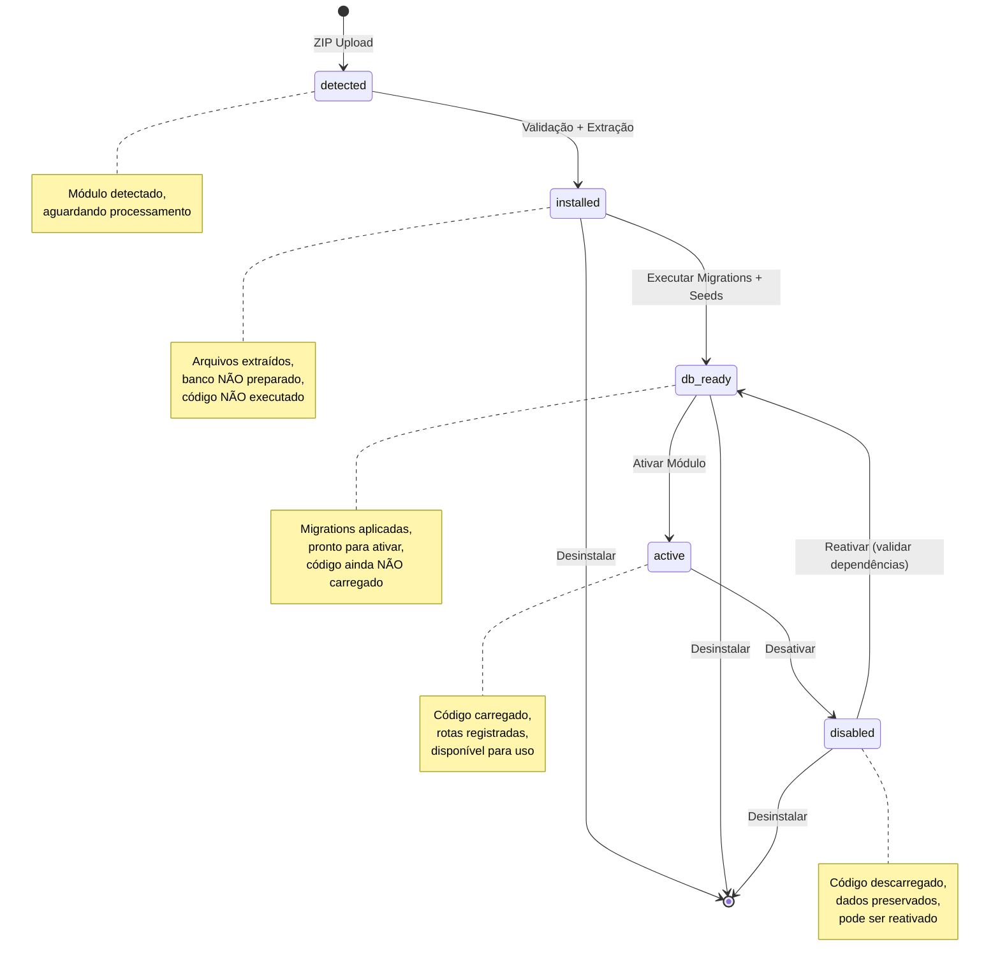
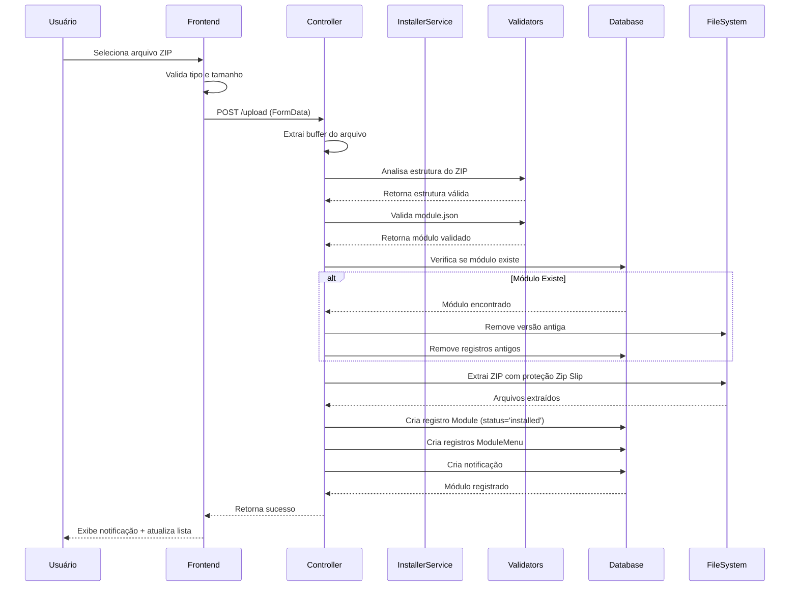
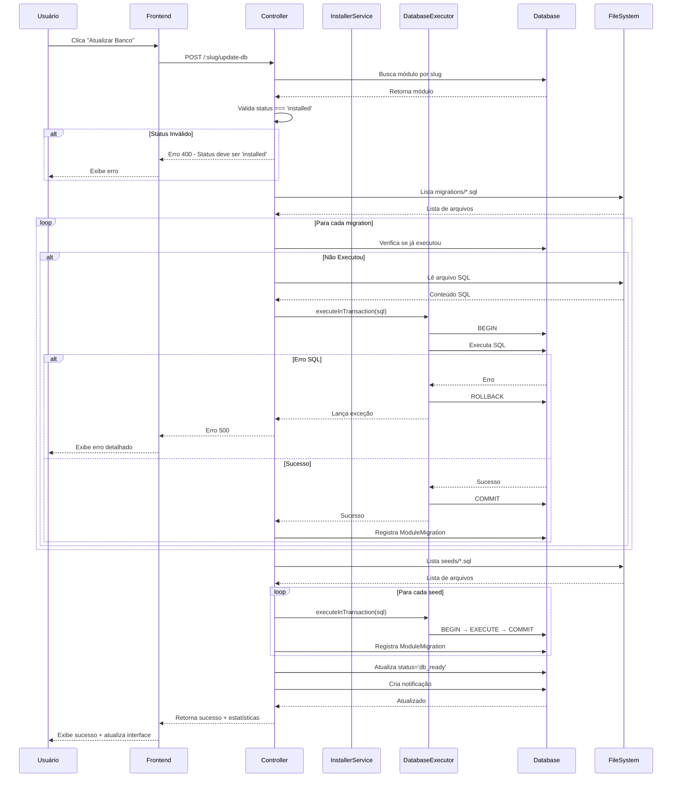
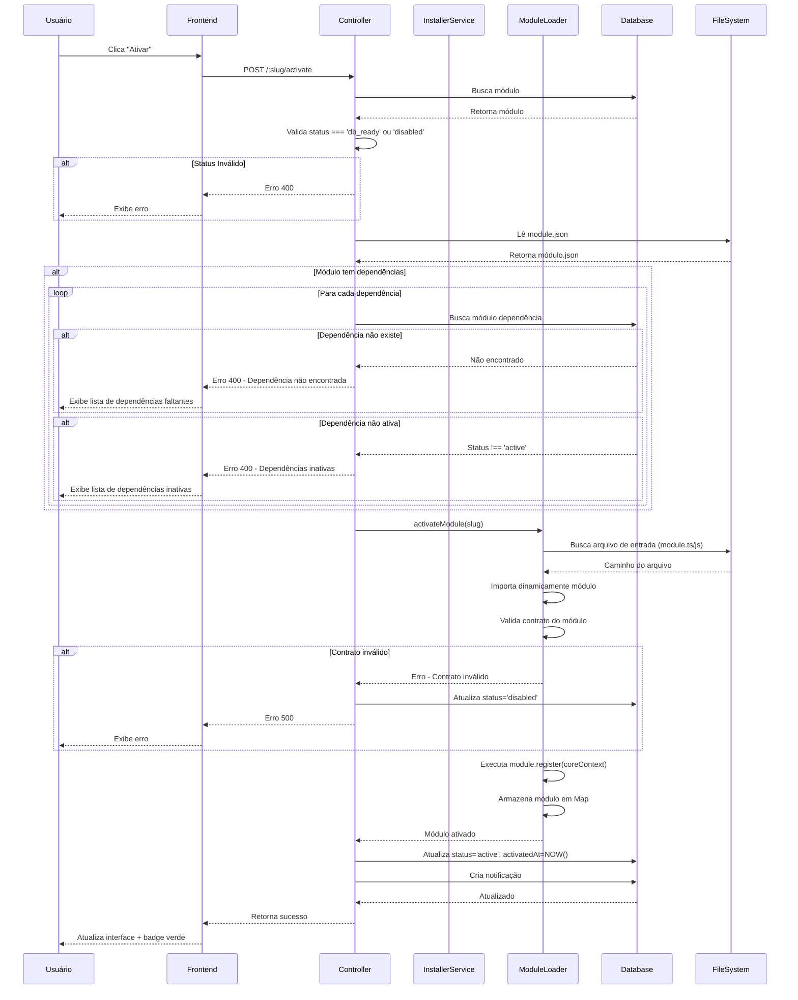
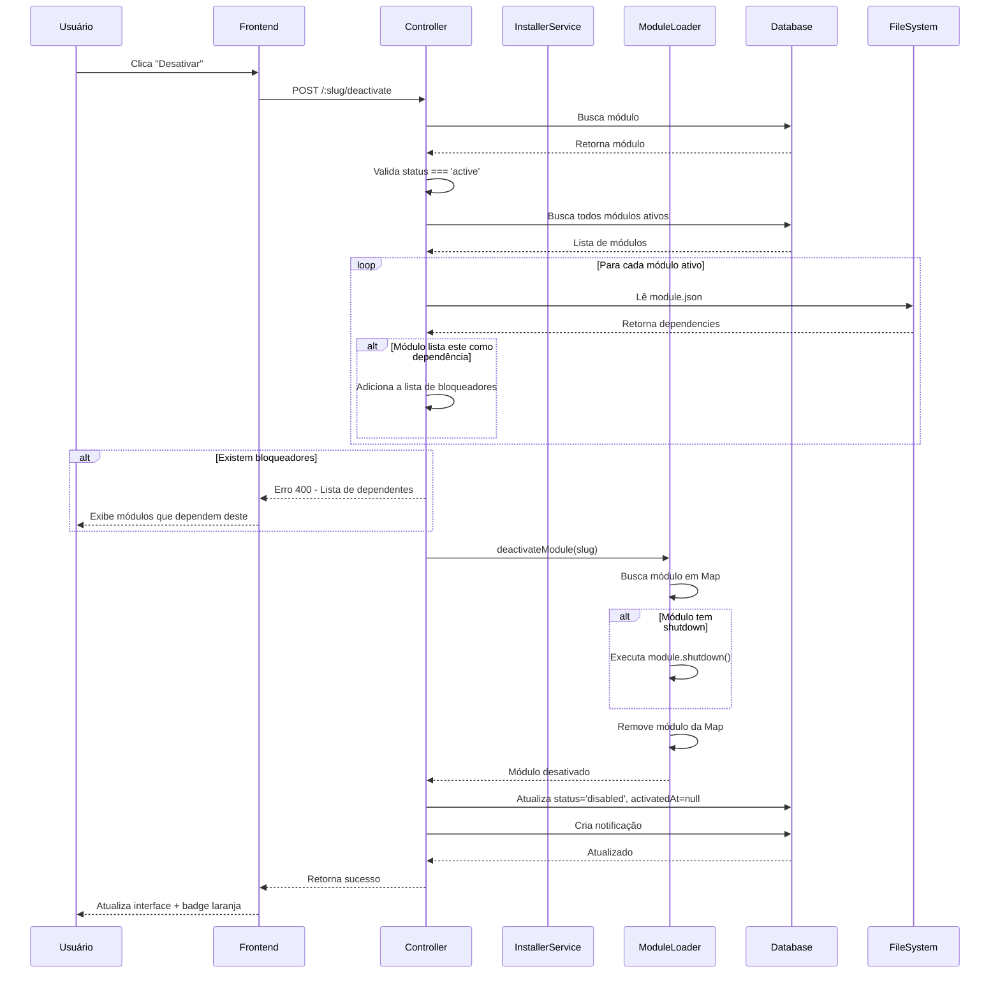
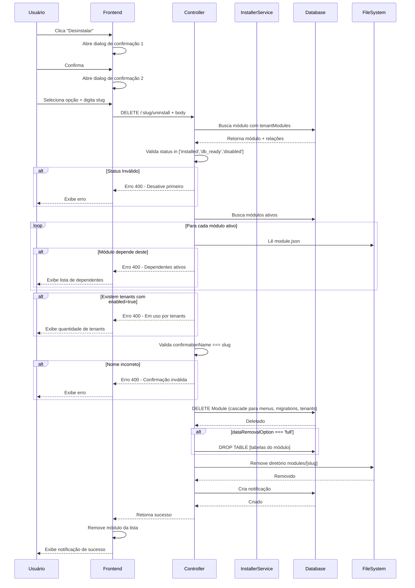

# Design Document: Sistema de Gerenciamento de Ciclo de Vida de Módulos

## Contexto Estratégico

### Visão Geral

Este documento define a arquitetura estratégica de um sistema de gerenciamento de módulos com ciclo de vida rigorosamente controlado, onde cada transição de estado é explícita, validada e irreversível. O sistema segue o princípio fundamental de que **instalação, preparação de banco de dados e ativação são operações completamente distintas e nunca devem ser mescladas**.

Documentação de auxílio:
RELATORIO_MODULOS.md

### Problema Central

Sistemas modulares tradicionais frequentemente falham ao permitir:

- Execução prematura de código de módulo durante instalação
- Transições de estado implícitas ou automáticas
- Operações fora de ordem sem validação adequada
- Interface de usuário que permite ações inválidas
- Estado inconsistente entre frontend e backend

### Objetivo Estratégico

Criar um sistema onde o **status do módulo é a única fonte de verdade**, controlando rigidamente:

- Quais botões aparecem na interface
- Quais endpoints podem ser invocados
- Quais operações são permitidas
- Quando o código do módulo pode executar

## Princípios Arquiteturais Fundamentais

### 1. Separação Total de Responsabilidades

Cada fase do ciclo de vida tem responsabilidade única e isolada:

- **Instalação**: Extrai arquivos, valida estrutura, registra metadados
- **Preparação de Banco**: Executa SQL puro (migrations e seeds)
- **Ativação**: Carrega código do módulo, registra rotas e serviços
- **Desativação**: Remove código da memória, preserva dados
- **Desinstalação**: Remove arquivos e registros conforme opção escolhida

### 2. Execução Tardia (Lazy Loading)

O código do módulo NUNCA é importado ou executado até que:

- O módulo esteja com status adequado
- Todas as validações tenham passado
- O CORE autorize explicitamente

### 3. Estado Explícito Controla Tudo

O status do módulo no banco de dados é a autoridade suprema que determina:

- Disponibilidade de ações na interface
- Permissões de execução no backend
- Fluxos de trabalho permitidos
- Mensagens de orientação ao usuário

### 4. Fail-Fast com Mensagens Claras

Qualquer tentativa de operação inválida deve:

- Ser bloqueada imediatamente
- Retornar erro específico e acionável
- Orientar sobre a ação correta
- Nunca permitir "verificar depois"

### 5. Zero Remendos, Zero Exceções

Não existem casos especiais, atalhos ou workarounds. O ciclo de vida é imutável e todas as transições seguem o mesmo conjunto de regras.

## Modelo de Ciclo de Vida

### Diagrama de Transições de Estado



### Definição de Estados

| Status | Descrição | Banco de Dados | Código Carregado | Reversível |
|--------|-----------|----------------|------------------|------------|
| **detected** | ZIP detectado no sistema, aguardando instalação | Não | Não | Sim (deletar registro) |
| **installed** | Arquivos extraídos e registrados, banco não preparado | Não | Não | Sim (desinstalar) |
| **db_ready** | Migrations e seeds executados, pronto para ativar | Sim | Não | Sim (desinstalar) |
| **active** | Módulo operacional com código carregado | Sim | Sim | Sim (desativar) |
| **disabled** | Módulo desligado, dados preservados | Sim | Não | Sim (desinstalar) |

### Invariantes Críticas

**INV-01**: Um módulo NUNCA pode pular estados na progressão
**INV-02**: Código do módulo só executa em estado `active`
**INV-03**: Migrations só executam em transição `installed` → `db_ready`
**INV-04**: Desinstalação só é permitida em estados `installed`, `db_ready` ou `disabled`
**INV-05**: Status no banco é sempre sincronizado com estado real do sistema

## Matriz de Controle de Ações

### Ações Permitidas por Status

| Status | Atualizar Banco | Ativar | Desativar | Desinstalar | Visualizar Info |
|--------|----------------|--------|-----------|-------------|-----------------|
| detected | ❌ | ❌ | ❌ | ❌ | ✅ |
| installed | ✅ | ❌ | ❌ | ✅ | ✅ |
| db_ready | ❌ | ✅ | ❌ | ✅ | ✅ |
| active | ❌ | ❌ | ✅ | ❌ | ✅ |
| disabled | ❌ | ✅* | ❌ | ✅ | ✅ |

*\* Reativação de módulo `disabled` requer validação de dependências*

### Regras Específicas de Bloqueio

**RB-01**: Se `status === 'installed'`, apenas botões "Atualizar Banco" e "Desinstalar" são habilitados

**RB-02**: Se `status === 'db_ready'`, apenas botões "Ativar" e "Desinstalar" são habilitados

**RB-03**: Se `status === 'active'`, apenas botão "Desativar" é habilitado

**RB-04**: Se `status === 'disabled'`, apenas botões "Ativar" e "Desinstalar" são habilitados

**RB-05**: Botões desabilitados devem ter aparência visual distinta e tooltip explicativo

## Arquitetura de Frontend

### Função de Controle de Ações

A interface deve implementar função centralizada que determina ações permitidas baseada exclusivamente no status:

**Assinatura da Função**:
```
getAllowedModuleActions(status: ModuleStatus): AllowedActions
```

**Entrada**: Status atual do módulo

**Saída**: Objeto com flags booleanas para cada ação

**Estrutura de Retorno**:
```
{
  updateDatabase: boolean
  activate: boolean
  deactivate: boolean
  uninstall: boolean
  viewInfo: boolean
}
```

**Regras de Implementação**:

- A função NÃO deve fazer chamadas API
- A função NÃO deve verificar estado global
- A função deve ser pura e determinística
- O resultado deve controlar diretamente o atributo `disabled` dos botões

### Lógica de Mapeamento

| Status | updateDatabase | activate | deactivate | uninstall | viewInfo |
|--------|----------------|----------|------------|-----------|----------|
| detected | false | false | false | false | true |
| installed | **true** | false | false | **true** | true |
| db_ready | false | **true** | false | **true** | true |
| active | false | false | **true** | false | true |
| disabled | false | **true** | false | **true** | true |

### Componentes de Interface

#### Tabela de Módulos

**Elementos por linha**:

- Nome do módulo
- Versão
- Badge de status com cor apropriada
- Botões de ação (habilitados conforme status)
- Botão de informações (sempre habilitado)

**Cores de Status**:

- `detected`: Cinza (neutro)
- `installed`: Amarelo (atenção, ação pendente)
- `db_ready`: Azul (pronto para ativar)
- `active`: Verde (operacional)
- `disabled`: Laranja (temporariamente desligado)

#### Botões de Ação

**Atualizar Banco de Dados**:

- Visível: `status === 'installed'`
- Ícone: Database
- Cor: Primária
- Tooltip quando desabilitado: "Preparação de banco já realizada"

**Ativar**:

- Visível: `status === 'db_ready' || status === 'disabled'`
- Ícone: Power
- Cor: Sucesso
- Tooltip quando desabilitado (db_ready): "Execute preparação de banco primeiro"
- Tooltip quando desabilitado (active): "Módulo já está ativo"

**Desativar**:

- Visível: `status === 'active'`
- Ícone: PowerOff
- Cor: Warning
- Tooltip quando desabilitado: "Apenas módulos ativos podem ser desativados"

**Desinstalar**:

- Visível: Sempre
- Habilitado: `status === 'installed' || status === 'db_ready' || status === 'disabled'`
- Ícone: Trash
- Cor: Destrutiva
- Tooltip quando desabilitado: "Desative o módulo antes de desinstalar"

### Fluxos de Interação do Usuário

#### Fluxo: Instalação Completa de Novo Módulo

**Passo 1 - Upload**:

- Usuário seleciona arquivo ZIP
- Sistema valida estrutura do ZIP (sem extrair)
- Sistema valida `module.json`
- Sistema extrai arquivos
- Sistema registra módulo com `status = 'installed'`
- Interface exibe módulo com badge amarelo
- Botões habilitados: "Atualizar Banco", "Desinstalar"

**Passo 2 - Preparação de Banco**:

- Usuário clica em "Atualizar Banco"
- Sistema exibe dialog com lista de migrations/seeds pendentes
- Usuário confirma execução
- Sistema executa migrations em transação
- Sistema executa seeds em transação
- Sistema atualiza `status = 'db_ready'`
- Interface atualiza badge para azul
- Botões habilitados: "Ativar", "Desinstalar"

**Passo 3 - Ativação**:

- Usuário clica em "Ativar"
- Sistema valida dependências
- Sistema carrega código do módulo
- Sistema registra rotas e menus
- Sistema atualiza `status = 'active'`
- Interface atualiza badge para verde
- Botões habilitados: "Desativar"

#### Fluxo: Desativação Temporária

**Passo 1 - Desativar**:

- Usuário clica em "Desativar"
- Sistema verifica dependências inversas
- Se bloqueado: Exibe lista de módulos dependentes
- Se permitido: Sistema descarrega código do módulo
- Sistema atualiza `status = 'disabled'`
- Interface atualiza badge para laranja
- Botões habilitados: "Ativar", "Desinstalar"

**Passo 2 - Reativar**:

- Usuário clica em "Ativar"
- Sistema valida dependências novamente
- Sistema recarrega código do módulo
- Sistema atualiza `status = 'active'`
- Interface volta ao estado ativo

#### Fluxo: Desinstalação Completa

**Passo 1 - Preparação**:

- Se módulo está `active`: Desativar primeiro
- Botão "Desinstalar" fica habilitado

**Passo 2 - Confirmação Dupla**:

- Usuário clica em "Desinstalar"
- Dialog 1: Confirmação simples com avisos
- Dialog 2: Seleção de opção de dados + campo de confirmação

**Opções de Remoção de Dados**:

- **Manter Tudo**: Remove apenas registros do CORE, preserva tabelas e dados
- **Remover CORE**: Remove registros do CORE, preserva tabelas de módulo
- **Remover Tudo**: Remove CORE + tabelas + dados do módulo (irreversível)

**Campo de Confirmação**:

- Usuário deve digitar o slug exato do módulo
- Botão "Confirmar" só habilita se slug for exato

**Passo 3 - Execução**:

- Sistema executa remoção conforme opção
- Sistema remove arquivos do módulo
- Sistema remove registro do banco
- Interface remove módulo da lista

### Mensagens de Orientação

#### Mensagens por Status

**Status: installed**

- Título: "Preparação Pendente"
- Mensagem: "Execute a preparação do banco de dados antes de ativar este módulo"
- Ação sugerida: "Atualizar Banco"

**Status: db_ready**

- Título: "Pronto para Ativar"
- Mensagem: "Banco de dados preparado. Ative o módulo para torná-lo operacional"
- Ação sugerida: "Ativar"

**Status: active**

- Título: "Módulo Operacional"
- Mensagem: "Este módulo está ativo e operacional no sistema"
- Ação disponível: "Desativar"

**Status: disabled**

- Título: "Módulo Desativado"
- Mensagem: "Este módulo está temporariamente desativado. Dados preservados"
- Ação sugerida: "Ativar" ou "Desinstalar"

#### Mensagens de Erro

**Erro: Tentar ativar com status !== db_ready**

```
Ação Bloqueada
Não é possível ativar este módulo.
Motivo: Banco de dados não foi preparado
Solução: Execute "Atualizar Banco" primeiro
```

**Erro: Tentar desativar módulo com dependentes**

```
Desativação Bloqueada
Este módulo não pode ser desativado.
Motivo: Módulos dependentes ainda ativos
Dependentes: [lista de módulos]
Solução: Desative os módulos dependentes primeiro
```

**Erro: Tentar desinstalar módulo ativo**

```
Desinstalação Bloqueada
Este módulo não pode ser desinstalado.
Motivo: Módulo está atualmente ativo
Solução: Desative o módulo antes de desinstalar
```

**Erro: Tentar desinstalar módulo em uso por tenants**

```
Desinstalação Bloqueada
Este módulo não pode ser desinstalado.
Motivo: Em uso por X tenant(s)
Solução: Desabilite o módulo em todos os tenants primeiro
```

## Arquitetura de Backend

### Camadas de Validação

O backend implementa validação em múltiplas camadas:

**Camada 1 - Controller**: Valida presença de parâmetros e formato de requisição

**Camada 2 - Service**: Valida estado do módulo e pré-condições de negócio

**Camada 3 - Executor**: Valida integridade de dados e executa operação

**Camada 4 - Database**: Valida constraints e relações via Prisma/SQL

### Endpoints e Validações

#### POST /configuracoes/sistema/modulos/upload

**Propósito**: Instalar novo módulo a partir de ZIP

**Permissão**: SUPER_ADMIN

**Validações**:

- VA-01: Arquivo deve ser .zip
- VA-02: Tamanho máximo 50MB
- VA-03: ZIP deve conter `module.json` na raiz ou em pasta raiz
- VA-04: `module.json` deve ser JSON válido
- VA-05: Campos obrigatórios: `name`, `displayName`, `version`
- VA-06: `name` deve ser único (ou permitir atualização)
- VA-07: `name` deve conter apenas [a-zA-Z0-9_-]

**Processo**:

1. Validar ZIP sem extrair
2. Ler e validar `module.json`
3. Verificar se módulo já existe
4. Se existe: Remover versão antiga
5. Extrair arquivos com proteção Zip Slip
6. Registrar no banco com `status = 'installed'`
7. Registrar menus (se declarados)
8. Criar notificação de instalação

**Resultado**: `status = 'installed'`

**Garantias**:

- NENHUM código do módulo é executado
- NENHUMA migration é executada
- NENHUM seed é executado
- Apenas arquivos são extraídos e metadados registrados

#### POST /configuracoes/sistema/modulos/:slug/update-db

**Propósito**: Executar migrations e seeds do módulo

**Permissão**: SUPER_ADMIN

**Validações**:

- VB-01: Módulo deve existir
- VB-02: `status` deve ser exatamente `'installed'`
- VB-03: Migrations devem ser arquivos .sql válidos
- VB-04: Seeds devem ser arquivos .sql válidos
- VB-05: Migrations não podem ter sido executadas previamente

**Processo**:

1. Verificar status do módulo
2. Listar migrations pendentes
3. Listar seeds pendentes
4. Executar migrations em ordem alfabética em transação
5. Registrar cada migration executada em `ModuleMigration`
6. Executar seeds em ordem alfabética em transação
7. Registrar cada seed executada em `ModuleMigration`
8. Atualizar `status = 'db_ready'`
9. Criar notificação de sucesso

**Resultado**: `status = 'db_ready'`

**Garantias**:

- Migrations executam em transação única (rollback em erro)
- Seeds executam em transação única (rollback em erro)
- Cada migration é registrada individualmente
- Migrations duplicadas são ignoradas
- NENHUM código JavaScript/TypeScript é executado

**Tratamento de Erros**:

- Erro em migration: Rollback completo, status permanece `'installed'`
- Erro em seed: Rollback completo, status permanece `'installed'`
- Notificação de erro com detalhes técnicos

#### POST /configuracoes/sistema/modulos/:slug/activate

**Propósito**: Ativar módulo e carregar código

**Permissão**: SUPER_ADMIN

**Validações**:

- VC-01: Módulo deve existir
- VC-02: `status` deve ser `'db_ready'` ou `'disabled'`
- VC-03: Se `module.json` declara dependências, todas devem estar com `status = 'active'`
- VC-04: Arquivo de entrada do módulo deve existir (`module.ts` ou `module.js`)

**Processo**:

1. Verificar status do módulo
2. Ler `module.json` e validar dependências
3. Para cada dependência:
   - Verificar se existe no banco
   - Verificar se `status === 'active'`
   - Se falhar: Retornar erro com lista de dependências ausentes/inativas
4. Chamar `ModuleLoader.activateModule(slug)`
5. ModuleLoader carrega código do módulo dinamicamente
6. ModuleLoader valida contrato do módulo
7. ModuleLoader executa `register(coreContext)`
8. Atualizar `status = 'active'` e `activatedAt = NOW()`
9. Criar notificação de ativação

**Resultado**: `status = 'active'`

**Garantias**:

- Código do módulo SÓ é carregado APÓS validações
- Se qualquer validação falhar, código NÃO é executado
- Dependências são verificadas ANTES de carregar
- Status só muda APÓS sucesso completo

**Tratamento de Erros**:

- Erro de dependência: Retorna lista de módulos faltantes/inativos
- Erro no carregamento: Status muda para `'disabled'`, log de erro
- Erro no registro: Status muda para `'disabled'`, rollback

#### POST /configuracoes/sistema/modulos/:slug/deactivate

**Propósito**: Desativar módulo e descarregar código

**Permissão**: SUPER_ADMIN

**Validações**:

- VD-01: Módulo deve existir
- VD-02: `status` deve ser `'active'`
- VD-03: Nenhum outro módulo ativo pode declarar este como dependência

**Processo**:

1. Verificar status do módulo
2. Buscar todos os módulos com `status = 'active'`
3. Para cada módulo ativo:
   - Ler `module.json`
   - Verificar se lista este módulo em `dependencies`
   - Se sim: Adicionar à lista de bloqueadores
4. Se lista de bloqueadores não está vazia:
   - Retornar erro com lista de módulos dependentes
5. Chamar `ModuleLoader.deactivateModule(slug)`
6. ModuleLoader executa `shutdown()` do módulo (se existir)
7. ModuleLoader remove módulo da memória
8. Atualizar `status = 'disabled'` e `activatedAt = null`
9. Criar notificação de desativação

**Resultado**: `status = 'disabled'`

**Garantias**:

- Dados do banco de dados são preservados
- Arquivos do módulo são preservados
- Apenas código é removido da memória
- Validação de dependências inversas impede quebra de sistema

#### DELETE /configuracoes/sistema/modulos/:slug/uninstall

**Propósito**: Remover módulo do sistema

**Permissão**: SUPER_ADMIN

**Validações**:

- VE-01: Módulo deve existir
- VE-02: `status` deve ser `'installed'`, `'db_ready'` ou `'disabled'`
- VE-03: Nenhum módulo ativo pode listar este como dependência
- VE-04: Nenhum tenant pode ter `ModuleTenant.enabled = true` para este módulo
- VE-05: Campo `confirmationName` deve ser idêntico ao slug

**Parâmetros**:

- `dataRemovalOption`: Enum de opções de remoção
  - `'keep'`: Preserva tudo, remove apenas CORE
  - `'core_only'`: Remove CORE, preserva tabelas
  - `'full'`: Remove CORE + tabelas + dados
- `confirmationName`: String exata do slug para confirmação

**Processo**:

1. Verificar status do módulo
2. Verificar dependências inversas (bloquear se houver)
3. Verificar uso por tenants (bloquear se houver)
4. Validar confirmação de nome
5. Executar remoção conforme opção:
   - **keep**: Apenas deletar registro Module (cascade para menus, migrations, tenant_modules)
   - **core_only**: Igual a keep
   - **full**: Deletar registro + executar DROP TABLE de tabelas do módulo
6. Remover arquivos físicos do módulo
7. Criar notificação de desinstalação

**Resultado**: Módulo removido completamente

**Garantias**:

- Validações impedem quebra de sistema
- Confirmação dupla impede remoção acidental
- Opção de dados permite preservação quando necessário
- Remoção é atômica (sucesso completo ou falha completa)

#### GET /configuracoes/sistema/modulos

**Propósito**: Listar todos os módulos instalados

**Permissão**: SUPER_ADMIN

**Retorno**:

Lista de módulos com:

- `slug`: Identificador único
- `name`: Nome de exibição
- `version`: Versão instalada
- `description`: Descrição do módulo
- `status`: Status atual (enum)
- `hasBackend`: Se tem código backend
- `hasFrontend`: Se tem código frontend
- `installedAt`: Data de instalação
- `activatedAt`: Data de ativação (null se não ativo)
- `stats`: Estatísticas de uso
  - `tenants`: Quantidade de tenants usando
  - `migrations`: Quantidade de migrations executadas
  - `menus`: Quantidade de menus registrados

**Uso**: Frontend usa este endpoint para renderizar tabela de módulos

#### GET /configuracoes/sistema/modulos/:slug/status

**Propósito**: Obter status detalhado de um módulo específico

**Permissão**: SUPER_ADMIN

**Retorno**:

- Informações do módulo
- Lista de migrations executadas
- Lista de seeds executadas
- Lista de menus registrados
- Lista de tenants usando o módulo

**Uso**: Dialog de informações do módulo

### Serviços Especializados

#### ModuleInstallerService

**Responsabilidade**: Orquestração de alto nível do ciclo de vida

**Métodos Principais**:

- `installModuleFromZip(file)`: Instalação completa de ZIP
- `updateModuleDatabase(slug)`: Preparação de banco
- `activateModule(slug)`: Ativação com validações
- `deactivateModule(slug)`: Desativação com validações
- `uninstallModule(slug, options)`: Desinstalação segura
- `listModules()`: Listagem com estatísticas
- `getModuleStatus(slug)`: Status detalhado

**Regras de Implementação**:

- NUNCA importa código de módulo diretamente
- Delega carregamento de código para `ModuleLoader`
- Valida todas as pré-condições antes de chamar executores
- Cria notificações para todas as operações principais
- Loga todas as transições de estado

#### ModuleLoader

**Responsabilidade**: Carregamento seguro e lazy de código de módulo

**Métodos Principais**:

- `activateModule(slug)`: Carrega código e registra módulo
- `deactivateModule(slug)`: Descarrega código e limpa memória
- `getModule(slug)`: Retorna módulo carregado (se ativo)
- `getLoadedModules()`: Lista módulos em memória

**Regras de Implementação**:

- SÓ carrega módulos com `status === 'db_ready'`
- Valida contrato do módulo antes de registrar
- Executa import dinâmico apenas dentro de `activateModule`
- Mantém cache de módulos carregados em Map
- Remove módulo da memória em `deactivateModule`
- NUNCA permite acesso a código de módulo não ativo

**Proteções de Segurança**:

- Valida que path do módulo está dentro de `modules/`
- Verifica existência de arquivo antes de importar
- Valida que módulo implementa contrato obrigatório
- Captura erros e marca módulo como `disabled` em falha

#### ModuleDatabaseExecutorService

**Responsabilidade**: Execução segura de SQL de módulos

**Métodos Principais**:

- `executeInTransaction(sql)`: Executa SQL em transação atômica
- `executeMultipleInTransaction(queries)`: Executa múltiplas queries em transação
- `executeQuery(sql)`: Executa query e retorna resultados
- `tableExists(tableName)`: Verifica existência de tabela

**Regras de Implementação**:

- Usa pool de conexões PostgreSQL dedicado
- Todas as mutations usam transações
- Rollback automático em caso de erro
- Log detalhado de execuções
- Nunca executa código JavaScript/TypeScript

**Proteções de Segurança**:

- Queries executam em contexto isolado
- Timeouts configurados para prevenir locks
- Validação de SQL antes de executar
- Registro de todas as execuções em `ModuleMigration`

### Validações de Dependências

#### Validação em Ativação

**Algoritmo**:

```
função validarDependenciasAtivacao(slug):
    módulo = buscarMódulo(slug)
    
    se módulo.status não é 'db_ready' e não é 'disabled':
        retornar erro "Status inválido para ativação"
    
    moduleJson = lerModuleJson(módulo.slug)
    
    se moduleJson.dependencies existe e não é vazio:
        dependênciasInativas = []
        
        para cada dependência em moduleJson.dependencies:
            depMódulo = buscarMódulo(dependência)
            
            se depMódulo não existe:
                adicionar a dependênciasInativas: {slug, motivo: "não encontrado"}
            
            senão se depMódulo.status não é 'active':
                adicionar a dependênciasInativas: {slug, motivo: "não ativo", status: depMódulo.status}
        
        se dependênciasInativas não está vazio:
            retornar erro com lista de dependênciasInativas
    
    retornar sucesso
```

**Mensagem de Erro**:

```
Não é possível ativar o módulo [SLUG]

Dependências não satisfeitas:
- [DEP_1]: Não encontrado no sistema
- [DEP_2]: Status atual 'disabled' (requer 'active')
- [DEP_3]: Status atual 'installed' (requer 'active')

Ações necessárias:
1. Instale os módulos faltantes
2. Ative os módulos inativos
3. Tente ativar este módulo novamente
```

#### Validação em Desativação

**Algoritmo**:

```
função validarDependenciasDesativacao(slug):
    módulo = buscarMódulo(slug)
    
    se módulo.status não é 'active':
        retornar erro "Apenas módulos ativos podem ser desativados"
    
    módulosAtivos = buscarMódulos(status = 'active')
    dependentes = []
    
    para cada outroMódulo em módulosAtivos:
        se outroMódulo.slug == slug:
            continuar
        
        outroModuleJson = lerModuleJson(outroMódulo.slug)
        
        se outroModuleJson.dependencies contém slug:
            adicionar a dependentes: {
                slug: outroMódulo.slug,
                nome: outroMódulo.name
            }
    
    se dependentes não está vazio:
        retornar erro com lista de dependentes
    
    retornar sucesso
```

**Mensagem de Erro**:

```
Não é possível desativar o módulo [SLUG]

Este módulo é dependência de:
- [DEP_1] (Módulo de Relatórios)
- [DEP_2] (Módulo de Integração)

Ações necessárias:
1. Desative os módulos listados acima
2. Tente desativar este módulo novamente
```

#### Validação em Desinstalação

**Algoritmo**:

```
função validarDependenciasDesinstalacao(slug):
    módulo = buscarMódulo(slug)
    
    // Validar status
    se módulo.status não em ['installed', 'db_ready', 'disabled']:
        retornar erro "Desative o módulo antes de desinstalar"
    
    // Validar dependências inversas
    módulosAtivos = buscarMódulos(status = 'active')
    dependentes = []
    
    para cada outroMódulo em módulosAtivos:
        outroModuleJson = lerModuleJson(outroMódulo.slug)
        
        se outroModuleJson.dependencies contém slug:
            adicionar a dependentes: outroMódulo.name
    
    se dependentes não está vazio:
        retornar erro "Módulos dependentes: " + dependentes.join(', ')
    
    // Validar uso por tenants
    tenantsAtivos = buscarTenantModules(
        moduleId = módulo.id,
        enabled = true
    )
    
    se tenantsAtivos.length > 0:
        retornar erro "Módulo em uso por " + tenantsAtivos.length + " tenant(s)"
    
    retornar sucesso
```

## Modelo de Dados

### Enumerações

#### ModuleStatus

Estados possíveis do ciclo de vida:

```
enum ModuleStatus {
  detected      // ZIP detectado, aguardando instalação
  installed     // Arquivos extraídos, banco não preparado
  db_ready      // Migrations/seeds executados, pronto para ativar
  active        // Código carregado, operacional
  disabled      // Código descarregado, dados preservados
}
```

#### MigrationType

Tipos de scripts de banco de dados:

```
enum MigrationType {
  migration     // Scripts de criação/alteração de estrutura
  seed          // Scripts de carga inicial de dados
}
```

### Tabelas Principais

#### Module

Representa um módulo instalado no sistema.

| Campo | Tipo | Descrição | Constraints |
|-------|------|-----------|-------------|
| id | UUID | Identificador único | PK, NOT NULL |
| slug | String | Identificador amigável (ex: "financeiro") | UNIQUE, NOT NULL |
| name | String | Nome de exibição | NOT NULL |
| version | String | Versão do módulo (semver) | NOT NULL, DEFAULT '1.0.0' |
| description | String | Descrição funcional | NULLABLE |
| status | ModuleStatus | Estado do ciclo de vida | NOT NULL, DEFAULT 'detected' |
| hasBackend | Boolean | Se contém código backend | NOT NULL, DEFAULT false |
| hasFrontend | Boolean | Se contém código frontend | NOT NULL, DEFAULT false |
| installedAt | DateTime | Data/hora de instalação | NOT NULL |
| activatedAt | DateTime | Data/hora de ativação | NULLABLE |

**Índices**:

- `slug` (UNIQUE)
- `status` (para queries de listagem)

**Relações**:

- `menus`: Um-para-Muitos com `ModuleMenu`
- `migrations`: Um-para-Muitos com `ModuleMigration`
- `tenantModules`: Um-para-Muitos com `ModuleTenant`

#### ModuleMigration

Registra execução de migrations e seeds.

| Campo | Tipo | Descrição | Constraints |
|-------|------|-----------|-------------|
| id | UUID | Identificador único | PK, NOT NULL |
| moduleId | UUID | Módulo proprietário | FK(Module.id), NOT NULL |
| filename | String | Nome do arquivo .sql | NOT NULL |
| type | MigrationType | Tipo de script | NOT NULL |
| executedAt | DateTime | Data/hora de execução | NOT NULL |

**Constraints Únicos**:

- `(moduleId, filename, type)`: Garante que migration/seed só executa uma vez

**Índices**:

- `moduleId` (para buscar migrations de um módulo)
- `type` (para separar migrations de seeds)

#### ModuleMenu

Registra itens de menu declarados pelo módulo.

| Campo | Tipo | Descrição | Constraints |
|-------|------|-----------|-------------|
| id | UUID | Identificador único | PK, NOT NULL |
| moduleId | UUID | Módulo proprietário | FK(Module.id), NOT NULL |
| label | String | Texto do menu | NOT NULL |
| icon | String | Nome do ícone | NULLABLE |
| route | String | Rota de navegação | NOT NULL |
| parentId | UUID | Menu pai (para submenus) | FK(ModuleMenu.id), NULLABLE |
| order | Integer | Ordem de exibição | NOT NULL, DEFAULT 0 |
| permission | String | Permissão necessária | NULLABLE |
| isUserMenu | Boolean | Se aparece no menu do usuário | NOT NULL, DEFAULT true |

**Índices**:

- `moduleId` (para buscar menus de um módulo)
- `parentId` (para construir árvore de menus)
- `order` (para ordenação)

#### ModuleTenant

Relaciona módulos com tenants (ativação por tenant).

| Campo | Tipo | Descrição | Constraints |
|-------|------|-----------|-------------|
| id | UUID | Identificador único | PK, NOT NULL |
| moduleId | UUID | Módulo | FK(Module.id), NOT NULL |
| tenantId | UUID | Tenant | FK(Tenant.id), NOT NULL |
| enabled | Boolean | Se módulo está ativo para este tenant | NOT NULL, DEFAULT false |
| config | JSON | Configurações específicas do tenant | NULLABLE |
| enabledAt | DateTime | Data/hora de ativação | NULLABLE |

**Constraints Únicos**:

- `(moduleId, tenantId)`: Um módulo só pode ter uma relação por tenant

**Índices**:

- `moduleId` (para buscar tenants de um módulo)
- `tenantId` (para buscar módulos de um tenant)
- `enabled` (para filtrar ativos)

### Regras de Integridade

**RI-01**: Ao deletar `Module`, deletar em cascata: `ModuleMenu`, `ModuleMigration`, `ModuleTenant`

**RI-02**: `ModuleMigration` não pode ser deletada manualmente (histórico imutável)

**RI-03**: `ModuleTenant.enabled` só pode ser `true` se `Module.status === 'active'`

**RI-04**: `Module.activatedAt` só pode ter valor se `status === 'active'`

**RI-05**: `ModuleMigration.type === 'migration'` deve ser executada antes de `type === 'seed'`

## Fluxos de Processamento

### Fluxo: Upload e Instalação de Módulo



### Fluxo: Preparação de Banco de Dados



### Fluxo: Ativação de Módulo



### Fluxo: Desativação de Módulo



### Fluxo: Desinstalação de Módulo



## Estratégias de Teste

### Testes de Unidade

#### Frontend - getAllowedModuleActions

**Teste**: Status 'installed' permite apenas updateDatabase e uninstall

**Entrada**: `status = 'installed'`

**Expectativa**:
```
{
  updateDatabase: true,
  activate: false,
  deactivate: false,
  uninstall: true,
  viewInfo: true
}
```

**Teste**: Status 'db_ready' permite apenas activate e uninstall

**Entrada**: `status = 'db_ready'`

**Expectativa**:
```
{
  updateDatabase: false,
  activate: true,
  deactivate: false,
  uninstall: true,
  viewInfo: true
}
```

**Teste**: Status 'active' permite apenas deactivate

**Entrada**: `status = 'active'`

**Expectativa**:
```
{
  updateDatabase: false,
  activate: false,
  deactivate: true,
  uninstall: false,
  viewInfo: true
}
```

#### Backend - Validação de Dependências

**Teste**: Ativar módulo com dependência inativa deve falhar

**Cenário**:
- Módulo A depende de Módulo B
- Módulo B status = 'disabled'

**Ação**: `POST /modulos/A/activate`

**Expectativa**: HTTP 400 com mensagem "Módulos dependentes não estão ativos: B"

**Teste**: Desativar módulo com dependente ativo deve falhar

**Cenário**:
- Módulo A está ativo
- Módulo B (ativo) depende de A

**Ação**: `POST /modulos/A/deactivate`

**Expectativa**: HTTP 400 com lista de dependentes

### Testes de Integração

#### Ciclo Completo: Instalação → Ativação

**Etapa 1**: Upload de módulo válido

**Ação**: `POST /upload` com ZIP válido

**Verificações**:
- Status HTTP 200
- Módulo criado no banco com `status = 'installed'`
- Arquivos extraídos em `modules/[slug]`
- Menus registrados em `ModuleMenu`
- Notificação criada

**Etapa 2**: Tentativa de ativar sem preparar banco

**Ação**: `POST /:slug/activate`

**Verificações**:
- Status HTTP 400
- Mensagem de erro clara
- Status do módulo permanece `installed`

**Etapa 3**: Preparar banco de dados

**Ação**: `POST /:slug/update-db`

**Verificações**:
- Status HTTP 200
- Status atualizado para `db_ready`
- Migrations registradas em `ModuleMigration`
- Seeds registradas em `ModuleMigration`

**Etapa 4**: Ativar módulo

**Ação**: `POST /:slug/activate`

**Verificações**:
- Status HTTP 200
- Status atualizado para `active`
- `activatedAt` definido
- Módulo carregado em memória

#### Ciclo de Dependências

**Cenário**: Módulo B depende de Módulo A

**Etapa 1**: Instalar ambos os módulos

**Verificação**: Ambos com `status = 'installed'`

**Etapa 2**: Preparar banco de ambos

**Verificação**: Ambos com `status = 'db_ready'`

**Etapa 3**: Tentar ativar B sem ativar A

**Verificação**: Erro 400 com mensagem de dependência

**Etapa 4**: Ativar A primeiro

**Verificação**: A com `status = 'active'`

**Etapa 5**: Ativar B

**Verificação**: B com `status = 'active'`

**Etapa 6**: Tentar desativar A

**Verificação**: Erro 400 - B depende de A

**Etapa 7**: Desativar B

**Verificação**: B com `status = 'disabled'`

**Etapa 8**: Desativar A

**Verificação**: A com `status = 'disabled'`

### Testes de Segurança

#### Proteção contra Zip Slip

**Teste**: Upload de ZIP malicioso com path traversal

**Arquivo malicioso**: Contém entrada `../../etc/passwd`

**Expectativa**: Rejeição com erro de validação, arquivo não extraído

#### Proteção contra SQL Injection em Migrations

**Teste**: Migration com SQL malicioso

**Conteúdo**:
```sql
DROP TABLE users; --
```

**Expectativa**: SQL executa em transação isolada, não afeta tabelas do CORE

#### Execução Prematura de Código

**Teste**: Tentar importar módulo com status 'installed'

**Cenário**: Módulo com `status = 'installed'`

**Ação**: Chamar manualmente `ModuleLoader.loadModule()`

**Expectativa**: Módulo não é carregado, pois não está na lista de ativos

### Testes de Concorrência

#### Upload Simultâneo do Mesmo Módulo

**Cenário**: Dois usuários fazem upload do mesmo módulo simultaneamente

**Expectativa**: Constraint UNIQUE em `slug` impede duplicação, um upload falha

#### Ativação Simultânea

**Cenário**: Dois requests tentam ativar o mesmo módulo

**Expectativa**: Primeira request sucede, segunda falha (status já é `active`)

## Tratamento de Erros e Recuperação

### Classificação de Erros

#### Erros de Validação (HTTP 400)

**Características**:

- Causados por entrada inválida do usuário
- Podem ser corrigidos pelo usuário
- Não alteram estado do sistema

**Exemplos**:

- ZIP inválido
- Status incorreto para operação
- Dependências não satisfeitas
- Confirmação de nome incorreta

**Resposta**:
```json
{
  "statusCode": 400,
  "message": "Mensagem clara do erro",
  "error": "Bad Request",
  "details": {
    "reason": "Motivo específico",
    "solution": "Ação corretiva sugerida"
  }
}
```

#### Erros de Processamento (HTTP 500)

**Características**:

- Causados por falhas internas do sistema
- Requerem investigação técnica
- Podem deixar estado inconsistente

**Exemplos**:

- Erro ao extrair ZIP
- Erro em migration SQL
- Erro ao carregar código do módulo
- Falha de conexão com banco

**Resposta**:
```json
{
  "statusCode": 500,
  "message": "Erro interno do servidor",
  "error": "Internal Server Error",
  "details": {
    "operation": "Operação que falhou",
    "errorMessage": "Mensagem técnica do erro"
  }
}
```

### Estratégias de Rollback

#### Rollback em Preparação de Banco

**Cenário**: Erro durante execução de migration

**Ação Automática**:

1. Sistema executa `ROLLBACK` da transação
2. Status do módulo permanece `installed`
3. Nenhum registro é criado em `ModuleMigration`
4. Notificação de erro é criada com detalhes

**Recuperação Manual**:

1. Usuário corrige migration SQL
2. Usuário faz novo upload do módulo
3. Sistema atualiza arquivos
4. Usuário tenta "Atualizar Banco" novamente

#### Rollback em Ativação

**Cenário**: Erro ao carregar código do módulo

**Ação Automática**:

1. `ModuleLoader` captura exceção
2. Módulo é removido da memória
3. Status é atualizado para `disabled`
4. Log de erro é registrado

**Recuperação Manual**:

1. Desenvolvedor corrige código do módulo
2. Desenvolvedor faz novo upload
3. Sistema atualiza arquivos
4. Usuário tenta "Ativar" novamente

### Logs e Auditoria

#### Eventos Auditados

Todos os eventos abaixo devem ser registrados com:

- Timestamp
- Usuário executor (ID e username)
- IP de origem
- Slug do módulo
- Status anterior e novo
- Resultado (sucesso/falha)

**Lista de Eventos**:

- Upload de módulo
- Atualização de banco
- Ativação de módulo
- Desativação de módulo
- Desinstalação de módulo
- Erro em qualquer operação

#### Formato de Log

```
[TIMESTAMP] [NÍVEL] [CONTEXTO] Mensagem detalhada
  Usuario: [ID] ([USERNAME])
  IP: [IP_ADDRESS]
  Módulo: [SLUG]
  Status: [OLD_STATUS] → [NEW_STATUS]
  Resultado: [SUCESSO|FALHA]
  Detalhes: [JSON com informações adicionais]
```

## Considerações de Desempenho

### Otimizações de Consulta

**OPT-01**: Índice em `Module.status` para queries de listagem rápida

**OPT-02**: Índice composto em `ModuleMigration(moduleId, type)` para buscar migrations/seeds

**OPT-03**: Eager loading de relações em `listModules()` usando `include`

### Cache de Módulos Carregados

**Estratégia**:

- `ModuleLoader` mantém Map de módulos carregados em memória
- Evita reimport de módulos já ativos
- Invalidação automática em desativação

### Execução Assíncrona

**Operações Assíncronas**:

- Upload e extração de ZIP
- Execução de migrations (com feedback de progresso)
- Carregamento de código de módulo

**Feedback ao Usuário**:

- Interface mostra spinner durante operações longas
- Notificações informam conclusão de operações assíncronas

## Configurações e Parâmetros

### Limites de Sistema

| Parâmetro | Valor | Descrição |
|-----------|-------|-----------|
| Tamanho máximo de ZIP | 50 MB | Limite de upload |
| Timeout de migration | 60 segundos | Tempo máximo por migration |
| Pool de conexões DB | 10 conexões | Para executor de migrations |
| Tamanho máximo de module.json | 100 KB | Limite de metadados |

### Configurações de Segurança

| Parâmetro | Valor | Descrição |
|-----------|-------|-----------|
| Permitir sobrescrever módulo | Sim | Atualização de versão |
| Validar assinatura de ZIP | Não (futuro) | Verificação de integridade |
| Sandbox de execução | Não (futuro) | Isolamento de código |
| Verificação de dependências | Sim | Obrigatória |

## Glossário de Termos

**CORE**: Sistema principal da plataforma, responsável por gerenciar módulos

**Módulo**: Pacote de funcionalidades independente que estende o sistema

**Ciclo de Vida**: Sequência de estados que um módulo atravessa desde instalação até desinstalação

**Migration**: Script SQL que cria ou altera estrutura de banco de dados

**Seed**: Script SQL que insere dados iniciais no banco

**Lazy Loading**: Técnica de carregar código apenas quando necessário

**Fail-Fast**: Princípio de falhar imediatamente ao detectar erro, sem tentar continuar

**Zip Slip**: Vulnerabilidade que permite extrair arquivos fora do diretório esperado

**Dependência**: Módulo que outro módulo requer para funcionar

**Tenant**: Instância isolada do sistema para um cliente específico

**Module.json**: Arquivo de manifesto que descreve metadados do módulo

**Status**: Estado atual do módulo no ciclo de vida

**Contrato de Módulo**: Interface que todos os módulos devem implementar

**Transação**: Operação de banco de dados atômica (tudo ou nada)

**Rollback**: Reverter transação de banco de dados em caso de erro
