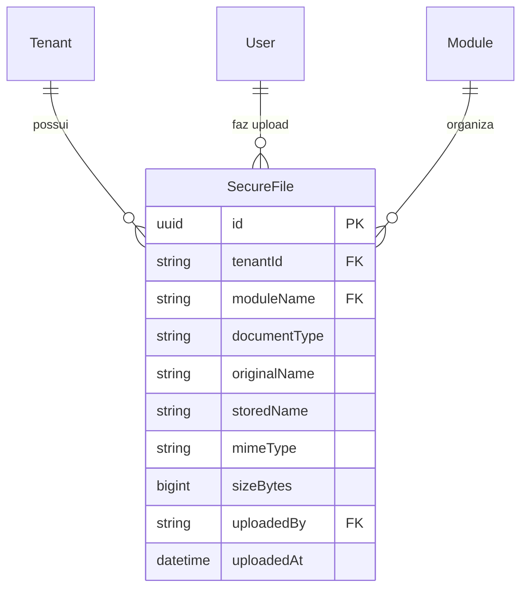
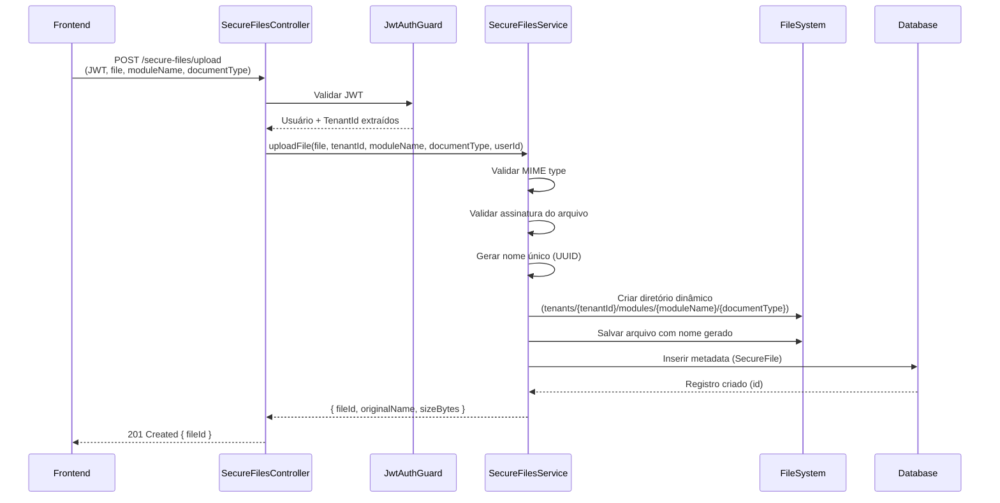
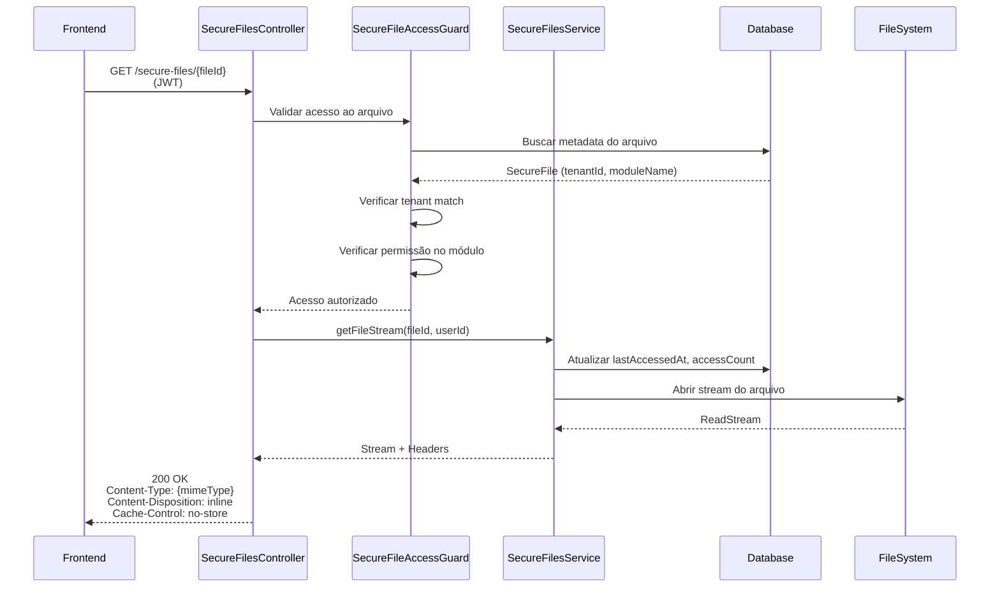
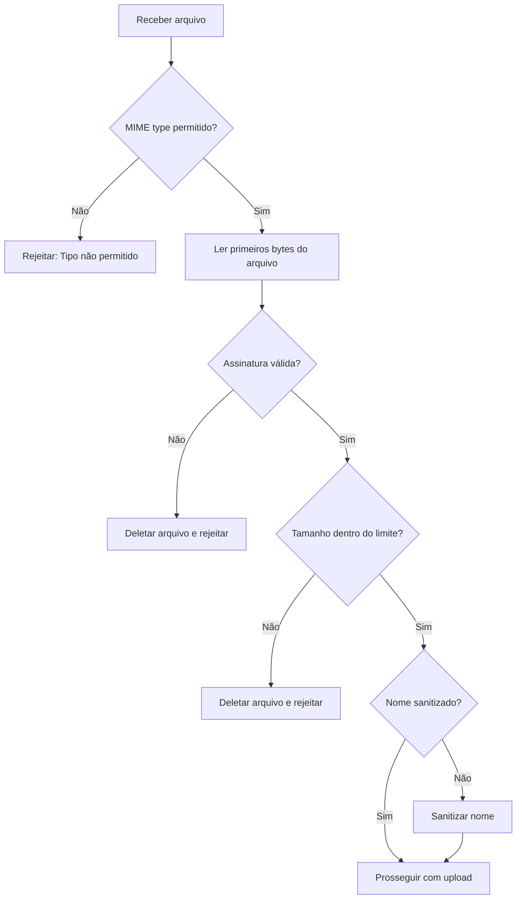
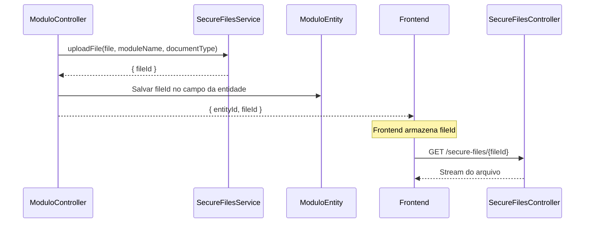

# Implementação de Uploads Sensíveis Multi-Tenant

## 1. Visão Geral

Sistema de upload e acesso seguro a arquivos sensíveis (documentos pessoais, imagens, comprovantes) com isolamento por tenant, módulo e tipo de documento. O sistema garante que nenhum arquivo sensível seja acessível publicamente, aplicando autenticação JWT, validação de tenant e streaming controlado.

### 1.1. Objetivos Estratégicos

- **Segurança Total**: Nenhum arquivo sensível exposto publicamente
- **Isolamento Rigoroso**: Separação física por tenant, módulo e tipo de documento
- **Streaming Controlado**: Acesso através de endpoint autenticado com validação de permissões
- **Escalabilidade**: Arquitetura preparada para Docker e volumes
- **Padronização**: Interface consistente para todos os módulos do sistema
- **Rastreabilidade**: Auditoria completa de uploads e acessos

### 1.2. Escopo

**Incluído:**
- Módulo NestJS para gerenciamento de uploads sensíveis
- Estrutura de diretórios hierárquica e segura
- Endpoints de upload e download com autenticação
- Modelo de dados para registro de metadata
- Guards de segurança e validação
- Serviço centralizado para uso por módulos
- Exemplos de integração no frontend

**Não Incluído:**
- Migração de arquivos públicos existentes
- Sistema de compressão de imagens
- CDN ou storage externo (S3, Azure Blob)
- Antivírus/malware scanning

## 2. Arquitetura de Diretórios

### 2.1. Estrutura Hierárquica Obrigatória

```
backend/uploads/
├── logos/                    (arquivos públicos existentes - mantidos)
├── modules/                  (instalação de módulos - mantidos)
└── secure/                   (NOVO - arquivos sensíveis)
    └── tenants/
        └── {tenantId}/
            └── modules/
                └── {moduleName}/
                    └── {documentType}/
                        └── {generatedFileName}
```

### 2.2. Exemplo Prático

```
backend/uploads/secure/tenants/
├── abc-123-tenant-id/
│   └── modules/
│       ├── cadastro-pessoas/
│       │   ├── documentos-pessoais/
│       │   │   ├── 9f3a2c8e-uuid.pdf
│       │   │   └── a1b2c3d4-uuid.pdf
│       │   └── imagens-documentos/
│       │       ├── e5f6g7h8-uuid.png
│       │       └── i9j0k1l2-uuid.jpg
│       └── contratos/
│           └── comprovantes/
│               └── m3n4o5p6-uuid.pdf
└── xyz-456-tenant-id/
    └── modules/
        └── financeiro/
            └── notas-fiscais/
                └── q7r8s9t0-uuid.pdf
```

### 2.3. Regras de Nomenclatura

| Componente | Regra | Exemplo |
|------------|-------|---------|
| **tenantId** | UUID do banco de dados | `abc-123-tenant-id` |
| **moduleName** | Slug do módulo | `cadastro-pessoas` |
| **documentType** | Definido pelo módulo dinamicamente | `imagens-documentos` |
| **generatedFileName** | UUID + extensão original | `9f3a2c8e-uuid.png` |

**Importante:**
- Nunca usar nome original do arquivo enviado pelo cliente
- Todas as pastas criadas dinamicamente conforme necessidade
- Validação de caracteres permitidos em documentType (apenas letras, números e hífen)

## 3. Modelo de Dados

### 3.1. Nova Tabela: SecureFile

Armazenamento de metadata de arquivos sensíveis no banco de dados.

| Campo | Tipo | Descrição | Obrigatório |
|-------|------|-----------|-------------|
| id | UUID | Identificador único do arquivo | Sim |
| tenantId | String | ID do tenant proprietário | Sim |
| moduleName | String | Slug do módulo que fez upload | Sim |
| documentType | String | Tipo de documento (categoria) | Sim |
| originalName | String | Nome original do arquivo (sanitizado) | Sim |
| storedName | String | Nome do arquivo no filesystem | Sim |
| mimeType | String | Tipo MIME validado | Sim |
| sizeBytes | BigInt | Tamanho do arquivo em bytes | Sim |
| uploadedBy | String | ID do usuário que fez upload | Sim |
| uploadedAt | DateTime | Data/hora do upload | Sim |
| lastAccessedAt | DateTime | Última vez que foi acessado | Não |
| accessCount | Int | Contador de acessos | Não |
| deletedAt | DateTime | Soft delete | Não |
| metadata | String (JSON) | Metadados adicionais específicos do módulo | Não |

**Índices Necessários:**
- `tenantId` (isolamento multi-tenant)
- `moduleName` (filtrar por módulo)
- `uploadedBy` (auditoria)
- `documentType` (busca por categoria)
- `tenantId + moduleName + documentType` (consulta composta comum)
- `deletedAt` (soft delete)

### 3.2. Relacionamentos



## 4. Componentes do Sistema

### 4.1. SecureFilesModule

Módulo NestJS centralizado para gerenciamento de uploads sensíveis.

**Estrutura:**
```
src/core/secure-files/
├── secure-files.module.ts
├── secure-files.controller.ts
├── secure-files.service.ts
├── guards/
│   ├── secure-file-access.guard.ts
│   └── tenant-file-ownership.guard.ts
├── dto/
│   ├── upload-file.dto.ts
│   └── file-query.dto.ts
├── interfaces/
│   └── secure-file.interface.ts
└── config/
    └── secure-multer.config.ts
```

### 4.2. SecureFilesController

Controlador com endpoints de upload e download.

**Endpoints:**

| Método | Rota | Descrição | Guards |
|--------|------|-----------|--------|
| POST | `/secure-files/upload` | Upload de arquivo sensível | JwtAuthGuard, TenantOwnershipGuard |
| GET | `/secure-files/:fileId` | Download/streaming de arquivo | JwtAuthGuard, SecureFileAccessGuard |
| GET | `/secure-files/:fileId/metadata` | Obter metadata do arquivo | JwtAuthGuard, SecureFileAccessGuard |
| DELETE | `/secure-files/:fileId` | Soft delete de arquivo | JwtAuthGuard, TenantOwnershipGuard |
| GET | `/secure-files/list` | Listar arquivos do tenant/módulo | JwtAuthGuard |

### 4.3. SecureFilesService

Serviço central para operações de arquivo e metadata.

**Responsabilidades:**
- Criação dinâmica de diretórios por tenant/módulo/tipo
- Geração de nomes únicos de arquivo
- Validação de tipos MIME e assinaturas de arquivo
- Persistência de metadata no banco
- Streaming seguro de arquivos
- Auditoria de acessos
- Soft delete e limpeza de arquivos órfãos

**Métodos Principais:**

| Método | Parâmetros | Retorno | Descrição |
|--------|-----------|---------|-----------|
| `uploadFile` | file, tenantId, moduleName, documentType, userId | SecureFile | Realiza upload e registra metadata |
| `getFileStream` | fileId, userId | Stream + headers | Valida acesso e retorna stream |
| `getFileMetadata` | fileId, userId | SecureFile | Retorna metadata do arquivo |
| `deleteFile` | fileId, userId | boolean | Soft delete do arquivo |
| `listFiles` | tenantId, moduleName?, documentType? | SecureFile[] | Lista arquivos filtrados |

### 4.4. Guards de Segurança

#### SecureFileAccessGuard

Valida se o usuário tem permissão para acessar o arquivo solicitado.

**Validações:**
1. Arquivo pertence ao tenant do usuário
2. Usuário tem permissão no módulo associado
3. Arquivo não está deletado (soft delete)
4. Registro de auditoria de acesso

#### TenantOwnershipGuard

Valida se o arquivo pertence ao tenant do usuário autenticado.

**Validações:**
1. Extração do tenantId do JWT
2. Verificação de propriedade do arquivo
3. Validação de status ativo do tenant

### 4.5. Configuração Multer Segura

Configuração personalizada do Multer para uploads sensíveis.

**Características:**
- Storage em disco com paths dinâmicos
- Geração automática de UUID para nomes de arquivo
- Validação de MIME type na configuração
- Validação de assinatura de arquivo (magic numbers)
- Limite de tamanho configurável por ambiente
- Sanitização de nomes de arquivo

**Tipos MIME Permitidos (Configurável):**
- Imagens: `image/jpeg`, `image/png`, `image/webp`, `image/gif`
- Documentos: `application/pdf`, `application/msword`, `application/vnd.openxmlformats-officedocument.wordprocessingml.document`
- Planilhas: `application/vnd.ms-excel`, `application/vnd.openxmlformats-officedocument.spreadsheetml.sheet`
- Comprimidos: `application/zip`, `application/x-rar-compressed`

**Validação de Assinatura (Magic Numbers):**

| MIME Type | Magic Numbers (Hex) |
|-----------|---------------------|
| image/jpeg | FF D8 FF |
| image/png | 89 50 4E 47 |
| application/pdf | 25 50 44 46 |
| application/zip | 50 4B 03 04 |

## 5. Fluxos de Operação

### 5.1. Fluxo de Upload



### 5.2. Fluxo de Download/Acesso



### 5.3. Fluxo de Validação de Arquivo



## 6. Segurança

### 6.1. Princípios de Segurança

| Princípio | Implementação |
|-----------|---------------|
| **Zero Trust** | Nenhum arquivo acessível sem autenticação |
| **Least Privilege** | Usuário acessa apenas arquivos do próprio tenant |
| **Defense in Depth** | Múltiplas camadas: JWT + Tenant + Module + Ownership |
| **Auditability** | Registro de todos os uploads e acessos |
| **Sanitization** | Nomes de arquivo sempre sanitizados |

### 6.2. Validações de Segurança

**No Upload:**
1. JWT válido e não expirado
2. Usuário pertence a um tenant ativo
3. Módulo existe e está ativo para o tenant
4. MIME type permitido
5. Assinatura do arquivo corresponde ao MIME type
6. Tamanho dentro do limite configurado
7. Sanitização completa do nome original

**No Download:**
1. JWT válido e não expirado
2. Arquivo pertence ao tenant do usuário
3. Usuário tem permissão no módulo associado
4. Arquivo não está deletado (soft delete)
5. Registro de acesso em auditoria

### 6.3. Proteção do Diretório

**Configurações Obrigatórias:**

1. **NestJS main.ts**: Nunca servir `/uploads/secure` como static
```
Não adicionar:
app.useStaticAssets(join(__dirname, '..', 'uploads', 'secure'))
```

2. **.gitignore**: Ignorar todos os arquivos em `/uploads/secure`
```
uploads/secure/**
!uploads/secure/.gitkeep
```

3. **Nginx/Apache (Produção)**: Bloquear acesso direto
```
Nginx:
location /uploads/secure {
    deny all;
    return 403;
}
```

4. **Permissões do FileSystem**:
- Diretório: 700 (rwx------)
- Arquivos: 600 (rw-------)
- Proprietário: Usuário da aplicação Node.js

## 7. Integração com Módulos

### 7.1. Interface para Módulos

Os módulos devem utilizar o SecureFilesService injetado, sem acesso direto ao filesystem.

**Contrato de Uso:**

```
Interface: SecureFileUploadRequest {
  file: Express.Multer.File
  moduleName: string
  documentType: string
  metadata?: Record<string, any>
}

Interface: SecureFileUploadResponse {
  fileId: string
  originalName: string
  sizeBytes: number
  uploadedAt: Date
}
```

**Exemplo de Integração no Módulo:**

Módulo injeta SecureFilesService:
1. Recebe arquivo no controller próprio
2. Chama `secureFilesService.uploadFile()`
3. Recebe `fileId` como resposta
4. Armazena `fileId` na entidade do módulo (não o path)
5. Para exibir: retorna `fileId` ao frontend
6. Frontend solicita `/secure-files/{fileId}` com JWT

### 7.2. Exemplos de DocumentType por Módulo

| Módulo | DocumentType | Descrição |
|--------|--------------|-----------|
| cadastro-pessoas | `documentos-pessoais` | CPF, RG, CNH |
| cadastro-pessoas | `imagens-documentos` | Foto de documentos |
| cadastro-pessoas | `comprovantes-residencia` | Contas de água, luz |
| contratos | `contratos-assinados` | PDFs de contratos |
| contratos | `anexos-contratuais` | Documentos anexos |
| financeiro | `notas-fiscais` | XML e PDF de NF-e |
| financeiro | `comprovantes-pagamento` | Recibos e transferências |

### 7.3. Fluxo de Integração



## 8. Consumo no Frontend

### 8.1. Upload de Arquivo

**Não usar:**
- Upload direto para diretório público
- Armazenamento de paths absolutos

**Usar:**

```
Fluxo:
1. FormData com arquivo + moduleName + documentType
2. POST /secure-files/upload (com Authorization header)
3. Receber { fileId } na resposta
4. Armazenar fileId no estado/entidade
```

### 8.2. Exibição de Imagem

**Não usar:**
- ``
- URLs diretas para arquivos sensíveis

**Usar:**

```
Fluxo:
1. Fetch com Authorization header
2. Converter response para Blob
3. Criar ObjectURL com URL.createObjectURL(blob)
4. Usar ObjectURL no src da imagem
5. Revogar ObjectURL após uso
```

### 8.3. Download de Documento

```
Fluxo:
1. Fetch com Authorization header
2. Obter response como Blob
3. Criar link temporário com URL.createObjectURL
4. Adicionar atributo download com nome original
5. Simular click no link
6. Revogar ObjectURL
```

### 8.4. Exemplo de Componente Frontend

**Estrutura Básica:**

```
Componente: SecureImageViewer
Props:
  - fileId: string
  - alt: string

Comportamento:
1. useEffect ao montar:
   - Fetch /secure-files/{fileId} com JWT
   - Converter para Blob
   - Criar ObjectURL
   - Setar no estado imageUrl
2. Renderizar 
3. useEffect ao desmontar:
   - Revogar ObjectURL
```

## 9. Variáveis de Ambiente

### 9.1. Configurações Docker-Ready

**Princípios:**
- Nenhum path absoluto hardcoded
- Uso de `process.cwd()` e `path.join()`
- Configuração via variáveis de ambiente

**Variáveis Obrigatórias:**

| Variável | Descrição | Valor Desenvolvimento | Valor Produção |
|----------|-----------|----------------------|----------------|
| `UPLOADS_ROOT` | Diretório raiz de uploads | `uploads` | `uploads` |
| `SECURE_UPLOADS_DIR` | Subdiretório de arquivos seguros | `uploads/secure` | `uploads/secure` |
| `MAX_SECURE_FILE_SIZE` | Tamanho máximo em bytes | `10485760` (10MB) | `20971520` (20MB) |
| `ALLOWED_SECURE_MIME_TYPES` | MIME types permitidos (CSV) | `image/jpeg,image/png,application/pdf` | `image/jpeg,image/png,application/pdf` |

**Resolução de Paths:**

```
Lógica:
const uploadsRoot = path.join(process.cwd(), process.env.UPLOADS_ROOT || 'uploads');
const secureDir = path.join(uploadsRoot, 'secure');
const tenantDir = path.join(secureDir, 'tenants', tenantId);
const moduleDir = path.join(tenantDir, 'modules', moduleName);
const documentDir = path.join(moduleDir, documentType);
```

### 9.2. Docker Compose Volume

**Mapeamento:**
```
services:
  backend:
    volumes:
      - ./uploads:/app/uploads
```

**Benefício:**
- Persistência de arquivos fora do container
- Backup facilitado
- Migração simplificada
- Sem perda de arquivos ao recriar container

## 10. Auditoria e Monitoramento

### 10.1. Logs de Auditoria

**Eventos Auditados:**

| Evento | Dados Registrados |
|--------|-------------------|
| Upload realizado | fileId, userId, tenantId, moduleName, documentType, sizeBytes, timestamp |
| Arquivo acessado | fileId, userId, tenantId, timestamp, ipAddress |
| Arquivo deletado | fileId, userId, tenantId, timestamp, reason |
| Falha de validação | userId, tenantId, fileName, reason, timestamp |
| Acesso negado | userId, fileId, reason, timestamp, ipAddress |

**Armazenamento:**
- Tabela `AuditLog` existente com action específica
- Detalhes em campo JSON `details`

### 10.2. Métricas de Monitoramento

| Métrica | Descrição | Alertas |
|---------|-----------|---------|
| Upload rate | Uploads por minuto/hora | > 100/min |
| Storage size | Tamanho total do diretório secure | > 80% do limite |
| Failed uploads | Taxa de uploads rejeitados | > 10% |
| Access denied | Tentativas de acesso negadas | > 5/min para mesmo usuário |
| Orphaned files | Arquivos sem registro no DB | > 10 arquivos |

## 11. Manutenção e Operações

### 11.1. Rotinas de Limpeza

**Job 1: Limpeza de Arquivos Soft Deleted**
- Frequência: Diária (madrugada)
- Ação: Deletar fisicamente arquivos com `deletedAt > 30 dias`
- Auditoria: Registrar arquivos removidos

**Job 2: Detecção de Arquivos Órfãos**
- Frequência: Semanal
- Ação: Identificar arquivos no FS sem registro no DB
- Notificação: Alerta para administrador

**Job 3: Sincronização DB x FileSystem**
- Frequência: Semanal
- Ação: Validar que todos os registros no DB têm arquivo correspondente
- Ação: Marcar registros órfãos como deletados

### 11.2. Comandos de Manutenção

**Verificação de Integridade:**
```
Comando: npm run secure-files:check
Ação: Compara registros DB vs FileSystem
Saída: Relatório de inconsistências
```

**Migração de Arquivos:**
```
Comando: npm run secure-files:migrate
Ação: Move arquivos públicos antigos para estrutura segura
Validação: Confirma migração bem-sucedida
```

**Limpeza Manual:**
```
Comando: npm run secure-files:cleanup --days=30
Ação: Remove arquivos soft-deleted mais antigos que X dias
Confirmação: Requer confirmação interativa
```

## 12. Estratégia de Migração

### 12.1. Fase 1: Infraestrutura (Semana 1)

**Atividades:**
1. Criar estrutura de diretórios `/uploads/secure`
2. Adicionar tabela `SecureFile` ao Prisma schema
3. Executar migration
4. Configurar variáveis de ambiente
5. Criar SecureFilesModule básico

**Validação:**
- Diretórios criados com permissões corretas
- Tabela no banco com índices
- Variáveis carregadas corretamente

### 12.2. Fase 2: Serviços Core (Semana 2)

**Atividades:**
1. Implementar SecureFilesService
2. Criar Guards de segurança
3. Implementar SecureFilesController
4. Configurar Multer seguro
5. Testes unitários dos serviços

**Validação:**
- Upload funcional via Postman
- Download com streaming
- Validações de segurança ativas

### 12.3. Fase 3: Integração (Semana 3)

**Atividades:**
1. Documentar interface para módulos
2. Criar módulo de exemplo
3. Adaptar módulo existente (se houver)
4. Implementar componentes frontend
5. Testes de integração

**Validação:**
- Módulo exemplo funcional
- Frontend exibindo imagens corretamente
- Download de documentos funcionando

### 12.4. Fase 4: Auditoria e Monitoramento (Semana 4)

**Atividades:**
1. Implementar logs de auditoria
2. Criar jobs de limpeza
3. Implementar comandos de manutenção
4. Documentação final
5. Testes de carga

**Validação:**
- Auditoria registrando eventos
- Jobs executando conforme agendado
- Documentação completa

## 13. Casos de Uso Detalhados

### 13.1. UC-01: Upload de Documento Pessoal

**Ator:** Usuário autenticado (módulo Cadastro de Pessoas)

**Pré-condições:**
- Usuário autenticado com JWT válido
- Módulo "cadastro-pessoas" ativo para o tenant
- Arquivo selecionado no formulário

**Fluxo Principal:**
1. Usuário seleciona arquivo PDF de CPF
2. Frontend envia POST /secure-files/upload com:
   - File: documento.pdf
   - moduleName: "cadastro-pessoas"
   - documentType: "documentos-pessoais"
3. Backend valida JWT e extrai tenantId
4. Backend valida tipo MIME e assinatura
5. Backend cria diretório: `secure/tenants/{tenantId}/modules/cadastro-pessoas/documentos-pessoais/`
6. Backend salva arquivo com nome UUID
7. Backend registra metadata no banco
8. Backend retorna `{ fileId: "uuid-do-arquivo" }`
9. Frontend armazena fileId na entidade Pessoa
10. Frontend exibe mensagem de sucesso

**Pós-condições:**
- Arquivo armazenado em local seguro
- Metadata registrado no banco
- fileId associado à entidade

### 13.2. UC-02: Visualização de Imagem de Documento

**Ator:** Usuário autenticado

**Pré-condições:**
- Usuário autenticado com JWT válido
- fileId disponível no estado da aplicação
- Usuário tem permissão no módulo associado

**Fluxo Principal:**
1. Frontend solicita GET /secure-files/{fileId} com JWT
2. Backend valida JWT e extrai tenantId + userId
3. Backend busca metadata do arquivo no banco
4. Backend valida que arquivo pertence ao tenant do usuário
5. Backend valida permissão no módulo associado
6. Backend atualiza lastAccessedAt e accessCount
7. Backend cria stream do arquivo
8. Backend retorna stream com headers:
   - Content-Type: image/png
   - Content-Disposition: inline
   - Cache-Control: no-store
9. Frontend recebe response como Blob
10. Frontend cria ObjectURL com URL.createObjectURL
11. Frontend exibe imagem em ``
12. Frontend revoga ObjectURL ao desmontar componente

**Pós-condições:**
- Imagem exibida no navegador
- Acesso registrado em auditoria
- ObjectURL revogado (sem vazamento de memória)

### 13.3. UC-03: Download de Documento

**Ator:** Usuário autenticado

**Pré-condições:**
- Usuário autenticado com JWT válido
- fileId disponível
- Usuário tem permissão no módulo

**Fluxo Principal:**
1. Usuário clica em botão "Baixar Documento"
2. Frontend solicita GET /secure-files/{fileId} com JWT
3. Backend valida acesso (mesmo fluxo UC-02)
4. Backend retorna stream com headers:
   - Content-Type: application/pdf
   - Content-Disposition: attachment; filename="nome-original.pdf"
5. Frontend recebe response como Blob
6. Frontend cria ObjectURL temporário
7. Frontend cria elemento `<a>` com href=objectUrl e download="nome.pdf"
8. Frontend simula click no elemento
9. Navegador inicia download
10. Frontend revoga ObjectURL

**Pós-condições:**
- Arquivo baixado no dispositivo do usuário
- Download registrado em auditoria

### 13.4. UC-04: Exclusão de Arquivo (Soft Delete)

**Ator:** Usuário autenticado com permissão de exclusão

**Pré-condições:**
- Usuário autenticado
- fileId disponível
- Arquivo pertence ao tenant do usuário
- Arquivo não está deletado

**Fluxo Principal:**
1. Usuário clica em "Excluir Documento"
2. Frontend exibe confirmação
3. Usuário confirma
4. Frontend envia DELETE /secure-files/{fileId} com JWT
5. Backend valida JWT e extrai tenantId
6. Backend busca arquivo no banco
7. Backend valida propriedade (tenant match)
8. Backend atualiza campo deletedAt com timestamp atual
9. Backend registra exclusão em auditoria
10. Backend retorna 200 OK
11. Frontend remove arquivo da lista

**Pós-condições:**
- Arquivo marcado como deletado (soft delete)
- Arquivo físico permanece no FS (limpeza posterior)
- Exclusão registrada em auditoria

**Fluxo Alternativo:**
- Job noturno deleta fisicamente arquivos com deletedAt > 30 dias

## 14. Tratamento de Erros

### 14.1. Erros de Upload

| Erro | HTTP Status | Mensagem | Ação do Frontend |
|------|-------------|----------|------------------|
| Arquivo muito grande | 413 | File size exceeds limit | Exibir limite permitido |
| MIME type não permitido | 400 | File type not allowed | Exibir tipos permitidos |
| Assinatura inválida | 400 | File signature validation failed | Exibir erro de validação |
| Módulo não encontrado | 404 | Module not found | Validar módulo antes de upload |
| Tenant inativo | 403 | Tenant is inactive | Redirecionar para login |
| Erro ao salvar arquivo | 500 | Internal server error | Tentar novamente |
| Disco cheio | 507 | Insufficient storage | Notificar administrador |

### 14.2. Erros de Download

| Erro | HTTP Status | Mensagem | Ação do Frontend |
|------|-------------|----------|------------------|
| Arquivo não encontrado | 404 | File not found | Exibir mensagem de erro |
| Acesso negado | 403 | Access denied | Verificar permissões |
| Arquivo deletado | 410 | File has been deleted | Remover da interface |
| Tenant mismatch | 403 | File belongs to another tenant | Log de segurança |
| Arquivo corrompido | 500 | File read error | Notificar administrador |

### 14.3. Estratégia de Recuperação

**Falha no Upload:**
1. Deletar arquivo físico se foi criado
2. Não persistir metadata
3. Retornar erro detalhado ao frontend
4. Registrar em log de erros

**Falha no Download:**
1. Retornar erro HTTP apropriado
2. Registrar tentativa de acesso em auditoria
3. Alertar administrador se erro recorrente

**Inconsistência DB x FileSystem:**
1. Job de sincronização detecta
2. Registra em log de inconsistências
3. Notifica administrador
4. Oferece opção de correção automática

## 15. Performance e Otimização

### 15.1. Estratégias de Cache

| Tipo | Estratégia | TTL | Benefício |
|------|-----------|-----|-----------|
| Metadata | Cache em memória (LRU) | 5 minutos | Reduz consultas ao DB |
| Validação de Módulo | Cache de módulos ativos por tenant | 10 minutos | Reduz joins complexos |
| Permissões de Usuário | Cache de permissões | 5 minutos | Acelera validação de acesso |

**Importante:**
- Arquivos nunca são cacheados (sempre streaming fresco)
- Invalidação de cache ao atualizar módulos/permissões

### 15.2. Otimização de Streaming

**Configurações:**
- Uso de `fs.createReadStream()` com buffers apropriados
- Header `Content-Length` sempre presente
- Suporte a range requests para arquivos grandes
- Compressão gzip desabilitada para arquivos já comprimidos (PDF, imagens)

### 15.3. Índices de Banco de Dados

**Justificativa dos Índices:**

| Índice | Query Beneficiada | Frequência |
|--------|-------------------|------------|
| `tenantId` | Listar arquivos do tenant | Muito Alta |
| `moduleName` | Filtrar por módulo | Alta |
| `tenantId + moduleName + documentType` | Listagem filtrada completa | Alta |
| `uploadedBy` | Auditoria de uploads por usuário | Média |
| `deletedAt` | Filtrar arquivos não deletados | Muito Alta |

## 16. Testes

### 16.1. Testes Unitários

**SecureFilesService:**
- Upload com validação de MIME type
- Upload com assinatura inválida
- Geração de nome único
- Criação dinâmica de diretórios
- Soft delete de arquivo
- Listagem com filtros

**Guards:**
- SecureFileAccessGuard: acesso permitido/negado
- TenantOwnershipGuard: validação de tenant

### 16.2. Testes de Integração

**Cenários:**
1. Upload + Download completo
2. Upload + Exclusão + Verificação
3. Múltiplos uploads simultâneos
4. Upload de módulo não autorizado
5. Acesso cross-tenant (deve falhar)

### 16.3. Testes de Carga

**Objetivos:**
- 100 uploads simultâneos sem falha
- 500 downloads simultâneos sem degradação
- Uso de memória estável durante streaming
- Tempo de resposta < 200ms para metadata
- Tempo de início de streaming < 500ms

## 17. Documentação para Desenvolvedores

### 17.1. Guia de Integração Rápida

**Para criar novo módulo com uploads sensíveis:**

1. Injetar SecureFilesService no módulo
2. Definir documentTypes necessários
3. No controller, usar Multer para receber arquivo
4. Chamar `secureFilesService.uploadFile()`
5. Armazenar fileId retornado na entidade
6. No frontend, solicitar arquivo via `/secure-files/{fileId}`

**Checklist de Integração:**
- [ ] SecureFilesModule importado no módulo
- [ ] SecureFilesService injetado
- [ ] documentType definido
- [ ] Upload retorna apenas fileId
- [ ] Entidade armazena fileId (não path)
- [ ] Frontend usa endpoint de download
- [ ] ObjectURL revogado após uso

### 17.2. Exemplos de Código

**Backend - Controller do Módulo:**

```
Lógica:
1. Receber arquivo via Multer
2. Extrair tenantId do JWT (req.user.tenantId)
3. Definir moduleName e documentType
4. Chamar secureFilesService.uploadFile(file, tenantId, moduleName, documentType, userId)
5. Receber { fileId }
6. Salvar fileId na entidade do módulo
7. Retornar resposta ao frontend
```

**Frontend - Upload:**

```
Lógica:
1. Criar FormData
2. Append arquivo
3. Append moduleName
4. Append documentType
5. POST /secure-files/upload com Authorization header
6. Receber { fileId }
7. Armazenar fileId no estado
```

**Frontend - Exibição:**

```
Lógica:
1. useEffect com dependency [fileId]
2. Fetch /secure-files/{fileId} com Authorization
3. Response.blob()
4. URL.createObjectURL(blob)
5. setState(imageUrl)
6. Cleanup: URL.revokeObjectURL
```

## 18. Considerações Futuras

### 18.1. Funcionalidades Adicionais (Não no Escopo Inicial)

**Prioridade Média:**
- Geração de thumbnails para imagens
- Versionamento de arquivos
- Compressão automática de imagens
- Assinatura digital de documentos

**Prioridade Baixa:**
- Migração para storage externo (S3, Azure Blob)
- CDN para distribuição global
- Antivírus integrado
- OCR de documentos
- Criptografia de arquivos em repouso

### 18.2. Melhorias de Performance

**Quando necessário:**
- Cache de arquivos frequentemente acessados (Redis)
- Pré-geração de thumbnails assíncrona
- Compressão de arquivos grandes (zip on-the-fly)
- Sharding de diretórios por tenant (quando > 1000 tenants)

### 18.3. Compliance e Regulamentação

**LGPD (Lei Geral de Proteção de Dados):**
- Implementar direito ao esquecimento (hard delete sob demanda)
- Exportação de dados do titular
- Registro de consentimento para armazenamento
- Criptografia de dados sensíveis em repouso

**ISO 27001:**
- Política de retenção de dados
- Backup automatizado de arquivos
- Disaster recovery plan
- Controle de acesso baseado em funções (RBAC)

## 19. Glossário

| Termo | Definição |
|-------|-----------|
| **Arquivo Sensível** | Documento ou imagem contendo dados pessoais, financeiros ou sigilosos |
| **documentType** | Categoria de documento definida dinamicamente pelo módulo |
| **fileId** | Identificador único (UUID) do arquivo registrado no banco |
| **Magic Numbers** | Assinatura binária que identifica o tipo real do arquivo |
| **Multer** | Biblioteca Node.js para upload de arquivos multipart/form-data |
| **ObjectURL** | URL temporária gerada pelo navegador para representar um Blob |
| **Soft Delete** | Marcação de exclusão sem remoção física do arquivo |
| **Streaming** | Transferência de arquivo em chunks, sem carregar tudo na memória |
| **tenantId** | Identificador único do tenant/empresa no sistema multi-tenant |

## 20. Referências Técnicas

### 20.1. Dependências NestJS

| Pacote | Versão | Uso |
|--------|--------|-----|
| `@nestjs/platform-express` | ^10.x | Suporte a Multer |
| `multer` | ^2.x | Processamento de upload |
| `uuid` | ^9.x | Geração de identificadores únicos |
| `mime-types` | ^2.x | Detecção e validação de MIME types |

### 20.2. Padrões de Projeto Aplicados

| Padrão | Aplicação |
|--------|-----------|
| **Repository** | Acesso a dados via PrismaService |
| **Guard Pattern** | Validação de acesso em Guards |
| **Service Layer** | Lógica de negócio no SecureFilesService |
| **DTO Pattern** | Validação de entrada com class-validator |
| **Singleton** | Instância única do SecureFilesService |

### 20.3. Princípios SOLID

| Princípio | Aplicação |
|-----------|-----------|
| **Single Responsibility** | Cada serviço tem responsabilidade única |
| **Open/Closed** | Guards extensíveis sem modificação |
| **Liskov Substitution** | Interfaces consistentes para módulos |
| **Interface Segregation** | Módulos usam apenas métodos necessários |
| **Dependency Inversion** | Injeção de dependências via NestJS |
