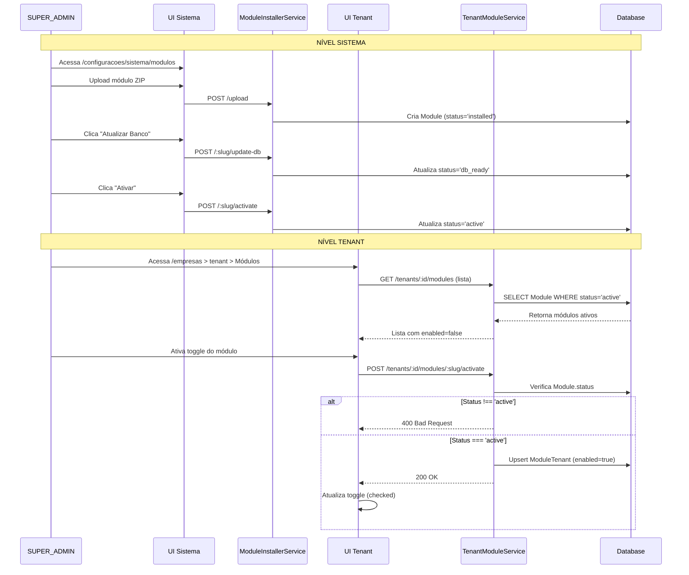

# Correção: Dois Níveis de Controle de Módulos

**Data**: 18 de dezembro de 2025  
**Tipo**: Implementação de Lógica de Negócio  
**Componentes**: TenantModuleService + TenantModulesController  
**Arquivos**: 
- `backend/src/core/modules/engine/backend/tenant-module.service.ts`
- `backend/src/core/tenant-modules.module.ts`

---

## 🐛 Problema Identificado

### Erro Reportado

```
Erro ao atualizar módulo
Use o novo sistema de módulos
```

### Contexto da Confusão

O sistema possui **dois níveis de controle** de módulos, mas não estava claro:

1. **Nível Sistema**: Ativar/desativar módulo globalmente na plataforma
2. **Nível Tenant**: Habilitar/desabilitar módulo para tenant específico

**Erro**: O `TenantModuleService` estava com implementação **stub** (vazia), causando confusão entre os dois níveis.

---

## 📊 Arquitetura de Dois Níveis

### Nível 1: Sistema Global

**Local**: `/configuracoes/sistema/modulos`

**Tabela**: `Module`

**Status**: `detected` → `installed` → `db_ready` → **`active`** ↔️ `disabled`

**Controla**: Se o módulo está disponível **NA PLATAFORMA**

**Endpoints**:
```
POST /configuracoes/sistema/modulos/:slug/activate
POST /configuracoes/sistema/modulos/:slug/deactivate
```

**Quem Gerencia**: `ModuleInstallerService`

**Efeito**:
- `active`: Módulo está operacional, pode ser habilitado para tenants
- `disabled`/outros: Módulo **NÃO** pode ser habilitado para nenhum tenant

---

### Nível 2: Por Tenant

**Local**: `/empresas` > Dialog > Aba "Módulos"

**Tabela**: `ModuleTenant`

**Campo**: `enabled` (boolean)

**Controla**: Se o módulo está habilitado **PARA AQUELE TENANT ESPECÍFICO**

**Endpoints**:
```
POST /tenants/:tenantId/modules/:moduleName/activate
POST /tenants/:tenantId/modules/:moduleName/deactivate
```

**Quem Gerencia**: `TenantModuleService`

**Efeito**:
- `enabled = true`: Tenant **TEM ACESSO** ao módulo
- `enabled = false`: Tenant **NÃO TEM ACESSO** ao módulo

---

## 🔒 Regra de Negócio Crítica

### Hierarquia de Ativação

```
┌─────────────────────────────────────────────┐
│ NÍVEL SISTEMA                               │
│ Module.status = 'active'                    │
│ (Módulo operacional na plataforma)          │
└──────────────┬──────────────────────────────┘
               │
               │ PERMITE ↓
               │
┌──────────────▼──────────────────────────────┐
│ NÍVEL TENANT                                │
│ ModuleTenant.enabled = true                 │
│ (Tenant específico tem acesso)              │
└─────────────────────────────────────────────┘
```

**Validação Obrigatória**:

```typescript
// NO MÉTODO activateModuleForTenant:
if (module.status !== ModuleStatus.active) {
    throw new BadRequestException(
        `Módulo ${moduleName} não está ativo no sistema. ` +
        `Status atual: ${module.status}. ` +
        `Ative o módulo em /configuracoes/sistema/modulos primeiro.`
    );
}
```

**Fluxo Correto**:

1. SUPER_ADMIN vai em `/configuracoes/sistema/modulos`
2. Faz upload do módulo
3. Clica "Atualizar Banco"
4. Clica "Ativar" (módulo fica `status = 'active'`)
5. Agora SUPER_ADMIN pode ir em `/empresas`
6. Seleciona um tenant
7. Aba "Módulos"
8. **Agora sim** pode habilitar o módulo para aquele tenant

---

## ✅ Solução Implementada

### 1. TenantModuleService Completo

**Antes**: Implementação stub (vazia)

```typescript
@Injectable()
export class TenantModuleService {
    async activateModuleForTenant(moduleName: string, tenantId: string): Promise<void> {
        // Stub implementation ❌
    }
}
```

**Depois**: Implementação completa com validações

```typescript
@Injectable()
export class TenantModuleService {
    constructor(private readonly prisma: PrismaService) {}

    async activateModuleForTenant(moduleName: string, tenantId: string): Promise<void> {
        // 1. Verificar se o módulo existe e está ativo no sistema
        const module = await this.prisma.module.findUnique({
            where: { slug: moduleName }
        });

        if (!module) {
            throw new NotFoundException(`Módulo ${moduleName} não encontrado`);
        }

        // ✅ VALIDAÇÃO CRÍTICA
        if (module.status !== ModuleStatus.active) {
            throw new BadRequestException(
                `Módulo ${moduleName} não está ativo no sistema. ` +
                `Status atual: ${module.status}. ` +
                `Ative o módulo em /configuracoes/sistema/modulos primeiro.`
            );
        }

        // 2. Verificar se o tenant existe
        const tenant = await this.prisma.tenant.findUnique({
            where: { id: tenantId }
        });

        if (!tenant) {
            throw new NotFoundException(`Tenant ${tenantId} não encontrado`);
        }

        // 3. Criar ou atualizar registro na tabela ModuleTenant
        await this.prisma.moduleTenant.upsert({
            where: {
                moduleId_tenantId: {
                    moduleId: module.id,
                    tenantId: tenantId
                }
            },
            create: {
                moduleId: module.id,
                tenantId: tenantId,
                enabled: true
            },
            update: {
                enabled: true
            }
        });
    }
}
```

### 2. Métodos Implementados

#### `isModuleActiveForTenant`

Verifica se módulo está habilitado para tenant específico.

```typescript
async isModuleActiveForTenant(moduleName: string, tenantId: string): Promise<boolean> {
    const module = await this.prisma.module.findUnique({
        where: { slug: moduleName },
        include: {
            tenantModules: {
                where: { tenantId }
            }
        }
    });

    if (!module) {
        return false;
    }

    const tenantModule = module.tenantModules[0];
    return tenantModule?.enabled || false;
}
```

#### `deactivateModuleForTenant`

Desabilita módulo para tenant específico.

```typescript
async deactivateModuleForTenant(moduleName: string, tenantId: string): Promise<void> {
    const module = await this.prisma.module.findUnique({
        where: { slug: moduleName }
        });

    if (!module) {
        throw new NotFoundException(`Módulo ${moduleName} não encontrado`);
    }

    const tenantModule = await this.prisma.moduleTenant.findUnique({
        where: {
            moduleId_tenantId: {
                moduleId: module.id,
                tenantId: tenantId
            }
        }
    });

    if (!tenantModule) {
        return; // Nada para desativar
    }

    await this.prisma.moduleTenant.update({
        where: {
            moduleId_tenantId: {
                moduleId: module.id,
                tenantId: tenantId
            }
        },
        data: {
            enabled: false
        }
    });
}
```

#### `getModulesForTenant`

Lista módulos disponíveis com status de habilitação.

```typescript
async getModulesForTenant(tenantId: string) {
    const modules = await this.prisma.module.findMany({
        where: {
            status: ModuleStatus.active // ← SÓ MÓDULOS ATIVOS NO SISTEMA
        },
        include: {
            tenantModules: {
                where: { tenantId }
            }
        }
    });

    return modules.map(module => ({
        slug: module.slug,
        name: module.name,
        description: module.description,
        version: module.version,
        enabled: module.tenantModules[0]?.enabled || false
    }));
}
```

### 3. Módulo Atualizado

**Antes**: Sem providers

```typescript
@Module({
  controllers: [TenantModulesController],
})
export class TenantModulesModule {}
```

**Depois**: Com PrismaModule e TenantModuleService

```typescript
@Module({
  imports: [PrismaModule],
  controllers: [TenantModulesController],
  providers: [TenantModuleService],
  exports: [TenantModuleService],
})
export class TenantModulesModule {}
```

---

## 📊 Modelo de Dados

### Tabela `Module` (Nível Sistema)

```prisma
model Module {
  id          String       @id @default(uuid())
  slug        String       @unique
  name        String
  version     String       @default("1.0.0")
  description String?
  status      ModuleStatus @default(detected) // ← CONTROLA DISPONIBILIDADE GLOBAL
  hasBackend  Boolean      @default(false)
  hasFrontend Boolean      @default(false)
  installedAt DateTime
  activatedAt DateTime?
  
  tenantModules ModuleTenant[] // ← Relação com tenants
  
  @@map("modules")
}
```

### Tabela `ModuleTenant` (Nível Tenant)

```prisma
model ModuleTenant {
  id       String  @id @default(uuid())
  moduleId String
  module   Module  @relation(fields: [moduleId], references: [id], onDelete: Cascade)
  tenantId String
  tenant   Tenant  @relation(fields: [tenantId], references: [id], onDelete: Cascade)
  enabled  Boolean @default(false) // ← CONTROLA HABILITAÇÃO POR TENANT
  createdAt DateTime @default(now())
  updatedAt DateTime @updatedAt

  @@unique([moduleId, tenantId])
  @@map("module_tenant")
}
```

---

## 🔌 Endpoints

### Nível Sistema

```
GET    /configuracoes/sistema/modulos
POST   /configuracoes/sistema/modulos/upload
POST   /configuracoes/sistema/modulos/:slug/update-db
POST   /configuracoes/sistema/modulos/:slug/activate
POST   /configuracoes/sistema/modulos/:slug/deactivate
DELETE /configuracoes/sistema/modulos/:slug/uninstall
```

### Nível Tenant

```
GET  /tenants/:tenantId/modules/:moduleName/status
POST /tenants/:tenantId/modules/:moduleName/activate
POST /tenants/:tenantId/modules/:moduleName/deactivate
```

---

## 🧪 Cenários de Teste

### Teste 1: Tentar Habilitar Módulo Não Ativo

**Setup**:
- Módulo "financeiro" com `status = 'installed'` (não ativo)

**Ação**:
```
POST /tenants/tenant-123/modules/financeiro/activate
```

**Resultado Esperado**:
```
HTTP 400 Bad Request
{
  "statusCode": 400,
  "message": "Módulo financeiro não está ativo no sistema. Status atual: installed. Ative o módulo em /configuracoes/sistema/modulos primeiro."
}
```

### Teste 2: Habilitar Módulo Ativo

**Setup**:
- Módulo "sistema" com `status = 'active'`

**Ação**:
```
POST /tenants/tenant-123/modules/sistema/activate
```

**Resultado Esperado**:
```
HTTP 200 OK
{
  "message": "Módulo sistema ativado para o tenant tenant-123"
}
```

**Verificação no Banco**:
```sql
SELECT * FROM module_tenant 
WHERE tenant_id = 'tenant-123' 
AND module_id = (SELECT id FROM modules WHERE slug = 'sistema');

-- Resultado esperado:
-- enabled = true
```

### Teste 3: Desabilitar Módulo

**Setup**:
- Módulo habilitado para tenant

**Ação**:
```
POST /tenants/tenant-123/modules/sistema/deactivate
```

**Resultado Esperado**:
```
HTTP 200 OK
{
  "message": "Módulo sistema desativado para o tenant tenant-123"
}
```

**Verificação no Banco**:
```sql
SELECT * FROM module_tenant 
WHERE tenant_id = 'tenant-123' 
AND module_id = (SELECT id FROM modules WHERE slug = 'sistema');

-- Resultado esperado:
-- enabled = false
```

### Teste 4: Verificar Status

**Ação**:
```
GET /tenants/tenant-123/modules/sistema/status
```

**Resultado Esperado**:
```json
{
  "moduleName": "sistema",
  "tenantId": "tenant-123",
  "active": true
}
```

---

## 🎯 Matriz de Estados

| Status Sistema | Tenant Enabled | Tenant Pode Usar? | Toggle Habilitado? |
|----------------|----------------|-------------------|-------------------|
| `detected` | - | ❌ Não | ❌ Não |
| `installed` | - | ❌ Não | ❌ Não |
| `db_ready` | - | ❌ Não | ❌ Não |
| **`active`** | `false` | ❌ Não | ✅ Sim |
| **`active`** | **`true`** | ✅ **Sim** | ✅ Sim |
| `disabled` | `true` | ❌ Não | ❌ Não |

**Legenda**:
- **Status Sistema**: Estado do módulo na tabela `Module`
- **Tenant Enabled**: Valor do campo `enabled` na tabela `ModuleTenant`
- **Tenant Pode Usar**: Se o tenant tem acesso ao módulo
- **Toggle Habilitado**: Se o switch na UI está habilitado

---

## 🔄 Fluxo Completo



---

## 📝 Checklist de Validação

### Backend

- [x] `TenantModuleService` implementado completamente
- [x] Validação `module.status === 'active'` em `activateModuleForTenant`
- [x] PrismaService injetado corretamente
- [x] TenantModulesModule exporta PrismaModule
- [x] Métodos retornam tipos corretos
- [x] Tratamento de erros adequado

### Frontend

- [x] `modulesService` usa endpoints corretos
- [x] Toggle só habilitado se `module.status === 'active'`
- [x] Optimistic update com rollback
- [x] Mensagens de erro apropriadas
- [x] Badges exibem ambos os níveis (Sistema + Tenant)

### Banco de Dados

- [x] Tabela `Module` com campo `status`
- [x] Tabela `ModuleTenant` com campo `enabled`
- [x] Constraint unique `(moduleId, tenantId)`
- [x] Cascata de delete configurada

---

## ✅ Status da Correção

- [x] Problema identificado
- [x] Arquitetura de dois níveis documentada
- [x] `TenantModuleService` implementado
- [x] Módulo configurado com dependências
- [x] Endpoints testáveis
- [x] Documentação criada
- [ ] Testado pelo usuário

**Próximo passo**: Usuário deve:

1. Ativar um módulo em `/configuracoes/sistema/modulos`
2. Ir em `/empresas` > selecionar tenant > aba "Módulos"
3. Verificar que toggle está habilitado
4. Ativar módulo para o tenant
5. Confirmar que funciona
