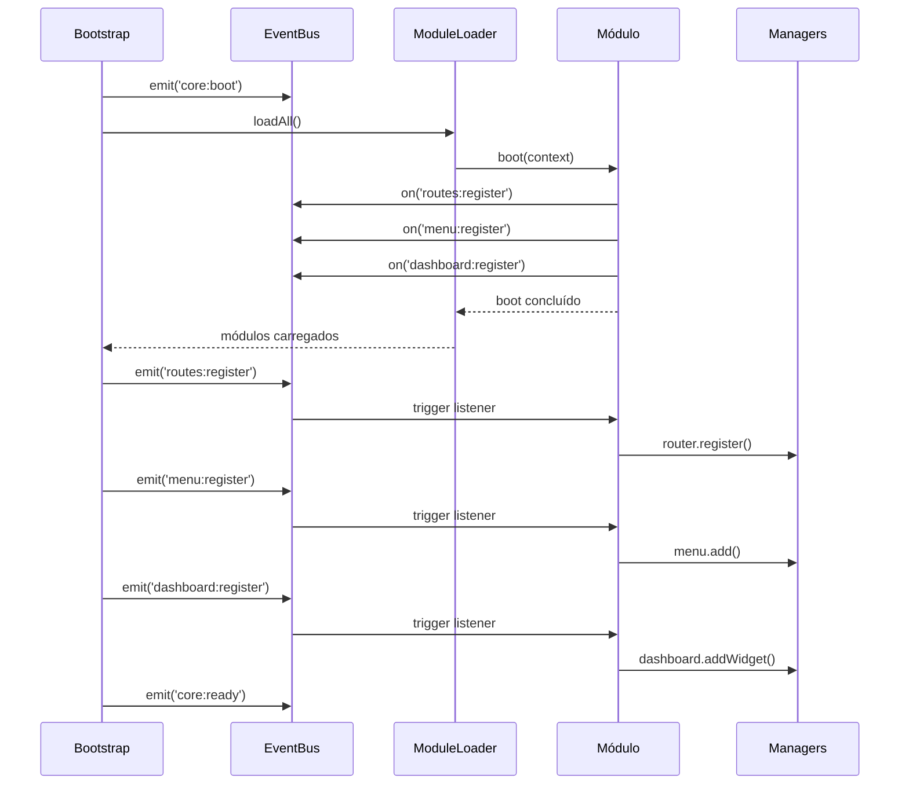

# 🔧 Correção: Ordem de Eventos no Bootstrap

## ❌ Problema Identificado

O módulo `demo-completo` estava sendo carregado mas **não registrava** menus, widgets, rotas e outros recursos no sistema.

### Causa Raiz

O `CoreBootstrap` estava disparando os eventos de registro **ANTES** de carregar os módulos:

```typescript
// ❌ ORDEM ERRADA (ANTES)
1. Disparar core:boot
2. Disparar menu:register      ← Módulos ainda não carregados!
3. Disparar dashboard:register  ← Módulos ainda não carregados!
4. Disparar routes:register     ← Módulos ainda não carregados!
5. Carregar módulos
6. Disparar core:ready
```

**Resultado**: Quando os eventos eram disparados, os módulos ainda não tinham registrado seus listeners, então nada era executado.

---

## ✅ Solução Aplicada

Correção da ordem de execução no [`core/bootstrap/CoreBootstrap.ts`](file:///d:/Usuarios/Servidor/GORInformatica/Documents/GitHub/Projeto-menu-multitenant-seguro/core/bootstrap/CoreBootstrap.ts):

```typescript
// ✅ ORDEM CORRETA (DEPOIS)
1. Disparar core:boot
2. Carregar módulos              ← Módulos registram listeners aqui
3. Disparar routes:register      ← Agora os módulos estão escutando!
4. Disparar menu:register        ← Agora os módulos estão escutando!
5. Disparar dashboard:register   ← Agora os módulos estão escutando!
6. Disparar permissions:register
7. Disparar notifications:register
8. Disparar core:ready
```

---

## 📝 Mudanças Realizadas

### Arquivo: `core/bootstrap/CoreBootstrap.ts`

#### 1. Moveu carregamento de módulos ANTES dos eventos

**Antes:**
```typescript
// 3. Disparar eventos de registro
await eventBus.emit('menu:register', { ... });
await eventBus.emit('dashboard:register', { ... });

// 4. Criar e inicializar module loader
this.loader = new ModuleLoader({ ... });

// 5. Carregar todos os módulos
const result = await this.loader.loadAll(context);
```

**Depois:**
```typescript
// 3. Criar e inicializar module loader
this.loader = new ModuleLoader({ ... });

// 4. Carregar todos os módulos (eles registram listeners aqui)
const result = await this.loader.loadAll(context);

// 5. AGORA disparar eventos de registro (módulos já estão escutando)
await eventBus.emit('routes:register', { router, ... });
await eventBus.emit('menu:register', { ... });
await eventBus.emit('dashboard:register', { ... });
```

#### 2. Adicionou evento `routes:register`

O evento `routes:register` estava faltando e foi adicionado:

```typescript
const router = options.router || this.createDummyRouter();

await eventBus.emit('routes:register', {
  router,
  timestamp: new Date(),
});
```

---

## 🧪 Como Testar

### Opção 1: Script de Teste (Recomendado)

```bash
# Executar script de teste
ts-node test-core-demo.ts
```

O script irá:
1. Inicializar o CORE
2. Carregar o módulo demo-completo
3. Verificar se todos os recursos foram registrados
4. Mostrar resumo completo

### Opção 2: Teste Manual

1. **Verificar logs de inicialização**
   - Deve aparecer: `✓ 6 itens de menu adicionados`
   - Deve aparecer: `✓ 4 widgets registrados`
   - Deve aparecer: `✓ 6 rotas criadas`

2. **Verificar resumo final**
   ```
   📊 Módulos carregados: 1
   📊 Itens de menu: 6
   📊 Widgets: 4
   📊 Canais de notificação: 1
   📊 Permissões: 9 (4 padrão + 5 demo)
   ```

---

## 📊 Resultado Esperado

### ✅ Antes da Correção
- Módulo carregava sem erros
- Nenhum menu aparecia
- Nenhum widget registrado
- Nenhuma rota criada
- Apenas permissões padrão

### ✅ Depois da Correção
- Módulo carrega com sucesso
- **6 menus** registrados
- **4 widgets** registrados
- **6 rotas** criadas
- **5 permissões** adicionadas
- **1 canal** de notificação
- **5 event listeners** ativos

---

## 🎯 Fluxo Correto de Inicialização



---

## 💡 Lições Aprendidas

### 1. Event-Driven Architecture
- **Listeners devem ser registrados ANTES dos eventos serem disparados**
- A ordem de execução é crítica em sistemas orientados a eventos

### 2. Bootstrap Sequence
- Infraestrutura primeiro (Event Bus, Context)
- Módulos em segundo (registram listeners)
- Eventos em terceiro (disparam ações)
- Ready no final (sistema pronto)

### 3. Debugging
- Sempre verificar logs de inicialização
- Contar recursos registrados
- Comparar com valores esperados

---

## 🔍 Debugging

### Comandos Úteis

```typescript
// Ver todos os menus
managers.menu.debug();

// Ver todos os widgets
console.log('Widgets:', managers.dashboard.count());

// Ver permissões
console.log('Permissões:', managers.acl.getPermissions());

// Ver roles
console.log('Roles:', managers.acl.getRoles());
```

### Logs Importantes

```
✅ Carregado: demo-completo
🔐 [1/10] Registrando permissões customizadas...
   ✓ 5 permissões registradas com sucesso
🧭 [2/10] Criando estrutura de menu...
   ✓ 6 itens de menu adicionados
📊 [3/10] Registrando widgets no dashboard...
   ✓ 4 widgets registrados
```

---

## ✅ Checklist de Verificação

- [x] Eventos disparados DEPOIS do carregamento de módulos
- [x] Evento `routes:register` adicionado
- [x] Router passado no evento
- [x] Menus sendo registrados
- [x] Widgets sendo registrados
- [x] Rotas sendo criadas
- [x] Permissões sendo adicionadas
- [x] Canais de notificação funcionando

---

## 📚 Arquivos Relacionados

1. **Corrigidos**
   - [`core/bootstrap/CoreBootstrap.ts`](file:///d:/Usuarios/Servidor/GORInformatica/Documents/GitHub/Projeto-menu-multitenant-seguro/core/bootstrap/CoreBootstrap.ts) - Ordem de eventos corrigida

2. **Testados**
   - [`modules/demo-completo/index.ts`](file:///d:/Usuarios/Servidor/GORInformatica/Documents/GitHub/Projeto-menu-multitenant-seguro/modules/demo-completo/index.ts) - Módulo funcionando

3. **Criados**
   - [`test-core-demo.ts`](file:///d:/Usuarios/Servidor/GORInformatica/Documents/GitHub/Projeto-menu-multitenant-seguro/test-core-demo.ts) - Script de teste

---

**✅ Correção aplicada com sucesso!**  
**🎯 O módulo demo-completo agora registra todos os recursos corretamente!**
