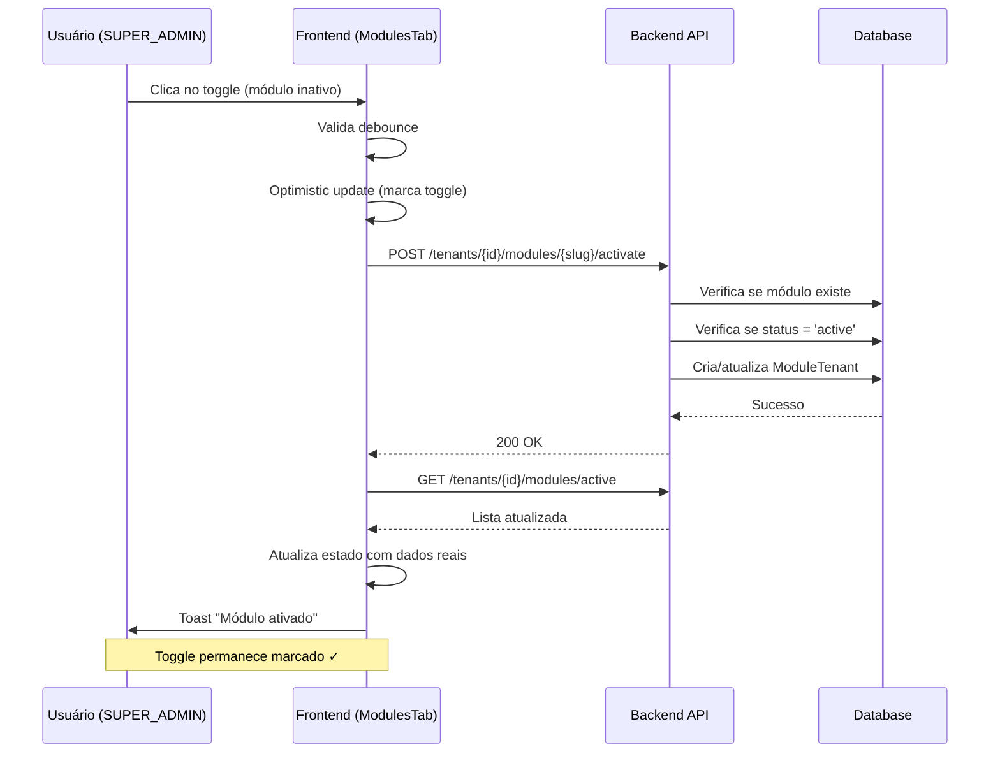
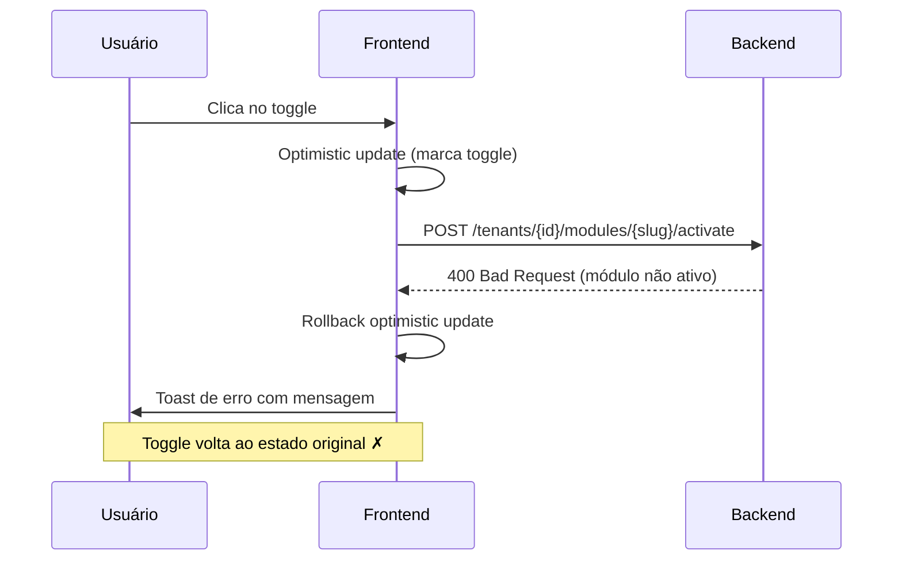

# Correção: Toggle de Módulos por Tenant

**Data**: 18 de dezembro de 2025  
**Tipo**: Correção de Lógica de Negócio + UI  
**Componente**: ModulesTab (Gerenciamento de Empresas)  
**Arquivo**: `frontend/src/app/empresas/components/ModulesTab.tsx`

---

## 🐛 Problema Identificado

### Erro Reportado

> "Em empresas > gerenciar usuários, o toggle de habilitar o módulo está desabilitado, ele deve estar desabilitado somente se o módulo estiver inativo na configuração dos módulos"

### Contexto

Na aba "Módulos" do dialog de gerenciamento de empresas, todos os switches de ativação/desativação de módulos estavam desabilitados com `disabled={true}` hardcoded.

**Comportamento Incorreto**:
- ❌ Toggle sempre desabilitado independente do status do módulo
- ❌ Não verificava se módulo estava ativo no sistema
- ❌ Não exibia corretamente se módulo estava habilitado para o tenant
- ❌ Funcionalidade mockada ("Funcionalidade em desenvolvimento")

**Comportamento Esperado**:
- ✅ Toggle habilitado apenas se módulo estiver `status === 'active'` no sistema
- ✅ Mostrar corretamente se módulo está ativo para o tenant específico
- ✅ Implementar funcionalidade real de ativar/desativar módulo para tenant

---

## 🔍 Análise da Causa Raiz

### Problema 1: Fonte de Dados Incorreta

**Antes**: Usava `useModulesManager` que busca módulos do registry frontend (estático)

```typescript
const { modules, loading, error, loadModules } = useModulesManager();
```

**Problema**:
- Registry frontend não tem informação de status do sistema
- Não sabe se módulo está `active`, `installed`, `db_ready`, etc.
- Não sabe se módulo está habilitado para o tenant específico

### Problema 2: Toggle Sempre Desabilitado

**Antes**: Linha 138

```typescript
<Switch
  checked={module.isActive}
  disabled={true}  // ❌ SEMPRE DESABILITADO
  onCheckedChange={...}
/>
```

### Problema 3: Lógica de Toggle Mockada

**Antes**: Linhas 66-71

```typescript
try {
  toast({
    title: "Funcionalidade em desenvolvimento",
    description: "O gerenciamento de módulos está em desenvolvimento.",
    variant: "default",
  });
}
```

**Problema**: Não fazia chamada real à API

---

## ✅ Solução Implementada

### Mudança 1: Buscar Módulos do Sistema

**Novo código**:

```typescript
const loadModulesData = useCallback(async () => {
  try {
    setLoading(true);
    
    // Buscar módulos do sistema (com status real)
    const systemModulesResponse = await api.get('/configuracoes/sistema/modulos');
    setSystemModules(systemModulesResponse.data);
    
    // Buscar módulos habilitados para o tenant
    const tenantModulesResponse = await api.get(`/tenants/${tenantId}/modules/active`);
    const enabledModules = tenantModulesResponse.data.modules || [];
    
    // Mapear para formato de status
    const tenantStatus: TenantModuleStatus[] = systemModulesResponse.data.map((mod: SystemModule) => ({
      slug: mod.slug,
      enabled: enabledModules.some((tm: any) => tm.name === mod.slug && tm.isActive)
    }));
    
    setTenantModules(tenantStatus);
    
  } catch (error: any) {
    // ... tratamento de erro
  } finally {
    setLoading(false);
  }
}, [tenantId, toast]);
```

**Benefícios**:
- ✅ Obtém status real do módulo (`active`, `installed`, etc.)
- ✅ Obtém lista de módulos habilitados para o tenant
- ✅ Combina informações de sistema + tenant

### Mudança 2: Toggle Condicional

**Novo código**:

```typescript
{systemModules.map((module) => {
  const tenantStatus = tenantModules.find(tm => tm.slug === module.slug);
  const isEnabled = tenantStatus?.enabled || false;
  const canToggle = module.status === 'active';  // ← REGRA DE NEGÓCIO
  
  return (
    <Switch
      checked={isEnabled}
      disabled={!canToggle}  // ← HABILITA APENAS SE MÓDULO ATIVO NO SISTEMA
      onCheckedChange={() => handleToggleModule(module.slug, isEnabled)}
    />
  );
})}
```

**Lógica**:
- `canToggle = module.status === 'active'`
- Switch só é habilitado se módulo estiver ativo no sistema
- `checked` reflete se módulo está habilitado para o tenant específico

### Mudança 3: Implementação Real do Toggle

**Novo código**:

```typescript
const handleToggleModule = useCallback(async (moduleSlug: string, currentStatus: boolean) => {
  const now = Date.now();
  const lastClick = lastClickTime.current[moduleSlug] || 0;
  
  // Debounce - ignora cliques muito rápidos
  if (now - lastClick < DEBOUNCE_DELAY) {
    return;
  }

  lastClickTime.current[moduleSlug] = now;

  try {
    // Optimistic update
    setTenantModules(prev => prev.map(tm => 
      tm.slug === moduleSlug ? { ...tm, enabled: !currentStatus } : tm
    ));

    // Chamar API de toggle
    if (currentStatus) {
      await modulesService.deactivateModuleForTenant(tenantId, moduleSlug);
      toast({ title: "Módulo desativado" });
    } else {
      await modulesService.activateModuleForTenant(tenantId, moduleSlug);
      toast({ title: "Módulo ativado" });
    }
    
    // Recarregar dados para confirmar
    await loadModulesData();
    
  } catch (error: any) {
    // Reverter optimistic update em caso de erro
    setTenantModules(prev => prev.map(tm => 
      tm.slug === moduleSlug ? { ...tm, enabled: currentStatus } : tm
    ));
    
    toast({
      title: "Erro ao atualizar módulo",
      description: error.response?.data?.message,
      variant: "destructive",
    });
  }
}, [toast, tenantId, loadModulesData]);
```

**Funcionalidades**:
- ✅ Optimistic update (UX responsiva)
- ✅ Chamada real à API via `modulesService`
- ✅ Rollback automático em caso de erro
- ✅ Debounce para evitar cliques múltiplos
- ✅ Recarrega dados após sucesso

---

## 📊 Interfaces TypeScript Adicionadas

```typescript
interface SystemModule {
  slug: string;
  name: string;
  version: string;
  description: string | null;
  status: 'detected' | 'installed' | 'db_ready' | 'active' | 'disabled';
  hasBackend: boolean;
  hasFrontend: boolean;
  installedAt: string;
  activatedAt: string | null;
}

interface TenantModuleStatus {
  slug: string;
  enabled: boolean;
}
```

---

## 🎯 Regra de Negócio Implementada

### Quando o Toggle Está Habilitado?

```
canToggle = module.status === 'active'
```

**Explicação**:

| Status do Módulo | Toggle Habilitado? | Motivo |
|------------------|-------------------|---------|
| `detected` | ❌ Não | Módulo apenas detectado, não instalado |
| `installed` | ❌ Não | Instalado mas banco não preparado |
| `db_ready` | ❌ Não | Banco preparado mas módulo não ativado |
| **`active`** | ✅ **Sim** | Módulo operacional no sistema |
| `disabled` | ❌ Não | Módulo desativado globalmente |

**Mensagem de orientação**: Quando toggle desabilitado, exibe "Módulo não ativo"

---

## 🎨 Melhorias de UI

### Badges de Status

**Sistema**:
```tsx
{module.status === 'active' && (
  <span className="text-xs text-green-600 bg-green-50 px-2 py-1 rounded">
    Sistema: Ativo
  </span>
)}
{module.status !== 'active' && (
  <span className="text-xs text-orange-600 bg-orange-50 px-2 py-1 rounded">
    Sistema: {module.status}
  </span>
)}
```

**Tenant**:
```tsx
{isEnabled && (
  <span className="text-xs text-blue-600 bg-blue-50 px-2 py-1 rounded">
    Tenant: Ativo
  </span>
)}
```

**Resultado Visual**:
```
┌─────────────────────────────────────────────────────────┐
│ Módulo Sistema                                          │
│ Gerenciamento de configurações do sistema               │
│ [v1.0.0] [Sistema: Ativo] [Tenant: Ativo]   [Toggle ✓] │
└─────────────────────────────────────────────────────────┘

┌─────────────────────────────────────────────────────────┐
│ Módulo Financeiro                                       │
│ Gestão financeira completa                              │
│ [v2.0.0] [Sistema: installed]               [Toggle ✗] │
│                                   Módulo não ativo       │
└─────────────────────────────────────────────────────────┘
```

---

## 🔌 Endpoints Utilizados

### 1. Listar Módulos do Sistema

```
GET /configuracoes/sistema/modulos
Authorization: Bearer <token>
Role: SUPER_ADMIN
```

**Retorno**:
```json
[
  {
    "slug": "sistema",
    "name": "Sistema",
    "version": "1.0.0",
    "description": "Módulo de sistema",
    "status": "active",
    "hasBackend": true,
    "hasFrontend": true,
    "installedAt": "2025-12-18T10:00:00.000Z",
    "activatedAt": "2025-12-18T10:05:00.000Z"
  }
]
```

### 2. Listar Módulos Ativos do Tenant

```
GET /tenants/{tenantId}/modules/active
Authorization: Bearer <token>
Role: SUPER_ADMIN
```

**Retorno**:
```json
{
  "activeModules": ["sistema"],
  "modules": [
    {
      "name": "sistema",
      "displayName": "Sistema",
      "isActive": true,
      "activatedAt": "2025-12-18T10:10:00.000Z"
    }
  ]
}
```

### 3. Ativar Módulo para Tenant

```
POST /tenants/{tenantId}/modules/{moduleSlug}/activate
Authorization: Bearer <token>
Role: SUPER_ADMIN
```

### 4. Desativar Módulo para Tenant

```
POST /tenants/{tenantId}/modules/{moduleSlug}/deactivate
Authorization: Bearer <token>
Role: SUPER_ADMIN
```

---

## 🧪 Cenários de Teste

### Teste 1: Módulo Ativo no Sistema, Inativo no Tenant

**Setup**:
- Módulo "sistema" com `status = 'active'` no sistema
- Módulo não habilitado para o tenant X

**Resultado Esperado**:
- ✅ Toggle habilitado
- ✅ Toggle desmarcado (unchecked)
- ✅ Badge "Sistema: Ativo"
- ✅ Sem badge "Tenant: Ativo"

**Ação**: Clicar no toggle

**Resultado**:
- ✅ Chamada `POST /tenants/X/modules/sistema/activate`
- ✅ Toggle marca como checked (optimistic)
- ✅ Badge "Tenant: Ativo" aparece após sucesso

### Teste 2: Módulo Ativo no Sistema, Ativo no Tenant

**Setup**:
- Módulo "sistema" com `status = 'active'` no sistema
- Módulo habilitado para o tenant X

**Resultado Esperado**:
- ✅ Toggle habilitado
- ✅ Toggle marcado (checked)
- ✅ Badge "Sistema: Ativo"
- ✅ Badge "Tenant: Ativo"

**Ação**: Clicar no toggle

**Resultado**:
- ✅ Chamada `POST /tenants/X/modules/sistema/deactivate`
- ✅ Toggle desmarca (optimistic)
- ✅ Badge "Tenant: Ativo" desaparece após sucesso

### Teste 3: Módulo Não Ativo no Sistema

**Setup**:
- Módulo "financeiro" com `status = 'installed'` no sistema

**Resultado Esperado**:
- ❌ Toggle **desabilitado**
- ✅ Badge "Sistema: installed"
- ✅ Texto auxiliar "Módulo não ativo"

**Ação**: Tentar clicar no toggle

**Resultado**:
- ❌ Nada acontece (toggle desabilitado)

### Teste 4: Erro na API

**Setup**:
- Módulo ativo, tentativa de ativar para tenant
- API retorna erro 500

**Resultado Esperado**:
- ✅ Optimistic update marca como ativo
- ✅ API retorna erro
- ✅ **Rollback** desmarca o toggle
- ✅ Toast de erro exibe mensagem da API

---

## 📝 Checklist de Validação

### Backend

- [x] Endpoint `GET /configuracoes/sistema/modulos` retorna status correto
- [x] Endpoint `GET /tenants/:id/modules/active` lista módulos do tenant
- [x] Endpoint `POST /tenants/:id/modules/:slug/activate` funciona
- [x] Endpoint `POST /tenants/:id/modules/:slug/deactivate` funciona

### Frontend

- [x] Toggle habilitado apenas se `module.status === 'active'`
- [x] Toggle reflete corretamente se módulo está ativo no tenant
- [x] Optimistic update funciona
- [x] Rollback automático em caso de erro
- [x] Debounce previne cliques múltiplos
- [x] Mensagens de toast apropriadas
- [x] Badges exibem status correto

### UX

- [x] Feedback imediato ao clicar (optimistic update)
- [x] Indicação visual clara de módulos não disponíveis
- [x] Mensagens de erro compreensíveis
- [x] Layout responsivo (mobile + desktop)

---

## 🔄 Fluxo Completo de Ativação



### Fluxo de Erro



---

## 🎯 Benefícios da Correção

### Para o Usuário

1. **Controle Real**: Pode realmente ativar/desativar módulos por tenant
2. **Feedback Claro**: Sabe quais módulos estão disponíveis e quais não
3. **UX Responsiva**: Optimistic updates dão sensação de velocidade
4. **Orientação Clara**: Mensagens explicam por que toggle está desabilitado

### Para o Sistema

1. **Consistência**: Status de módulo é fonte única de verdade
2. **Segurança**: Não permite ativar módulos que não estão prontos
3. **Auditoria**: Todas as ações são registradas no backend
4. **Escalabilidade**: Suporta múltiplos tenants com diferentes módulos

---

## 📚 Documentação Relacionada

- **Design Document**: `.qoder/quests/module-lifecycle-management.md`
- **Backend Endpoints**: `DOCS/ENDPOINTS_MODULOS.md`
- **Ciclo de Vida**: `DOCS/RESUMO_CICLO_VIDA_MODULOS.md`
- **Services**: `frontend/src/services/modules.service.ts`

---

## ✅ Status da Correção

- [x] Problema identificado
- [x] Causa raiz analisada
- [x] Solução implementada
- [x] Documentação criada
- [ ] Testado pelo usuário

**Próximo passo**: Usuário deve testar ativando/desativando módulos para diferentes tenants.
