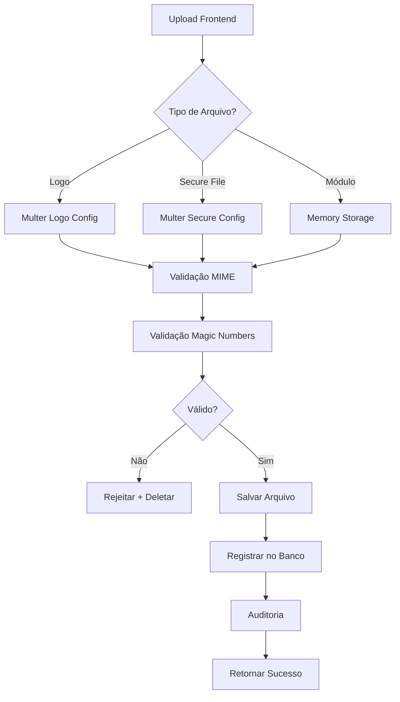

# 📸 Relatório Completo do Sistema de Imagens

> **Data de Criação**: 19 de Dezembro de 2024  
> **Versão do Documento**: 1.0  
> **Status**: Produção

## 📋 Índice

1. [Visão Geral](#visão-geral)
2. [Arquitetura do Sistema](#arquitetura-do-sistema)
3. [Sistema de Logos de Empresas](#sistema-de-logos-de-empresas)
4. [Sistema de Arquivos Seguros](#sistema-de-arquivos-seguros)
5. [Configurações e Variáveis de Ambiente](#configurações-e-variáveis-de-ambiente)
6. [Segurança e Validação](#segurança-e-validação)
7. [Cache e Performance](#cache-e-performance)
8. [Endpoints da API](#endpoints-da-api)
9. [Integração Frontend](#integração-frontend)
10. [Melhorias Implementadas](#melhorias-implementadas)
11. [Troubleshooting](#troubleshooting)

---

## 🎯 Visão Geral

O sistema possui **três tipos principais de upload de arquivos**:

### 1. Logos de Empresas (Tenants)
- **Finalidade**: Identidade visual das empresas no sistema
- **Acesso**: Público (sem autenticação para visualização)
- **Localização**: `backend/uploads/logos/`
- **Tipos aceitos**: Imagens (JPEG, PNG, WebP, GIF)
- **Tamanho máximo**: 5 MB

### 2. Arquivos Sensíveis (Secure Files)
- **Finalidade**: Documentos confidenciais isolados por tenant
- **Acesso**: Autenticado + validação de tenant
- **Localização**: `backend/uploads/secure/{tenantId}/{moduleName}/{documentType}/`
- **Tipos aceitos**: Imagens, PDFs, documentos Office
- **Tamanho máximo**: 10 MB (configurável)

### 3. Módulos do Sistema
- **Finalidade**: Instalação de novos módulos via ZIP
- **Acesso**: Apenas SUPER_ADMIN
- **Localização**: `backend/modules/{slug}/`
- **Tipos aceitos**: Arquivos ZIP
- **Tamanho máximo**: 50 MB

---

## 🏗️ Arquitetura do Sistema

### Estrutura de Diretórios

```
backend/
└── uploads/
    ├── logos/              # Logos de empresas (público)
    │   └── {uuid}_{nome}.png
    ├── secure/             # Arquivos sensíveis (privado)
    │   └── {tenantId}/
    │       └── {moduleName}/
    │           └── {documentType}/
    │               └── {uuid}.{ext}
    ├── temp/               # Processamento temporário
    └── modules/            # Instalação de módulos
```

### Fluxo de Dados



---

## 🏢 Sistema de Logos de Empresas

### 1. Configuração de Upload

#### Arquivo de Configuração
**Localização**: `backend/src/core/common/config/multer.config.ts`

```typescript
export const multerConfig = {
  storage: diskStorage({
    destination: process.env.LOGOS_UPLOAD_DIR || './uploads/logos',
    filename: (req, file, callback) => {
      // Sanitiza e gera nome único
      const sanitizedName = file.originalname
        .replace(/[^a-zA-Z0-9.-]/g, '_')
        .toLowerCase();
      const uniqueName = `${uuidv4()}_${sanitizedName}`;
      callback(null, uniqueName);
    },
  }),
  fileFilter: (req, file, callback) => {
    // Validação de tipo MIME
    const allowedMimeTypes = getAllowedLogoMimeTypes();
    if (!allowedMimeTypes.includes(file.mimetype)) {
      return callback(
        new BadRequestException('Tipo de arquivo não permitido.'),
        false
      );
    }
    callback(null, true);
  },
  limits: {
    fileSize: getMaxLogoFileSize(), // 5 MB padrão
    files: 1,
  },
};
```

#### Validações Implementadas

| Tipo de Validação | Descrição | Momento |
|-------------------|-----------|---------|
| **MIME Type** | Verifica content-type do arquivo | Upload |
| **Extensão** | Valida extensão do nome (.jpg, .png, etc) | Upload |
| **Magic Numbers** | Verifica assinatura binária real | Pós-Upload |
| **Tamanho Mínimo** | Garante arquivo maior que 100 bytes | Pós-Upload |
| **Tamanho Máximo** | Limite de 5 MB | Upload |
| **Nome do Arquivo** | Remove caracteres perigosos | Upload |

#### Magic Numbers Suportados

```typescript
const FILE_SIGNATURES = {
  'image/jpeg': [0xFF, 0xD8, 0xFF],
  'image/png': [0x89, 0x50, 0x4E, 0x47],
  'image/webp': [0x52, 0x49, 0x46, 0x46],
  'image/gif': [0x47, 0x49, 0x46]
};
```

### 2. Modelo de Dados

#### Tabela: `tenants`

```prisma
model Tenant {
  id              String   @id @default(uuid())
  nomeFantasia    String
  logoUrl         String?  // Nome do arquivo da logo
  isMasterTenant  Boolean  @default(false) // Tenant principal da plataforma
  ativo           Boolean  @default(true)
  // ... outros campos
  
  @@index([isMasterTenant])
}
```

### 3. Endpoints de Upload

#### Upload de Logo (SUPER_ADMIN)

```http
POST /tenants/:id/upload-logo
Authorization: Bearer {token}
Content-Type: multipart/form-data

Field: logo (arquivo)
```

**Comportamento**:
1. Valida JWT e role SUPER_ADMIN
2. Processa upload via Multer
3. Valida magic numbers
4. Remove logo antigo (se existir)
5. Atualiza `logoUrl` no banco
6. Registra auditoria

**Resposta de Sucesso**:
```json
{
  "id": "uuid-tenant",
  "logoUrl": "uuid-v4_logo.png",
  "nomeFantasia": "Empresa Exemplo"
}
```

#### Upload de Logo (ADMIN do Próprio Tenant)

```http
POST /tenants/my-tenant/upload-logo
Authorization: Bearer {token}
Content-Type: multipart/form-data

Field: logo (arquivo)
```

**Diferença**: Usa tenantId do usuário logado (do JWT)

#### Remoção de Logo

```http
PATCH /tenants/:id/remove-logo
Authorization: Bearer {token}
```

**Comportamento**:
1. Remove arquivo físico
2. Define `logoUrl = null` no banco
3. Registra auditoria

### 4. Acesso Público aos Logos

#### Via Arquivos Estáticos

```http
GET /uploads/logos/{filename}
```

**Configuração** (`backend/src/main.ts`):

```typescript
app.useStaticAssets(uploadsPath, {
  prefix: '/uploads/',
  setHeaders: (res, path, stat) => {
    if (path.includes('logos/')) {
      // CORS permissivo para logos (recurso público)
      res.setHeader('Access-Control-Allow-Origin', '*');
      res.setHeader('Cache-Control', 'public, max-age=86400');
    }
    // Headers de segurança
    res.setHeader('X-Content-Type-Options', 'nosniff');
    res.setHeader('X-Frame-Options', 'DENY');
  },
});
```

**Por que CORS Permissivo?**
- Logos são recursos visuais não sensíveis
- Necessário para páginas públicas (login)
- Tags `` não enviam header `origin`
- Não contém informações confidenciais

#### Via Endpoints de Metadata

##### Logo da Empresa Master (Plataforma)

```http
GET /tenants/public/master-logo
```

**Resposta**:
```json
{
  "logoUrl": "uuid-v4_logo.png",
  "nomeFantasia": "Sistema Exemplo"
}
```

**Lógica de Seleção**:
1. Busca tenant com `isMasterTenant = true` e `ativo = true`
2. Se não encontrar, usa primeiro tenant ativo por data de criação

##### Logo de Tenant Específico

```http
GET /tenants/public/:id/logo
```

**Resposta**:
```json
{
  "logoUrl": "uuid-v4_logo.png",
  "nomeFantasia": "Empresa Específica"
}
```

### 5. Auditoria de Logos

Todos os uploads e remoções de logos são registrados na tabela `audit_logs`:

```json
{
  "action": "TENANT_LOGO_UPLOADED",
  "userId": "uuid-do-usuario",
  "tenantId": "uuid-do-tenant",
  "details": {
    "tenantName": "Nome da Empresa",
    "oldLogo": "uuid-antigo.png",
    "newLogo": "uuid-novo.png"
  },
  "createdAt": "2024-12-19T10:30:00Z"
}
```

**Ações Registradas**:
- `TENANT_LOGO_UPLOADED`: Upload de nova logo
- `TENANT_LOGO_REMOVED`: Remoção de logo

---

## 🔒 Sistema de Arquivos Seguros

### 1. Estrutura de Armazenamento

**Padrão de Diretórios**:
```
uploads/secure/
└── {tenantId}/
    └── {moduleName}/
        └── {documentType}/
            └── {uuid}.{extensão}
```

**Exemplo Real**:
```
uploads/secure/
└── tenant-abc-123/
    └── cadastro-pessoas/
        ├── documentos-pessoais/
        │   ├── 550e8400-e29b-41d4-a716-446655440000.pdf
        │   └── 6ba7b810-9dad-11d1-80b4-00c04fd430c8.pdf
        └── comprovantes-residencia/
            └── 7c9e6679-7425-40de-944b-e07fc1f90ae7.jpg
```

### 2. Modelo de Dados

#### Tabela: `SecureFile`

```prisma
model SecureFile {
  id           String    @id @default(uuid())
  tenantId     String    // Isolamento por tenant
  moduleName   String    // Módulo que fez upload
  documentType String    // Tipo de documento
  originalName String    // Nome original (sanitizado)
  storedName   String    // Nome único no filesystem
  mimeType     String    // Tipo MIME
  sizeBytes    BigInt    // Tamanho em bytes
  uploadedBy   String    // ID do usuário
  metadata     String?   // JSON com dados adicionais
  deletedAt    DateTime? // Soft delete
  createdAt    DateTime  @default(now())
  updatedAt    DateTime  @updatedAt
  
  @@index([tenantId, moduleName])
  @@index([deletedAt])
}
```

### 3. Fluxo de Upload de Arquivo Seguro

```
1. Frontend envia arquivo + metadata
   ↓
2. Multer salva temporariamente em ./uploads/temp/
   ↓
3. Service valida assinatura (magic numbers)
   ↓
4. Service sanitiza nome original
   ↓
5. Service gera nome único (UUID + extensão)
   ↓
6. Service cria estrutura de diretórios dinâmica
   ↓
7. Service move arquivo de temp/ para destino final
   ↓
8. Service registra metadata no banco (tabela SecureFile)
   ↓
9. Service cria log de auditoria
   ↓
10. Retorna fileId para o frontend
```

### 4. Endpoints de Secure Files

#### Upload

```http
POST /secure-files/upload
Authorization: Bearer {token}
Content-Type: multipart/form-data

Body:
  - file: {arquivo}
  - tenantId: {uuid}
  - moduleName: {string}
  - documentType: {string}
  - userId: {uuid}
  - metadata: {json-string}
```

#### Download

```http
GET /secure-files/download/:fileId
Authorization: Bearer {token}
```

**Validações**:
- ✅ JWT válido
- ✅ Arquivo pertence ao tenant do usuário
- ✅ Arquivo não foi deletado (soft delete)
- ✅ Registra acesso em auditoria

#### Listar Arquivos

```http
GET /secure-files?moduleName={string}&documentType={string}
Authorization: Bearer {token}
```

**Isolamento**: Automático por tenant via `TenantIsolationInterceptor`

#### Deletar (Soft Delete)

```http
DELETE /secure-files/:fileId
Authorization: Bearer {token}
```

**Comportamento**:
- Define `deletedAt` no banco
- Arquivo físico permanece no sistema
- Registra deleção em auditoria

### 5. Tipos de Documento Recomendados

| Módulo | documentType | Descrição |
|--------|--------------|-----------|
| cadastro-pessoas | `documentos-pessoais` | CPF, RG, CNH |
| cadastro-pessoas | `imagens-documentos` | Fotos de documentos |
| cadastro-pessoas | `comprovantes-residencia` | Contas de água, luz |
| contratos | `contratos-assinados` | PDFs de contratos |
| contratos | `anexos-contratuais` | Documentos anexos |
| financeiro | `notas-fiscais` | XML e PDF de NF-e |
| financeiro | `comprovantes-pagamento` | Recibos e transferências |

### 6. Regras de Segurança Críticas

#### ❌ NUNCA FAZER

- Expor pasta `/uploads/secure` como static
- Retornar path absoluto do arquivo ao frontend
- Usar nome original do arquivo no filesystem
- Permitir acesso cross-tenant
- Salvar URL pública do arquivo no banco

#### ✅ SEMPRE FAZER

- Validar JWT em todos os acessos
- Verificar tenant ownership
- Usar `fileId` para referenciar arquivos
- Sanitizar nomes de arquivo
- Validar assinatura de arquivo (magic numbers)
- Registrar acessos em auditoria

---

## ⚙️ Configurações e Variáveis de Ambiente

### Arquivo: `backend/.env`

```env
# ============================================
# UPLOADS E ARQUIVOS ESTÁTICOS
# ============================================
UPLOAD_DESTINATION="./uploads"
MAX_FILE_SIZE="10485760"  # 10MB em bytes
ALLOWED_FILE_TYPES="image/jpeg,image/png,image/webp"

# URL pública para acesso aos arquivos de upload
UPLOADS_PUBLIC_URL="http://localhost:4000/uploads"

# ============================================
# UPLOADS DE LOGOS DE EMPRESAS
# ============================================
MAX_LOGO_FILE_SIZE="5242880"  # 5MB
ALLOWED_LOGO_MIME_TYPES="image/jpeg,image/png,image/webp,image/gif"
LOGOS_UPLOAD_DIR="./uploads/logos"
LOGO_CACHE_TTL="86400"  # 24 horas em segundos

# ============================================
# UPLOADS SENSÍVEIS (SECURE FILES)
# ============================================
UPLOADS_ROOT="uploads"
SECURE_UPLOADS_DIR="uploads/secure"
MAX_SECURE_FILE_SIZE="10485760"  # 10MB
ALLOWED_SECURE_MIME_TYPES="image/jpeg,image/png,image/webp,image/gif,application/pdf,application/msword,application/vnd.openxmlformats-officedocument.wordprocessingml.document,application/vnd.ms-excel,application/vnd.openxmlformats-officedocument.spreadsheetml.sheet"

# ============================================
# UPLOAD DE MÓDULOS
# ============================================
MAX_MODULE_FILE_SIZE="52428800"  # 50MB
MODULES_TEMP_DIR="./uploads/temp"
MODULES_INSTALL_DIR="./modules"

# ============================================
# PROTEÇÃO ADICIONAL DE UPLOADS
# ============================================
ENABLE_FILE_SIGNATURE_VALIDATION="true"
SECURE_FILES_SOFT_DELETE="true"
SECURE_FILES_RETENTION_DAYS="90"
```

### Configurações Dinâmicas

O sistema agora usa funções para ler configurações do `.env`:

```typescript
// Logos
const getLogosUploadDir = () => 
  process.env.LOGOS_UPLOAD_DIR || './uploads/logos';

const getMaxLogoFileSize = () => 
  parseInt(process.env.MAX_LOGO_FILE_SIZE || '5242880', 10);

const getAllowedLogoMimeTypes = () => 
  (process.env.ALLOWED_LOGO_MIME_TYPES || 'image/jpeg,image/png,image/webp,image/gif')
    .split(',');
```

---

## 🛡️ Segurança e Validação

### 1. Validação em Múltiplas Camadas

#### Camada 1: Frontend (Validação Inicial)
```typescript
// Validação de tipo
if (!file.type.startsWith('image/')) {
  toast({ title: "Erro", description: "Apenas imagens são permitidas" });
  return;
}

// Validação de tamanho
if (file.size > 5 * 1024 * 1024) {
  toast({ title: "Erro", description: "Tamanho máximo: 5MB" });
  return;
}
```

#### Camada 2: Multer (Upload)
```typescript
fileFilter: (req, file, callback) => {
  // Valida MIME type
  const allowedTypes = ['image/jpeg', 'image/png', 'image/webp', 'image/gif'];
  if (!allowedTypes.includes(file.mimetype)) {
    return callback(new BadRequestException('Tipo não permitido'), false);
  }
  
  // Valida extensão
  const allowedExt = ['.jpg', '.jpeg', '.png', '.webp', '.gif'];
  const ext = extname(file.originalname).toLowerCase();
  if (!allowedExt.includes(ext)) {
    return callback(new BadRequestException('Extensão inválida'), false);
  }
  
  callback(null, true);
}
```

#### Camada 3: Controller (Pós-Upload)
```typescript
async uploadLogo(@UploadedFile() file: Express.Multer.File) {
  if (!file) {
    throw new BadRequestException('Nenhum arquivo foi enviado');
  }
  
  // Validação de assinatura do arquivo (magic numbers)
  await this.validateFileSignature(file);
  
  return this.tenantsService.updateLogo(id, file.filename);
}
```

#### Camada 4: Validação de Magic Numbers
```typescript
private async validateFileSignature(file: Express.Multer.File) {
  const filePath = join(process.cwd(), 'uploads', 'logos', file.filename);
  const buffer = fs.readFileSync(filePath);
  
  const signature = FILE_SIGNATURES[file.mimetype];
  if (!signature) {
    fs.unlinkSync(filePath); // Remove arquivo inválido
    throw new BadRequestException('Tipo não suportado');
  }
  
  // Verifica primeiros bytes
  for (let i = 0; i < signature.length; i++) {
    if (buffer[i] !== signature[i]) {
      fs.unlinkSync(filePath); // Remove arquivo corrompido
      throw new BadRequestException('Arquivo corrompido');
    }
  }
  
  // Valida tamanho mínimo
  if (buffer.length < 100) {
    fs.unlinkSync(filePath);
    throw new BadRequestException('Arquivo muito pequeno');
  }
}
```

### 2. Sanitização de Nomes de Arquivo

```typescript
// Remove caracteres perigosos
const sanitizedName = file.originalname
  .replace(/[^a-zA-Z0-9.-]/g, '_')  // Apenas alfanuméricos, ponto e hífen
  .toLowerCase()                     // Tudo minúsculo
  .substring(0, 255);                // Limite de 255 caracteres

// Adiciona UUID para garantir unicidade
const uniqueName = `${uuidv4()}_${sanitizedName}`;
```

### 3. CORS e Headers de Segurança

#### Para Logos (Público)
```typescript
res.setHeader('Access-Control-Allow-Origin', '*');
res.setHeader('Access-Control-Allow-Methods', 'GET, OPTIONS');
res.setHeader('Cache-Control', 'public, max-age=86400');
res.setHeader('X-Content-Type-Options', 'nosniff');
res.setHeader('X-Frame-Options', 'DENY');
res.setHeader('Cross-Origin-Resource-Policy', 'cross-origin');
```

#### Para Outros Arquivos Estáticos
```typescript
const allowedOrigins = [
  process.env.FRONTEND_URL || 'http://localhost:5000',
  'http://localhost:3000'
];

const origin = res.req.headers.origin;
if (origin && allowedOrigins.includes(origin)) {
  res.setHeader('Access-Control-Allow-Origin', origin);
}
```

### 4. Rate Limiting

- **Endpoints Públicos de Logo**: Rate limiting desabilitado (`@SkipThrottle()`)
- **Endpoints de Upload**: Rate limiting padrão (configurável)
- **Arquivos Estáticos**: Sem rate limiting no NestJS (recomendado em Nginx)

---

## 🚀 Cache e Performance

### 1. Estratégia de Cache

#### Cache-Busting Controlado

**Problema**: Navegadores cacheiam imagens, logo não atualiza após upload

**Solução**: Query string com timestamp controlado

```typescript
// Estado para controlar quando recarregar
const [logoTimestamp, setLogoTimestamp] = useState<number>(Date.now());

// URL com timestamp


// Forçar reload após upload
async function handleUploadLogo() {
  await api.post(...);
  setLogoTimestamp(Date.now()); // Força reload da imagem
  loadTenants();
}
```

#### Cache do Servidor

```typescript
// Logos: Cache de 24 horas
res.setHeader('Cache-Control', 'public, max-age=86400');

// Outros arquivos: Cache de 1 hora
res.setHeader('Cache-Control', 'public, max-age=3600');
```

#### Cache do Frontend

**Logo Master (Plataforma)**:
```typescript
// Cache em localStorage por 10 minutos
const cacheKey = 'master-logo-cache';
const cached = localStorage.getItem(cacheKey);

if (cached) {
  const { logoUrl, timestamp } = JSON.parse(cached);
  if (Date.now() - timestamp < 10 * 60 * 1000) {
    setMasterLogo(logoUrl);
    return;
  }
}

// Busca da API e cacheia
api.get("/tenants/public/master-logo").then(response => {
  const logoUrl = response.data?.logoUrl;
  localStorage.setItem(cacheKey, JSON.stringify({
    logoUrl,
    timestamp: Date.now()
  }));
});
```

**Listagem de Tenants**:
```typescript
// Invalidação manual após upload/remoção
localStorage.removeItem('tenants-list-cache');
loadTenants();
```

### 2. Lazy Loading (Futuro)

**Recomendação para otimização**:
```typescript
// Implementar lazy loading nativo

```

---

## 📡 Endpoints da API

### Resumo Completo

| Endpoint | Método | Autenticação | Autorização | Descrição |
|----------|--------|--------------|-------------|-----------|
| `/tenants/:id/upload-logo` | POST | ✅ JWT | SUPER_ADMIN | Upload logo de tenant específico |
| `/tenants/my-tenant/upload-logo` | POST | ✅ JWT | ADMIN | Upload logo do próprio tenant |
| `/tenants/:id/remove-logo` | PATCH | ✅ JWT | SUPER_ADMIN | Remove logo de tenant |
| `/tenants/my-tenant/remove-logo` | PATCH | ✅ JWT | ADMIN | Remove logo do próprio tenant |
| `/tenants/public/master-logo` | GET | ❌ Público | - | Metadata do logo master |
| `/tenants/public/:id/logo` | GET | ❌ Público | - | Metadata do logo de tenant |
| `/uploads/logos/{filename}` | GET | ❌ Público | - | Arquivo estático da logo |
| `/secure-files/upload` | POST | ✅ JWT | Baseado em tenant | Upload arquivo sensível |
| `/secure-files/download/:fileId` | GET | ✅ JWT | Baseado em tenant | Download arquivo sensível |
| `/secure-files` | GET | ✅ JWT | Baseado em tenant | Lista arquivos do tenant |
| `/secure-files/:fileId` | DELETE | ✅ JWT | Baseado em tenant | Soft delete de arquivo |

---

## 💻 Integração Frontend

### 1. Onde as Logos São Exibidas

#### Página de Login (Pública)
**Arquivo**: `frontend/src/core/login/page.tsx`

```typescript
// Busca logo master para exibir na página de login
useEffect(() => {
  api.get("/tenants/public/master-logo")
    .then(response => {
      setMasterLogo(response.data?.logoUrl);
    });
}, []);

// Exibição
{masterLogo && (
  
)}
```

#### TopBar (Autenticada)
**Arquivo**: `frontend/src/core/TopBar.tsx`

```typescript
// Logo Master (canto superior esquerdo)
{masterLogo && (
  
)}

// Logo do Tenant do Usuário (menu dropdown)
{userTenantLogo && (
  
)}
```

#### Página de Empresas (SUPER_ADMIN)
**Arquivo**: `frontend/src/core/empresas/page.tsx`

```typescript
// Estado para controle de cache
const [logoTimestamp, setLogoTimestamp] = useState<number>(Date.now());

// Cards da listagem
{tenant.logoUrl && (
  
)}

// Dialog de gerenciamento

```

### 2. Fluxo de Upload no Frontend

```typescript
async function handleUploadLogo() {
  if (!selectedTenant || !logoFile) return;
  
  setSubmitting(true);
  const formData = new FormData();
  formData.append('logo', logoFile);
  
  try {
    await api.post(
      `/tenants/${selectedTenant.id}/upload-logo`, 
      formData,
      {
        headers: {
          'Content-Type': 'multipart/form-data',
        },
      }
    );
    
    toast({
      title: "Sucesso",
      description: "Logo atualizado com sucesso!",
    });
    
    // Força reload da imagem
    setLogoTimestamp(Date.now());
    
    // Invalida cache
    localStorage.removeItem('tenants-list-cache');
    
    // Recarrega lista
    loadTenants();
  } catch (error) {
    toast({
      title: "Erro ao fazer upload do logo",
      description: error.response?.data?.message,
      variant: "destructive",
    });
  } finally {
    setSubmitting(false);
  }
}
```

### 3. Validação no Frontend

```typescript
function handleLogoFileChange(e: React.ChangeEvent<HTMLInputElement>) {
  const file = e.target.files?.[0];
  if (file) {
    // Validação de tipo
    if (!file.type.startsWith('image/')) {
      toast({
        title: "Erro",
        description: "Apenas arquivos de imagem são permitidos",
        variant: "destructive",
      });
      return;
    }
    
    // Validação de tamanho
    if (file.size > 5 * 1024 * 1024) {
      toast({
        title: "Erro",
        description: "O arquivo deve ter no máximo 5MB",
        variant: "destructive",
      });
      return;
    }
    
    setLogoFile(file);
    
    // Preview
    const reader = new FileReader();
    reader.onloadend = () => {
      setLogoPreview(reader.result as string);
    };
    reader.readAsDataURL(file);
  }
}
```

### 4. Tratamento de Erros

```typescript
 {
    console.error('Erro ao carregar logo:', logo);
    e.currentTarget.style.display = 'none';
    
    // Exibe fallback
    const fallback = e.currentTarget.parentElement?.querySelector('.fallback-icon');
    if (fallback) {
      fallback.classList.remove('hidden');
    }
  }}
/>
```

---

## ✨ Melhorias Implementadas

### 1. Consolidação da Configuração Multer
**Data**: 19/12/2024

**Problema**: 4 arquivos duplicados com configuração idêntica
- `backend/src/core/multer.config.ts`
- `backend/src/core/common/config/multer.config.ts`
- `backend/src/core/config/multer.config.ts`
- `backend/src/common/config/multer.config.ts`

**Solução**: Mantido apenas `backend/src/core/common/config/multer.config.ts`

**Benefícios**:
- ✅ Manutenção centralizada
- ✅ Menor risco de inconsistências
- ✅ Código mais limpo

---

### 2. Campo isMasterTenant Explícito
**Data**: 19/12/2024

**Problema**: Identificação da tenant master baseada em email hardcoded

**Solução**: 
- Adicionado campo `isMasterTenant Boolean @default(false)` na tabela `Tenant`
- Criado índice para performance
- Atualizado seed para marcar tenant principal
- Refatorado método `getMasterLogo()` em todos os services

**Schema**:
```prisma
model Tenant {
  isMasterTenant Boolean @default(false)
  
  @@index([isMasterTenant])
}
```

**Service**:
```typescript
async getMasterLogo() {
  const masterTenant = await this.prisma.tenant.findFirst({
    where: {
      isMasterTenant: true,
      ativo: true,
    },
    select: {
      logoUrl: true,
      nomeFantasia: true,
    },
  });
  
  // Fallback se não houver master definido
  if (!masterTenant) {
    const fallbackTenant = await this.prisma.tenant.findFirst({
      where: { ativo: true },
      orderBy: { createdAt: 'asc' },
    });
    return fallbackTenant;
  }
  
  return masterTenant;
}
```

**Benefícios**:
- ✅ Identificação explícita e confiável
- ✅ Independente de email
- ✅ Facilita mudança de master via interface

---

### 3. Auditoria de Logos
**Data**: 19/12/2024

**Problema**: Upload/remoção de logos não eram auditados

**Solução**: Registro automático na tabela `audit_logs`

**Implementação**:
```typescript
async updateLogo(id: string, filename: string, userId?: string) {
  // ... upload da logo ...
  
  // Registra auditoria
  if (userId) {
    await this.prisma.auditLog.create({
      data: {
        action: 'TENANT_LOGO_UPLOADED',
        userId,
        tenantId: id,
        details: JSON.stringify({
          tenantName: tenant.nomeFantasia,
          oldLogo: oldLogoUrl,
          newLogo: filename,
        }),
      },
    });
  }
  
  return updatedTenant;
}
```

**Ações Registradas**:
- `TENANT_LOGO_UPLOADED`: Upload de logo
- `TENANT_LOGO_REMOVED`: Remoção de logo

**Benefícios**:
- ✅ Rastreabilidade completa
- ✅ Conformidade com LGPD
- ✅ Detecção de alterações não autorizadas

---

### 4. Configurações via Variáveis de Ambiente
**Data**: 19/12/2024

**Problema**: Valores hardcoded no código

**Solução**: Adicionadas 10 novas variáveis no `.env`

**Variáveis Adicionadas**:
```env
# Logos
MAX_LOGO_FILE_SIZE="5242880"
ALLOWED_LOGO_MIME_TYPES="image/jpeg,image/png,image/webp,image/gif"
LOGOS_UPLOAD_DIR="./uploads/logos"
LOGO_CACHE_TTL="86400"

# Módulos
MAX_MODULE_FILE_SIZE="52428800"
MODULES_TEMP_DIR="./uploads/temp"
MODULES_INSTALL_DIR="./modules"

# Proteção
ENABLE_FILE_SIGNATURE_VALIDATION="true"
SECURE_FILES_SOFT_DELETE="true"
SECURE_FILES_RETENTION_DAYS="90"
```

**Benefícios**:
- ✅ Configuração flexível por ambiente
- ✅ Sem necessidade de alterar código
- ✅ Facilita deploy

---

### 5. Cache-Busting Inteligente
**Data**: 19/12/2024

**Problema**: Logos não atualizavam imediatamente após upload

**Solução**: Estado `logoTimestamp` com atualização controlada

**Implementação**:
```typescript
// Estado
const [logoTimestamp, setLogoTimestamp] = useState<number>(Date.now());

// URL com timestamp


// Atualização após upload
async function handleUploadLogo() {
  await api.post(...);
  setLogoTimestamp(Date.now()); // Força reload
}
```

**Locais Atualizados**:
- ✅ Dialog de gerenciamento de logo
- ✅ Cards de listagem de tenants
- ✅ Avatar do usuário na TopBar
- ✅ Logo no dropdown do menu

**Benefícios**:
- ✅ Atualização imediata após upload/remoção
- ✅ Evita re-renders desnecessários
- ✅ Controle fino sobre quando recarregar

---

## 🔧 Troubleshooting

### Problema: Logo não aparece após upload

**Possíveis Causas**:
1. ✅ Backend não está rodando
2. ✅ Pasta `backend/uploads/logos/` não existe
3. ✅ Permissões incorretas na pasta
4. ✅ URL da API configurada incorretamente
5. ✅ Cache do navegador

**Soluções**:

```bash
# Verificar se backend está rodando
cd backend
npm run start:dev

# Criar pasta de uploads se não existir
mkdir -p uploads/logos

# Verificar permissões (Linux/Mac)
chmod 755 uploads
chmod 755 uploads/logos

# Verificar variável de ambiente
echo $NEXT_PUBLIC_API_URL  # Frontend
echo $FRONTEND_URL         # Backend

# Limpar cache do navegador
Ctrl + Shift + R (Chrome/Edge/Firefox)
Cmd + Shift + R (Mac)
```

**Testar acesso direto**:
```
http://localhost:4000/uploads/logos/{filename}
```

---

### Problema: Erro 413 (Payload Too Large)

**Causa**: Arquivo excede limite configurado

**Solução**:

1. Verificar limite no `.env`:
```env
MAX_LOGO_FILE_SIZE="5242880"  # 5MB
```

2. Se necessário aumentar, editar `.env` e reiniciar backend:
```bash
# Aumentar para 10MB
MAX_LOGO_FILE_SIZE="10485760"

# Reiniciar
npm run start:dev
```

3. Verificar também limite do Nginx (produção):
```nginx
client_max_body_size 10M;
```

---

### Problema: Erro 400 (Bad Request) - Tipo não permitido

**Causa**: Arquivo não é uma imagem válida

**Soluções**:

1. Verificar tipos permitidos no `.env`:
```env
ALLOWED_LOGO_MIME_TYPES="image/jpeg,image/png,image/webp,image/gif"
```

2. Adicionar novo tipo (se necessário):
```env
ALLOWED_LOGO_MIME_TYPES="image/jpeg,image/png,image/webp,image/gif,image/svg+xml"
```

3. Verificar se arquivo não está corrompido

4. Verificar magic numbers (se SVG, não tem validação de assinatura)

---

### Problema: Logo não atualiza após upload

**Causa**: Cache do navegador

**Soluções**:

1. **Automático** (já implementado):
   - Sistema usa cache-busting com timestamp
   - Após upload, `logoTimestamp` é atualizado

2. **Manual**:
```typescript
// Forçar reload
setLogoTimestamp(Date.now());

// Ou limpar cache
localStorage.removeItem('tenants-list-cache');
```

3. **Ferramenta de limpeza**:
   - Acesse: `http://localhost:3000/clear-cache.html`
   - Clique em "Limpar Cache e Recarregar"

---

### Problema: CORS bloqueando logo

**Sintoma**: Erro no console:
```
Access to image at 'http://localhost:4000/uploads/logos/...' 
from origin 'http://localhost:3000' has been blocked by CORS policy
```

**Causa**: CORS não configurado ou restritivo

**Solução**:

Verificar configuração em `backend/src/main.ts`:

```typescript
app.useStaticAssets(uploadsPath, {
  prefix: '/uploads/',
  setHeaders: (res, path, stat) => {
    if (path.includes('logos/')) {
      res.setHeader('Access-Control-Allow-Origin', '*');
    }
  },
});
```

Se problema persistir, verificar middleware de CORS:
```typescript
app.enableCors({
  origin: [
    process.env.FRONTEND_URL || 'http://localhost:5000',
    'http://localhost:3000',
  ],
  credentials: true,
});
```

---

### Problema: Permissão negada ao salvar arquivo

**Sintoma**: Erro no backend:
```
EACCES: permission denied, open './uploads/logos/...'
```

**Solução (Linux/Mac)**:
```bash
# Dar permissão de escrita
chmod 755 uploads
chmod 755 uploads/logos

# Ou mudar dono (se necessário)
chown -R $USER:$USER uploads
```

**Solução (Windows)**:
- Verificar se pasta não está protegida
- Executar terminal como Administrador (se necessário)
- Verificar antivírus não está bloqueando

---

### Problema: Logo exibe como ícone quebrado

**Possíveis Causas**:
1. Arquivo não existe fisicamente
2. Caminho incorreto
3. Arquivo corrompido

**Soluções**:

1. Verificar se arquivo existe:
```bash
ls -la backend/uploads/logos/
```

2. Verificar URL no navegador:
```
http://localhost:4000/uploads/logos/{filename}
```

3. Verificar logs do backend para erros

4. Implementar handler de erro (já implementado):
```typescript
 {
    console.error('Erro ao carregar logo');
    e.currentTarget.style.display = 'none';
  }}
/>
```

---

## 📊 Estatísticas do Sistema

### Arquivos Modificados nas Melhorias

| Arquivo | Tipo | Mudanças |
|---------|------|----------|
| `backend/prisma/schema.prisma` | Schema | Campo `isMasterTenant` adicionado |
| `backend/prisma/seed.ts` | Seed | Marca tenant master |
| `backend/src/core/common/config/multer.config.ts` | Config | Configurações dinâmicas |
| `backend/src/core/tenants/tenants.service.ts` | Service | Método `getMasterLogo()` + auditoria |
| `backend/src/core/tenants/tenants.controller.ts` | Controller | Passa `userId` para auditoria |
| `backend/.env.example` | Config | 10 novas variáveis |
| `frontend/src/core/empresas/page.tsx` | UI | Cache-busting controlado |
| `frontend/src/app/empresas/page.tsx` | UI | Cache-busting controlado |
| `frontend/src/core/TopBar.tsx` | UI | Cache-busting em avatar |

**Arquivos Deletados**:
- `backend/src/common/config/multer.config.ts`
- `backend/src/core/config/multer.config.ts`
- `backend/src/core/multer.config.ts`

### Tamanhos Configurados

| Tipo de Arquivo | Tamanho Máximo | Configurável |
|-----------------|----------------|--------------|
| Logo de Empresa | 5 MB | ✅ `MAX_LOGO_FILE_SIZE` |
| Arquivo Sensível | 10 MB | ✅ `MAX_SECURE_FILE_SIZE` |
| Módulo ZIP | 50 MB | ✅ `MAX_MODULE_FILE_SIZE` |

### Cache

| Recurso | TTL | Configurável |
|---------|-----|--------------|
| Logo (servidor) | 24 horas | ✅ `LOGO_CACHE_TTL` |
| Logo Master (frontend) | 10 minutos | ❌ Hardcoded |
| Outros arquivos | 1 hora | ❌ Hardcoded |

---

## 📝 Conclusão

Este documento descreve completamente o sistema de imagens e uploads do projeto multitenant, incluindo:

- ✅ **3 sistemas de upload**: Logos, Secure Files e Módulos
- ✅ **Validação em 4 camadas**: Frontend, Multer, Controller, Magic Numbers
- ✅ **Segurança robusta**: CORS configurado, sanitização, auditoria
- ✅ **Performance otimizada**: Cache inteligente, cache-busting controlado
- ✅ **Configuração flexível**: 10+ variáveis de ambiente
- ✅ **Melhorias recentes**: 5 grandes melhorias implementadas

### Próximos Passos Sugeridos

1. **Implementar CDN**: Servir logos via CDN (CloudFlare, AWS CloudFront)
2. **Lazy Loading**: Implementar lazy loading nativo nas listagens
3. **Compressão de Imagens**: Otimizar automaticamente imagens no upload
4. **Versionamento de Logos**: Manter histórico das últimas N versões
5. **Backup Automático**: Backup diário da pasta `uploads/`

---

**Documento Gerado em**: 19 de Dezembro de 2024  
**Versão**: 1.0  
**Autor**: Sistema de IA  
**Última Atualização**: 19/12/2024
