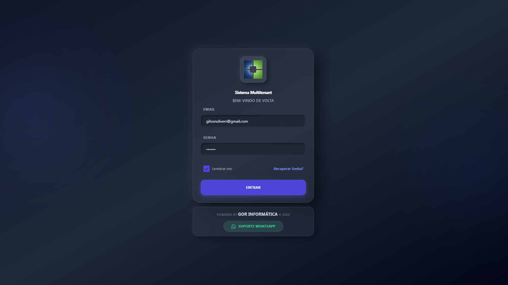
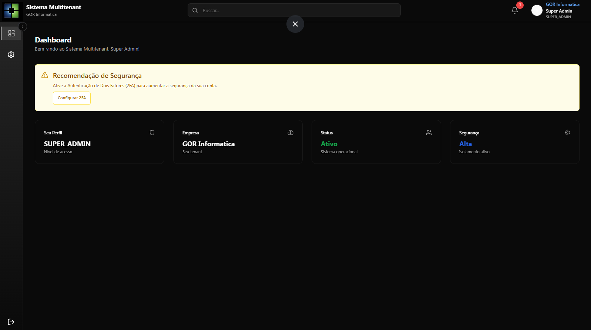
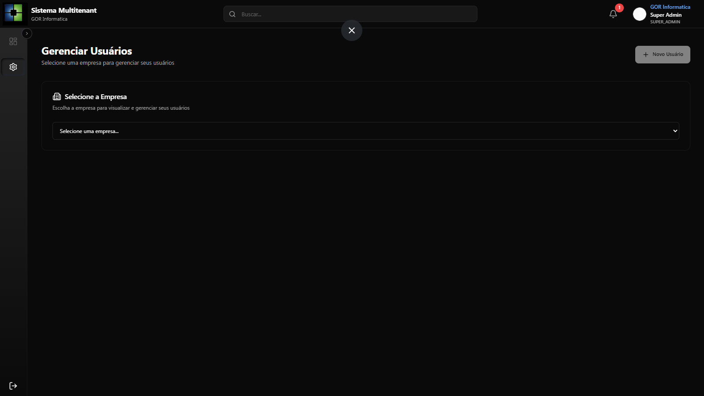
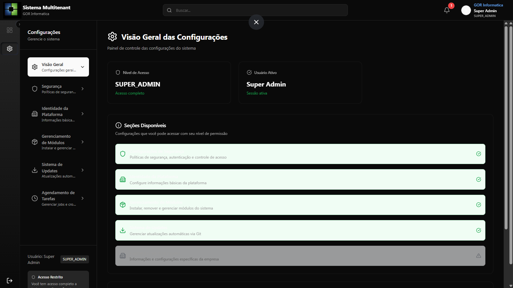

# Sistema Menu Multitenant Seguro

Plataforma SaaS multitenant orientada a isolamento de dados, seguranca operacional e implantacao simplificada via Docker. Projetado para operacao continua em producao com arquitetura modular pronta para evolucao funcional.

------------------------------------------------------------------------

## Visao Geral

Este repositorio entrega uma stack completa para aplicacoes SaaS multitenant:

- API backend em **NestJS** com autenticacao, autorizacao e isolamento por tenant
- Frontend administrativo moderno em **Next.js**
- Scripts oficiais para instalacao, atualizacao e remocao
- Estrutura documental centralizada para operacao e manutencao

Objetivo principal:

> Garantir isolamento entre clientes, facilidade de deploy e manutencao previsivel.

------------------------------------------------------------------------

## Principais Caracteristicas Tecnicas

### Arquitetura

- Multitenancy com separacao logica por tenant
- Backend modular preparado para expansao
- Frontend desacoplado e escalavel
- Docker Compose pronto para producao

### Operacao

- Scripts oficiais versionados
- Documentacao tecnica consolidada
- Fluxo controlado de update
- Base pronta para CI/CD

### Seguranca

- Controle de acesso centralizado
- Isolamento entre tenants
- Estrutura preparada para TLS e proxy reverso

------------------------------------------------------------------------

## Estrutura do Repositorio

```text
apps/
  backend/      -> API NestJS
  frontend/     -> Aplicacao Next.js

install/
  install.sh
  update.sh
  uninstall.sh
  scripts auxiliares

DOCS/           -> Documentacao tecnica e operacional
Scripts/        -> Scripts auxiliares e testes manuais
```

------------------------------------------------------------------------

## Instalacao Oficial

Sempre utilize os scripts da pasta `install/`.

### Instalacao inicial

```bash
sudo bash install/install.sh install -d crm.example.com.br -e seuemail@email.com -u gorinformatica
```

Alternativa interativa:

```bash
sudo bash install/install.sh install
```

------------------------------------------------------------------------

## Manuais de Instalação Detalhados

Para procedimentos passo a passo específicos, consulte os manuais abaixo:

- **[Instalação Docker - Desenvolvimento](DOCS/manual-instalacao/INSTALL_DOCKER_DEV.md)**: Guia para rodar o ambiente de desenvolvimento localmente.
- **[Instalação Docker - Local (Prod)](DOCS/manual-instalacao/INSTALL_DOCKER_LOCAL.md)**: Guia para rodar/testar o build de produção localmente.
- **[Instalação VPS - Produção](DOCS/manual-instalacao/INSTALL_VPS_PROD.md)**: Procedimento oficial para deploy em servidor VPS de Produção.
- **[Instalação VPS - Dev/Staging](DOCS/manual-instalacao/INSTALL_VPS_DEV.md)**: Procedimento para deploy em servidor VPS de Desenvolvimento/Homologação.

------------------------------------------------------------------------

## Atualizacao do Sistema

### Fluxo recomendado

```bash
sudo bash install/install.sh update
```

### Atualizacao pela branch desejada

```bash
sudo bash install/install.sh update main
```

### Atualizador interativo (legado, mantido no projeto)

```bash
sudo bash install/update.sh
```

------------------------------------------------------------------------

## Desinstalacao

```bash
sudo bash install/uninstall.sh
```

Scripts auxiliares:

- `install/check.sh` -> valida ambiente
- `install/restore-db.sh` -> restore banco
- `install/renew-cert.sh` -> renovar certificado

------------------------------------------------------------------------

## Reset Completo do Ambiente

Por seguranca, este README **nao** inclui sequencia destrutiva automatica de reset (ex.: `git reset --hard`, purge completo de Docker, remocao forcada de diretorios).

Se precisar de reset completo, siga este fluxo:

1. Execute `install/uninstall.sh`
2. Reclone o repositorio
3. Rode nova instalacao com `install/install.sh install`

------------------------------------------------------------------------

## Documentacao Tecnica

- `DOCS/INICIO_RAPIDO.md`
- `DOCS/install/README-INSTALADOR.md`
- `DOCS/install/TROUBLESHOOTING.md`
- `DOCS/INDICE_DOCUMENTACAO.md`

------------------------------------------------------------------------

## Licenca

**AGPL-3.0**

Consulte o arquivo `LICENSE`.

------------------------------------------------------------------------

## Creditos

**GOR Informatica - Gilson Oliveira**

- Site: `https://gorinformatica.com.br`
- WhatsApp: `(61) 3359-7358`

------------------------------------------------------------------------

## Apoio ao Projeto

Contribuicoes ajudam na evolucao continua da plataforma.


## Telas
 
 
 
 

