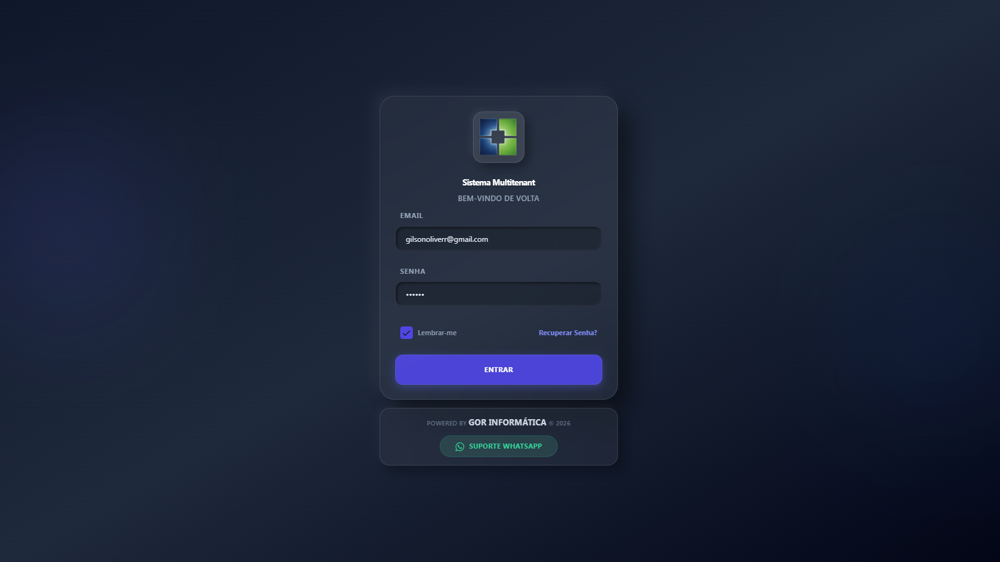
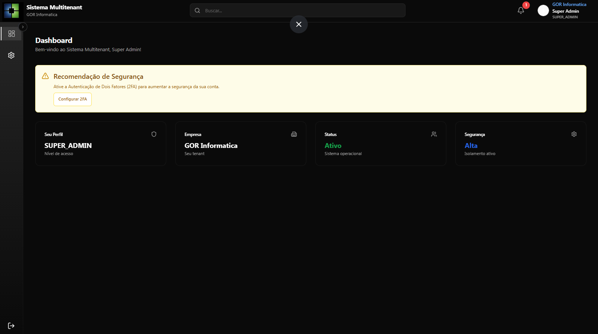
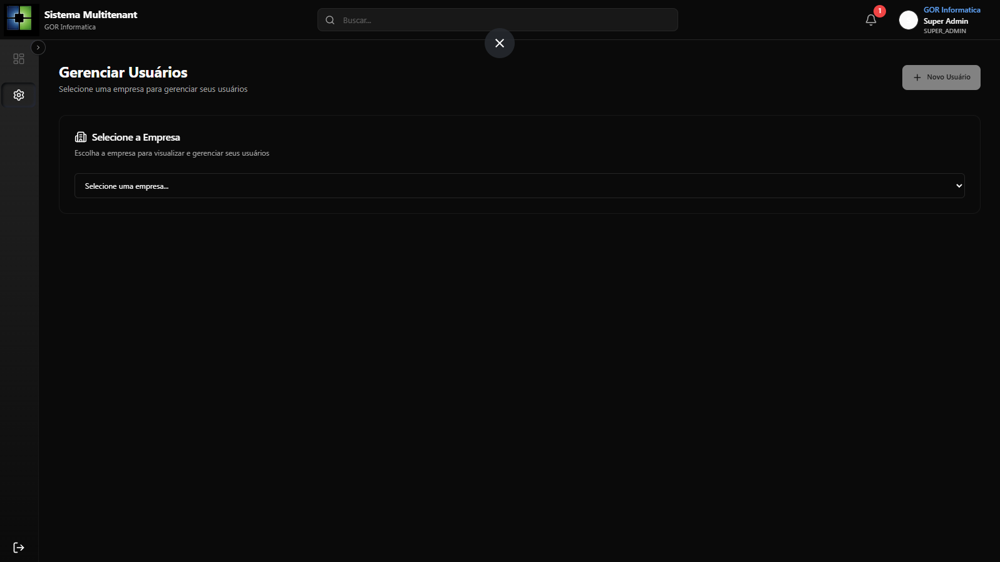
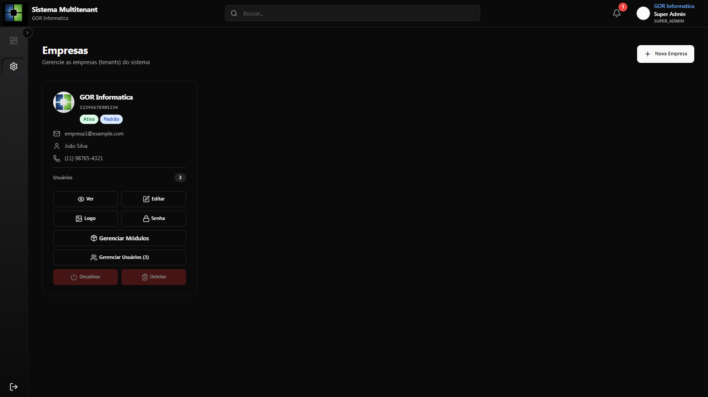
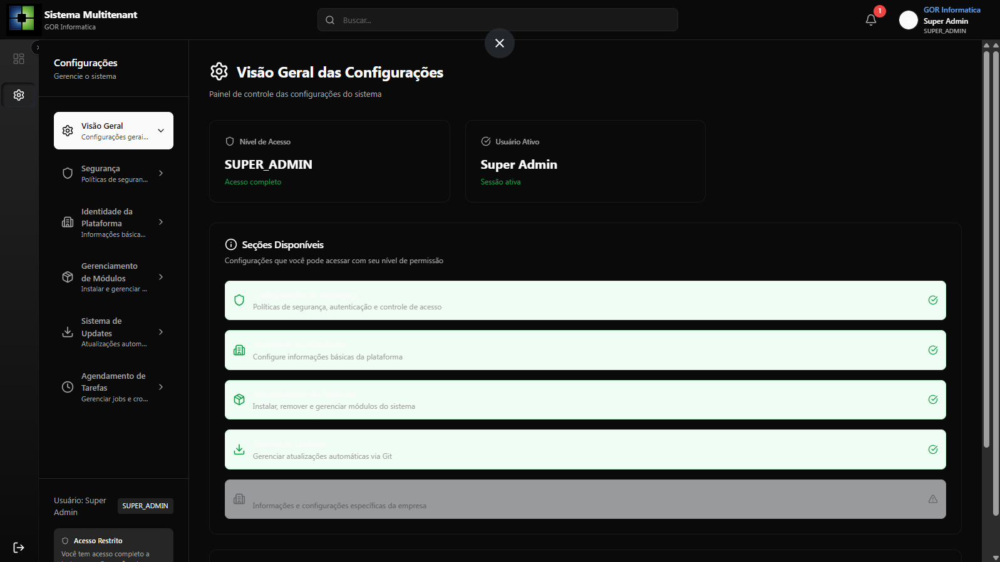

# Sistema Menu Multitenant Seguro

[](https://github.com/gorinformaticadev/Pluggor/actions/workflows/ci-cd.yml)

Plataforma SaaS multitenant orientada a isolamento de dados, segurança operacional e implantação simplificada via Docker. Projetado para operação contínua em produção com arquitetura modular pronta para evolução funcional.

------------------------------------------------------------------------

## Quality Gates

Os merges devem passar obrigatoriamente pelos seguintes jobs de CI:

- backend-build
- frontend-build
- scripts-check
- smoke-tests

------------------------------------------------------------------------
## Visão Geral

Este repositório entrega uma stack completa para aplicações SaaS multitenant:

- API backend em **NestJS** com autenticação, autorização e isolamento por tenant
- Frontend administrativo moderno em **Next.js**
- Scripts oficiais para instalação, atualização e remoção
- Estrutura documental centralizada para operação e manutenção

Objetivo principal:

> Garantir isolamento entre clientes, facilidade de deploy e manutencao previsivel.

------------------------------------------------------------------------

## Principais Características Técnicas

### Arquitetura

- Multitenancy com separação lógica por tenant
- Backend modular preparado para expansao
- Frontend desacoplado e escalável
- Docker Compose pronto para produção

### Operação

- Scripts oficiais versionados
- Documentação técnica consolidada
- Fluxo controlado de update
- Base pronta para CI/CD

### Segurança

- Controle de acesso centralizado
- Isolamento entre tenants
- Estrutura preparada para TLS e proxy reverso

------------------------------------------------------------------------

## Estrutura do Repositório

```text
apps/
  backend/      -> API NestJS
  frontend/     -> Aplicacao Next.js

install/
  install.sh
  update.sh
  uninstall.sh
  scripts auxiliares

DOCS/           -> Documentação técnica e operacional
Scripts/        -> Scripts auxiliares e testes manuais
```

------------------------------------------------------------------------

## Instalação Oficial

Sempre utilize os scripts da pasta `install/`.

### Instalação inicial

```bash
sudo bash install/install.sh install -d crm.example.com.br -e seuemail@email.com -u gorinformatica
```

Alternativa interativa:

```bash
sudo bash install/install.sh install
```

------------------------------------------------------------------------

## Manuais de Instalação Detalhados

Para procedimentos passo a passo específicos, consulte os manuais abaixo:

- **[Instalação Docker - Desenvolvimento](DOCS/manual-instalacao/INSTALL_DOCKER_DEV.md)**: Guia para rodar o ambiente de desenvolvimento localmente.
- **[Instalação Docker - Local (Prod)](DOCS/manual-instalacao/INSTALL_DOCKER_LOCAL.md)**: Guia para rodar/testar o build de produção localmente.
- **[Instalação VPS - Produção](DOCS/manual-instalacao/INSTALL_VPS_PROD.md)**: Procedimento oficial para deploy em servidor VPS de Produção.
- **[Instalação VPS - Dev/Staging](DOCS/manual-instalacao/INSTALL_VPS_DEV.md)**: Procedimento para deploy em servidor VPS de Desenvolvimento/Homologação.

------------------------------------------------------------------------

## Atualização do Sistema

### Fluxo recomendado

```bash
sudo bash install/install.sh update
```

### Atualização pela branch desejada

```bash
sudo bash install/install.sh update main
```

### Atualizador interativo (legado, mantido no projeto)

```bash
sudo bash install/update.sh
```

------------------------------------------------------------------------

## Desinstalação

```bash
sudo bash install/uninstall.sh
```

Scripts auxiliares:

- `install/check.sh` -> valida ambiente
- `install/restore-db.sh` -> wrapper de restore via API interna (Docker)
- `install/restore-native.sh` -> wrapper de restore via API interna (instalação native/PM2)
- `install/renew-cert.sh` -> renovar certificado

------------------------------------------------------------------------

## Restore Operacional (API oficial)

Fluxo oficial de restore:

1. Restore do dump em `staging database`
2. Validação de integridade/schema
3. Maintenance mode + quiesce (cron pausado e Prisma desconectado)
4. Promoção por swap/rename (`staging -> ativa`)
5. Smoke test + opcional `prisma migrate deploy`
6. Maintenance OFF + cron retomado

Wrappers manuais (`install/restore-db.sh` e `install/restore-native.sh`) **não executam pg_restore direto no banco principal**.
Eles apenas chamam a API interna localhost e fazem polling do job.

Variáveis mínimas para wrappers:

```bash
export BACKUP_INTERNAL_API_TOKEN="<token interno>"
export BACKUP_FILE="nome_do_backup.dump"
```

Opcional:

```bash
export BACKEND_INTERNAL_URL="http://127.0.0.1:4000/api"
export BACKUP_INTERNAL_TRUST_PROXY=false
export BACKUP_INTERNAL_ALLOWED_CIDRS="127.0.0.1/32,::1/128"
export BACKUP_INTERNAL_TRUSTED_PROXY_CIDRS="10.0.0.0/8,172.16.0.0/12,192.168.0.0/16"
export RUN_MIGRATIONS=true
bash install/restore-db.sh
```

-----------------------------------------------------------------------

## Restore em Staging (Opção A) - Runbook Mínimo

### 1) Pre-check

```bash
# Containers principais (Docker)
docker compose ps db redis backend

# Endpoint interno: token e allowlist
test -n "$BACKUP_INTERNAL_API_TOKEN" && echo "token: OK" || echo "token: MISSING"
echo "BACKUP_INTERNAL_ALLOWED_CIDRS=$BACKUP_INTERNAL_ALLOWED_CIDRS"
echo "BACKUP_INTERNAL_TRUST_PROXY=$BACKUP_INTERNAL_TRUST_PROXY"
```

### 2) Aplicar migrações antes do deploy

```bash
# Native
pnpm -C apps/backend exec prisma migrate deploy --schema prisma/schema.prisma

# Docker
docker compose exec backend pnpm exec prisma migrate deploy --schema prisma/schema.prisma
```

### 3) Validar endpoint interno (payload allowlisted)

```bash
export BACKEND_INTERNAL_URL="http://127.0.0.1:4000/api"
export BACKUP_FILE="backup_smoke.dump"

curl -sS -X POST "$BACKEND_INTERNAL_URL/backups/internal/restore-by-file" \
  -H "Content-Type: application/json" \
  -H "x-backup-internal-token: $BACKUP_INTERNAL_API_TOKEN" \
  --data "{\"backupFile\":\"$BACKUP_FILE\",\"runMigrations\":false,\"reason\":\"staging-smoke\"}"
```

Polling do job:

```bash
export JOB_ID="<job-id-retornado-no-post>"
curl -sS "$BACKEND_INTERNAL_URL/backups/internal/jobs/$JOB_ID" \
  -H "x-backup-internal-token: $BACKUP_INTERNAL_API_TOKEN"
```

### 4) Restore pequeno de prova (com promoção)

1. Enfileire restore de um dump pequeno conhecido.
2. Faça polling até `status=SUCCESS`.
3. Evidencie timestamps (`createdAt`, `startedAt`, `finishedAt`) e `currentStep`.
4. Valide health:

```bash
curl -sS http://127.0.0.1:4000/api/health
```

### 5) Testes obrigatorios A-F em staging (Postgres real)

1. **Teste A - Restore grande + promocao**
Comando:
```bash
curl -sS -X POST "$BACKEND_INTERNAL_URL/backups/internal/restore-by-file" \
  -H "Content-Type: application/json" \
  -H "x-backup-internal-token: $BACKUP_INTERNAL_API_TOKEN" \
  --data "{\"backupFile\":\"backup_grande.dump\",\"runMigrations\":false,\"reason\":\"teste-A\"}"
```
Evidência: job `SUCCESS`, duração (`finishedAt-startedAt`) e health `ok`.

2. **Teste B - Promoção com sessão pendurada**
Comando (manter sessão ativa):
```bash
docker compose exec db psql -U "$DB_USER" -d "$DB_NAME" -c "SELECT pg_backend_pid(); SELECT pg_sleep(600);"
```
Em paralelo, rode restore. Evidência: promoção conclui (ou falha controlada) sem estado quebrado.

3. **Teste C - Crash entre renames**
Simulação:
```bash
# durante o cutover em staging
docker compose kill -s SIGKILL backend
docker compose up -d backend
```
Evidência: logs com reconciler (`caso C`) e recuperação para estado consistente.

4. **Teste D - Reconnect Prisma falhando**
Simulacao (janela do pos-promote):
```bash
docker pause multitenant-postgres
sleep 70
docker unpause multitenant-postgres
```
Evidência: retries até timeout, job `FAILED` com mensagem curta e maintenance mantida.

5. **Teste E - 2 restores simultaneos**
Comandos:
```bash
curl -sS -X POST "$BACKEND_INTERNAL_URL/backups/internal/restore-by-file" \
  -H "Content-Type: application/json" \
  -H "x-backup-internal-token: $BACKUP_INTERNAL_API_TOKEN" \
  --data '{"backupFile":"backup_smoke_1.dump","runMigrations":false,"reason":"teste-E1"}'

curl -sS -X POST "$BACKEND_INTERNAL_URL/backups/internal/restore-by-file" \
  -H "Content-Type: application/json" \
  -H "x-backup-internal-token: $BACKUP_INTERNAL_API_TOKEN" \
  --data '{"backupFile":"backup_smoke_2.dump","runMigrations":false,"reason":"teste-E2"}'
```
Evidência: segundo job em `WAITING_LOCK`, `lockAttempts` incrementando e `nextRunAt` futuro (consultar tabela `backup_jobs` no Postgres).

6. **Teste F - Dump inválido / objeto perigoso**
Comandos:
```bash
# F1 - dump inválido (assinatura incorreta)
printf 'NOT_A_PG_DUMP' > /tmp/invalid.dump
curl -sS -X POST "http://127.0.0.1:4000/api/backups/upload" \
  -H "Authorization: Bearer $ADMIN_JWT" \
  -F "file=@/tmp/invalid.dump"

# F2 - dump com objeto perigoso (FUNCTION) em ambiente de laboratório
docker compose exec db psql -U "$DB_USER" -d "$DB_NAME" -c "CREATE OR REPLACE FUNCTION public.fn_danger() RETURNS int LANGUAGE sql AS $$ SELECT 1 $$;"
docker compose exec db pg_dump -U "$DB_USER" -d "$DB_NAME" -Fc -f /tmp/danger.dump
docker cp multitenant-postgres:/tmp/danger.dump /tmp/danger.dump
curl -sS -X POST "http://127.0.0.1:4000/api/backups/upload" \
  -H "Authorization: Bearer $ADMIN_JWT" \
  -F "file=@/tmp/danger.dump"
```
Evidência: bloqueio por padrão com erro operacional curto no restore (sem `allowUnsafeObjects`).

-----------------------------------------------------------------------

## Reset Completo do Ambiente

Por segurança, este README **não** inclui sequência destrutiva automática de reset (ex.: `git reset --hard`, purge completo de Docker, remoção forçada de diretórios).
Se precisar de reset completo, siga este fluxo:

1. Execute `install/uninstall.sh`
2. Reclone o repositório
3. Rode nova instalação com `install/install.sh install`

------------------------------------------------------------------------

## Documentação Técnica

- `DOCS/INICIO_RAPIDO.md`
- `DOCS/install/README-INSTALADOR.md`
- `DOCS/install/TROUBLESHOOTING.md`
- `DOCS/INDICE_DOCUMENTACAO.md`

------------------------------------------------------------------------

## Licença

**AGPL-3.0**

Consulte o arquivo `LICENSE`.

------------------------------------------------------------------------

## Créditos

**GOR Informatica - Gilson Oliveira**

- Site: `https://gorinformatica.com.br`
- WhatsApp: `(61) 3359-7358`

------------------------------------------------------------------------

## Apoio ao Projeto

Contribuições ajudam na evolução contínua da plataforma.


## Telas
 
 
 
 

